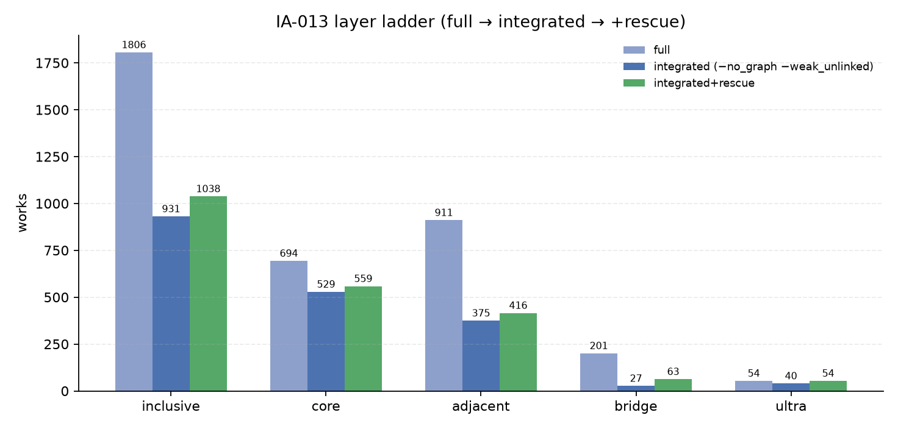
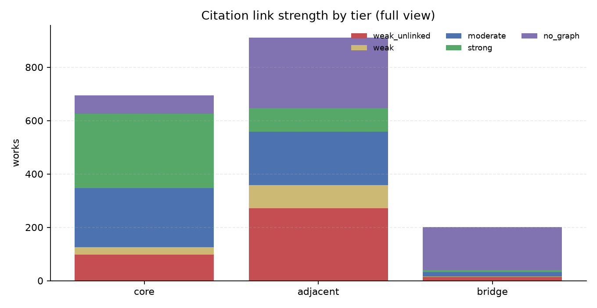
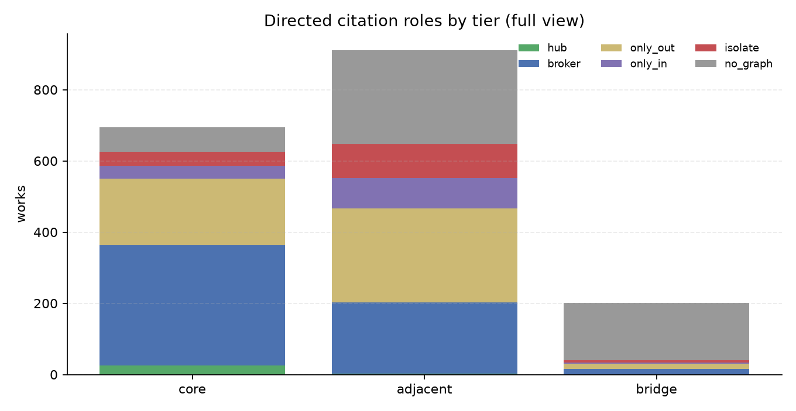
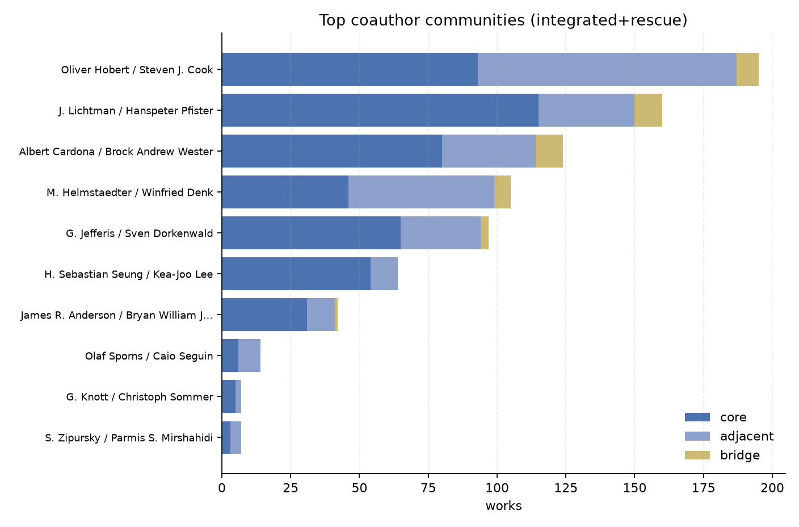
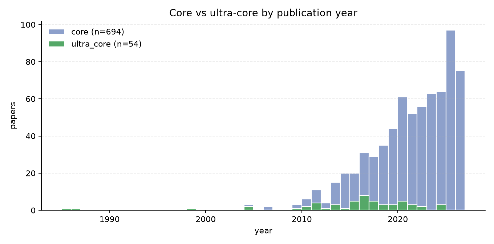
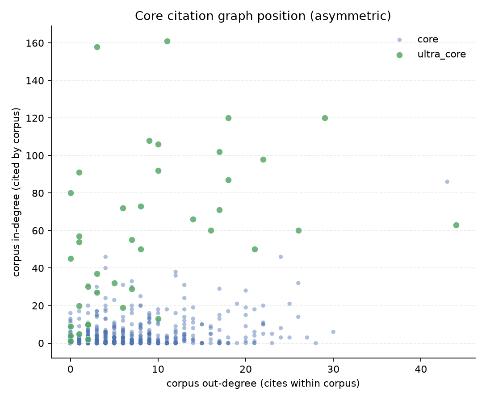
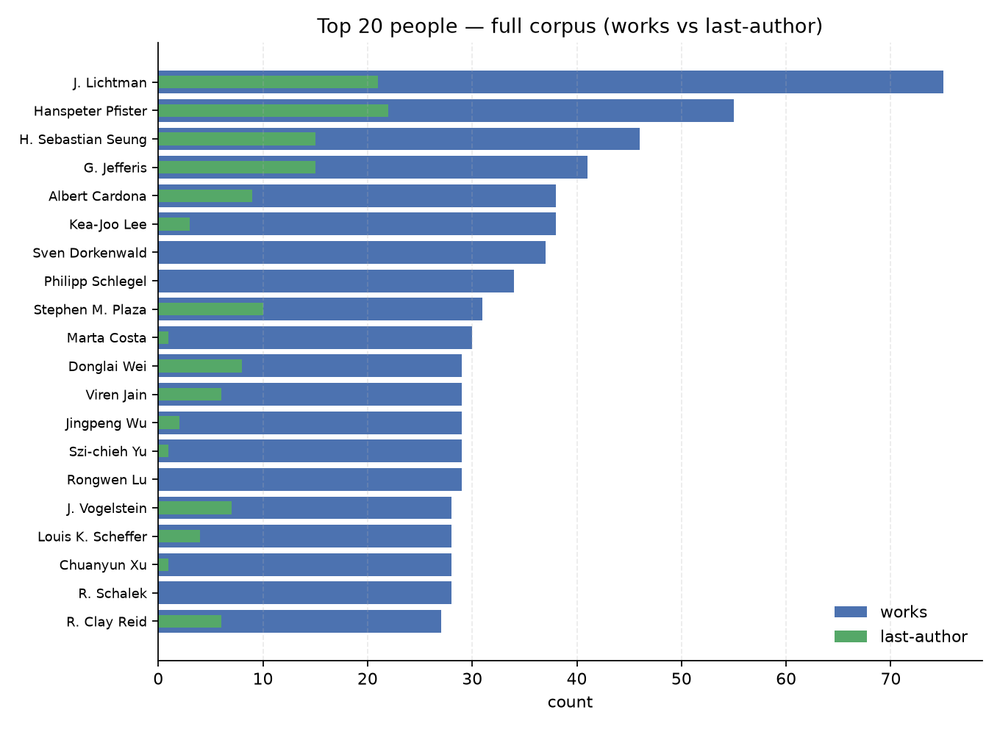
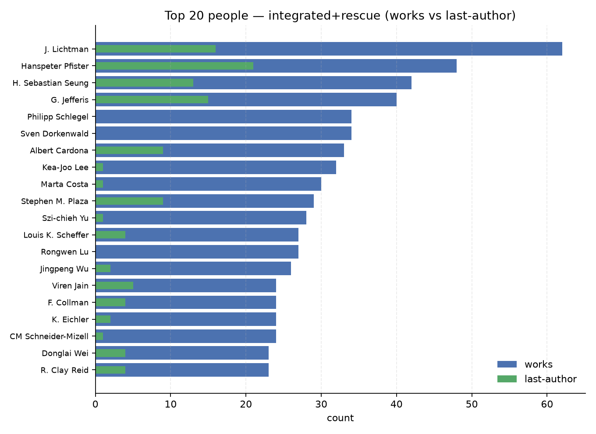
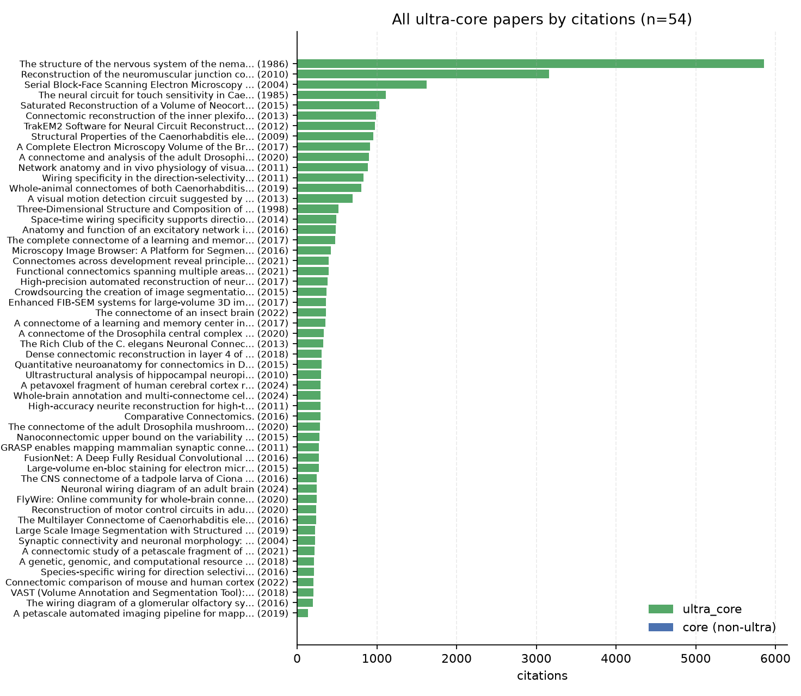
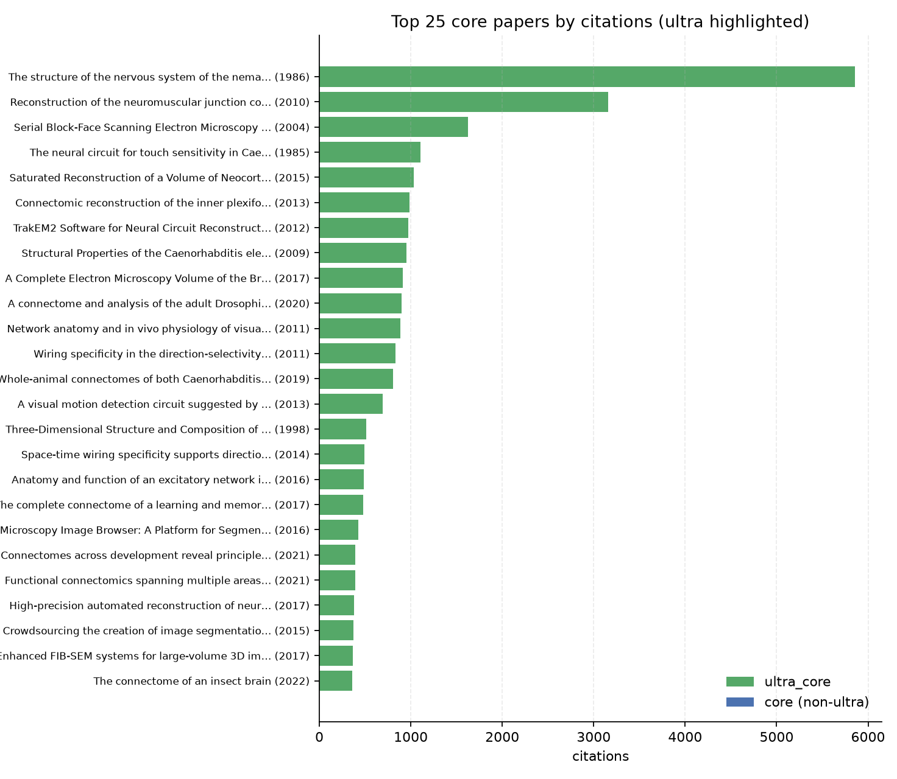

# Connectomics corpus graph review

**Date:** 2026-08-24  
**Screening:** IA-007-v3 agent adjudication (complete)  
**Scope:** IA-013 layers (full → integrated → integrated+rescue), citation roles, authorship (trim_middle), people, ultra-core and core paper lists, figures

---

## 1. Executive summary

Preferred nested corpus views over the v3 inclusive set (core + adjacent + role_bridge):

| | Full | Integrated | Integrated+rescue |
|---|---:|---:|---:|
| Inclusive works | 1,803 | 933 | 1,033 |
| Core | 686 | 529 | 551 |
| Adjacent | 915 | 377 | 418 |
| Role bridge | 202 | 27 | 64 |
| Ultra-core | 46 | 40 | 46 |
| People (trim_middle) | 3,182 | 1,755 | 1,951 |

**Integrated** = full minus **`no_graph`** and minus **`weak_unlinked`** (in = 0 and in+out ≤ 2).  
**Integrated+rescue** = integrated ∪ high-value `no_graph` reinstatements (ultra ∨ cites ≥ 100 ∨ (core ∧ cites ≥ 50)).

Dropped from full to reach integrated: 485 `no_graph` and 385 `weak_unlinked`. Rescue brings back 100 of the `no_graph` papers (including all ultra that were off-graph).

**Legacy prime** (audit only) = full − `weak_unlinked` while **keeping** `no_graph` → 1,418 works. Prefer integrated / integrated+rescue for “citation-integrated” claims (IA-013).

**Use full** for high-recall audit and periphery review. **Use integrated** for strict graph analyses. **Use integrated+rescue** for checkpoint / curriculum when coverage gaps matter.

Machine-readable lists: `label_ultra_core_ranked.csv` (n=46), `label_core_ranked.csv` (n=686).

---

## 2. Shared rules

1. **Semantic tiers** from IA-007-v3 agent adjudication (strict nanoscale / synaptic wiring core).
2. **Citation graph** is directed and asymmetric; high out/in is normal.
3. **Link strength:** weak_unlinked / weak / moderate / strong (weak if total degree <= 2; weak_unlinked if also in = 0); `no_graph` when degrees are undefined.
4. **Authorship trim (`trim_middle`):** exclude authors whose *only* corpus credit is a single middle-author slot (including middle on a consortium paper when that is their sole inclusion). Consortium middles with other credit elsewhere are kept. First/last weighted higher for community assignment.
5. **ultra_core:** core_relevant AND (citations >= 200 OR landmark title AND citations >= 100).

---

## 3. Screening ladder (v2 -> v3 + IA-013)

| Rung | v2 | v3 full | Integrated | +rescue |
|---|---:|---:|---:|---:|
| Inclusive | 1,912 | **1,803** | **933** | **1,033** |
| core | 1,075 | **686** | **529** | **551** |
| ultra_core | 65 | **46** | **40** | **46** |

v3 demotes many v2 false cores (macro MRI, reviews, adjacent biology). Integrated drops both unmeasured (`no_graph`) and thin (`weak_unlinked`) attachments; rescue restores coverage-critical `no_graph` works without claiming they are graph-integrated.




*Figure 1. IA-013 layer ladder (full → integrated → +rescue)*


---

## 4. Citation position by tier

| Tier | Full works | Full med total deg | Full weak_unlinked | Full no_graph | Integrated works | +rescue works |
|---|---:|---:|---:|---:|---:|---:|
| core | 686 | 8.0 | 97 | 60 | **529** | **551** |
| adjacent | 915 | 2.0 | 274 | 264 | **377** | **418** |
| bridge | 202 | 5.0 | 14 | 161 | **27** | **64** |

### Citation roles (graph-matched, full view)

| Tier | hub | broker | only_out | only_in | isolate |
|---|---:|---:|---:|---:|---:|
| core | 25 | 338 | 187 | 37 | 39 |
| adjacent | 2 | 201 | 267 | 85 | 96 |
| bridge | 0 | 15 | 16 | 2 | 8 |

Core concentrates brokers/hubs. Adjacent is only-out and weak_unlinked heavy. Bridge is often off-graph.




*Figure 2. Citation link strength by tier*




*Figure 3. Directed citation roles by tier*


---

## 5. Authorship and communities

| | Full | Integrated | +rescue |
|---|---:|---:|---:|
| Coauthor nodes | 3182 | 1755 | 1951 |
| Coauthor edges | 53187 | 26756 | 39078 |
| Communities | 296 | 175 | 186 |
| Persons with first/last | 2165 | 1146 | 1271 |
| Raw unique bylines | 6590 | 3621 | 4230 |
| Excluded sole middle-only | 3408 | 1866 | 2279 |

### Top communities (full)

| Community | Works | Core | Adjacent | Ultra |
|---|---:|---:|---:|---:|
| Xiaoyin Chen / Yonggang Wang | 353 | 104 | 209 | 3 |
| J. Lichtman / Hanspeter Pfister | 240 | 148 | 70 | 15 |
| Albert Cardona / J. Vogelstein | 216 | 92 | 98 | 7 |
| H. Sebastian Seung / G. Jefferis | 149 | 108 | 33 | 9 |
| M. Helmstaedter / R. Friedrich | 129 | 63 | 61 | 6 |
| Oliver Hobert / Steven J. Cook | 100 | 34 | 65 | 4 |
| Olaf Sporns / B. Mišić | 93 | 12 | 62 | 1 |
| Javier DeFelipe / Michael W. Reimann | 55 | 16 | 35 | 0 |

### Top communities (integrated+rescue)

| Community | Works | Core | Adjacent | Ultra |
|---|---:|---:|---:|---:|
| Oliver Hobert / Steven J. Cook | 194 | 91 | 95 | 9 |
| J. Lichtman / Hanspeter Pfister | 159 | 114 | 34 | 11 |
| Albert Cardona / Brock Andrew Wester | 126 | 81 | 35 | 8 |
| G. Jefferis / H. Sebastian Seung | 102 | 69 | 30 | 8 |
| M. Helmstaedter / K. Briggman | 101 | 42 | 53 | 4 |
| Kea-Joo Lee / Rongwen Lu | 61 | 52 | 9 | 3 |
| James R. Anderson / Bryan William Jones | 42 | 31 | 10 | 2 |
| Olaf Sporns / Caio Seguin | 14 | 6 | 8 | 0 |



*Figure 4. Top coauthor communities (integrated+rescue)*




*Figure 5. Core vs ultra-core by year*




*Figure 6. Core citation in/out degree*


---

## 6. Interpretation

**Full** is the high-recall field map: every inclusive paper, annotated with citation role and lab lineage, including thin attachments (`weak_unlinked`) and off-graph papers (`no_graph`).

**Integrated** is the true citation-integrated spine: drop both `no_graph` and `weak_unlinked`.

**Integrated+rescue** is the preferred checkpoint when coverage gaps matter: same as integrated, plus flagged high-value `no_graph` reinstatements (not claimed as graph-integrated).

**Legacy prime** drops only `weak_unlinked` and keeps all `no_graph` — useful as an audit continuity cut, not as the “integrated” claim.

Recommended use:

1. Checkpoint / curriculum spine → integrated+rescue core ∩ (moderate ∪ strong ∪ ultra ∪ rescued_no_graph).
2. Strict graph analyses → integrated only.
3. Human review → full ∩ (`weak_unlinked` ∪ unreescued `no_graph`), especially core.
4. Ultra-core list → all 46 appear under full and integrated+rescue (40 remain on-graph in strict integrated).
5. Community maps → prefer integrated+rescue for nanoscale program lineages.

---

## 7. People counts

| Metric | Full | Integrated | +rescue |
|---|---:|---:|---:|
| Works | 1803 | 933 | 1033 |
| Author mentions (raw) | 13,608 | 7,786 | 8,844 |
| Unique persons (raw) | 6,590 | 3,621 | 4,230 |
| **Persons after trim_middle** | **3,182** | **1,755** | **1,951** |
| With first or last credit | 2,165 | 1,146 | 1,271 |
| Sole middle-only excluded | 3,408 | 1,866 | 2,279 |
| Top-100 floor (min works) | >=14 | >=10 | >=11 |
| Top-100 median works | 20.5 | 16.0 | 17.0 |

Ranking for top 100 by works: works desc, then last-author count, first/single, ultra_core works, core works. Eligible authors only under trim_middle.




*Figure 7. Top 20 people (full)*




*Figure 8. Top 20 people (integrated+rescue)*


---

## 8. Top 100 people - full corpus (by works)


| # | Name | Works | Last | First | Middle | Core | Adj | Ultra |
|---|---|---|---|---|---|---|---|---|
| 1 | J. Lichtman | 74 | 20 | 3 | 51 | 54 | 14 | 5 |
| 2 | Hanspeter Pfister | 55 | 23 | 1 | 31 | 43 | 7 | 2 |
| 3 | H. Sebastian Seung | 43 | 14 | 3 | 26 | 37 | 5 | 6 |
| 4 | G. Jefferis | 41 | 15 | 0 | 27 | 32 | 7 | 5 |
| 5 | Albert Cardona | 38 | 9 | 2 | 28 | 32 | 5 | 6 |
| 6 | Kea-Joo Lee | 37 | 3 | 3 | 33 | 34 | 3 | 4 |
| 7 | Sven Dorkenwald | 37 | 0 | 5 | 32 | 35 | 2 | 6 |
| 8 | Philipp Schlegel | 34 | 0 | 5 | 29 | 30 | 3 | 4 |
| 9 | Stephen M. Plaza | 31 | 10 | 6 | 15 | 29 | 1 | 3 |
| 10 | Marta Costa | 30 | 1 | 0 | 29 | 24 | 4 | 4 |
| 11 | Donglai Wei | 29 | 8 | 1 | 20 | 22 | 4 | 2 |
| 12 | Jingpeng Wu | 29 | 2 | 2 | 26 | 27 | 1 | 4 |
| 13 | Szi-chieh Yu | 29 | 1 | 2 | 30 | 27 | 2 | 4 |
| 14 | Rongwen Lu | 29 | 0 | 2 | 27 | 28 | 1 | 4 |
| 15 | Louis K. Scheffer | 28 | 4 | 6 | 18 | 24 | 4 | 4 |
| 16 | Chuanyun Xu | 28 | 1 | 5 | 22 | 16 | 11 | 3 |
| 17 | J. Vogelstein | 27 | 7 | 4 | 16 | 9 | 14 | 1 |
| 18 | R. Clay Reid | 27 | 6 | 1 | 20 | 18 | 8 | 4 |
| 19 | Viren Jain | 27 | 5 | 2 | 20 | 21 | 4 | 3 |
| 20 | Xiaoyin Chen | 27 | 4 | 1 | 22 | 19 | 6 | 0 |
| 21 | F. Collman | 27 | 4 | 0 | 23 | 25 | 2 | 5 |
| 22 | R. Schalek | 27 | 0 | 1 | 26 | 21 | 5 | 3 |
| 23 | Y. Meirovitch | 26 | 5 | 5 | 16 | 22 | 3 | 1 |
| 24 | CM Schneider-Mizell | 26 | 1 | 4 | 21 | 26 | 0 | 5 |
| 25 | Xiao-jing Wang | 25 | 6 | 7 | 13 | 7 | 15 | 0 |
| 26 | K. Eichler | 25 | 2 | 2 | 22 | 23 | 2 | 3 |
| 27 | Yonggang Wang | 25 | 0 | 6 | 20 | 9 | 11 | 1 |
| 28 | Michał Januszewski | 25 | 0 | 3 | 22 | 25 | 0 | 3 |
| 29 | A. S. Bates | 24 | 0 | 5 | 20 | 19 | 4 | 4 |
| 30 | T. Macrina | 24 | 0 | 1 | 23 | 24 | 0 | 4 |
| 31 | N. Kemnitz | 24 | 0 | 0 | 24 | 23 | 0 | 4 |
| 32 | G. Rubin | 23 | 5 | 0 | 18 | 20 | 3 | 5 |
| 33 | Narayan Kasthuri | 23 | 5 | 0 | 18 | 15 | 6 | 0 |
| 34 | Yuanyuan Li | 23 | 0 | 6 | 17 | 9 | 11 | 0 |
| 35 | Yunming Wu | 23 | 0 | 1 | 22 | 17 | 4 | 3 |
| 36 | Oliver Hobert | 22 | 16 | 0 | 6 | 5 | 17 | 1 |
| 37 | C. Priebe | 22 | 10 | 3 | 9 | 5 | 15 | 1 |
| 38 | Harald F. Hess | 22 | 9 | 0 | 13 | 18 | 3 | 3 |
| 39 | Brock Andrew Wester | 22 | 6 | 0 | 16 | 15 | 1 | 0 |
| 40 | Jan Funke | 22 | 5 | 2 | 15 | 18 | 4 | 4 |
| 41 | Mark Ellisman | 22 | 4 | 0 | 19 | 15 | 3 | 0 |
| 42 | Aljoscha Nern | 22 | 0 | 1 | 21 | 16 | 6 | 3 |
| 43 | J. Bae | 22 | 0 | 0 | 22 | 21 | 0 | 3 |
| 44 | Hongqing Han | 21 | 14 | 0 | 7 | 14 | 6 | 0 |
| 45 | M. Helmstaedter | 21 | 12 | 5 | 4 | 13 | 8 | 3 |
| 46 | Junkyung Kim | 21 | 9 | 5 | 8 | 4 | 16 | 2 |
| 47 | S. Saalfeld | 21 | 4 | 2 | 15 | 17 | 3 | 5 |
| 48 | Jordan K. Matelsky | 21 | 0 | 7 | 14 | 14 | 1 | 0 |
| 49 | Shin-ya Takemura | 21 | 0 | 5 | 23 | 17 | 3 | 5 |
| 50 | C. Jordan | 21 | 0 | 0 | 21 | 21 | 0 | 4 |
| 51 | William R. Gray-Roncal | 20 | 10 | 3 | 7 | 12 | 3 | 0 |
| 52 | Bryan William Jones | 20 | 5 | 1 | 14 | 14 | 6 | 0 |
| 53 | James R. Anderson | 20 | 1 | 3 | 16 | 15 | 5 | 0 |
| 54 | Fu-Ning Li | 20 | 0 | 2 | 18 | 19 | 0 | 7 |
| 55 | W. Silversmith | 20 | 0 | 0 | 20 | 19 | 0 | 4 |
| 56 | A. Sterling | 20 | 0 | 0 | 20 | 19 | 1 | 3 |
| 57 | D. Chklovskii | 19 | 13 | 1 | 5 | 10 | 9 | 4 |
| 58 | Yu-Xian Zhang | 19 | 1 | 2 | 17 | 10 | 6 | 0 |
| 59 | Zhi-Hang Lin | 19 | 0 | 5 | 14 | 12 | 6 | 2 |
| 60 | S. Popovych | 19 | 0 | 1 | 18 | 19 | 0 | 4 |
| 61 | D. Brittain | 19 | 0 | 0 | 19 | 19 | 0 | 5 |
| 62 | Akhilesh Halageri | 19 | 0 | 0 | 19 | 19 | 0 | 4 |
| 63 | M. Murthy | 18 | 6 | 0 | 12 | 16 | 1 | 3 |
| 64 | D. Bock | 18 | 4 | 1 | 13 | 14 | 3 | 4 |
| 65 | W. Lee | 18 | 4 | 1 | 13 | 14 | 4 | 4 |
| 66 | Arie Matsliah | 18 | 2 | 1 | 15 | 17 | 1 | 2 |
| 67 | Zhiyuan Lu | 18 | 0 | 2 | 18 | 18 | 0 | 5 |
| 68 | R. D. Fetter | 18 | 0 | 0 | 18 | 18 | 0 | 6 |
| 69 | D. Bumbarger | 18 | 0 | 0 | 18 | 17 | 1 | 2 |
| 70 | Marta Zlatic | 17 | 9 | 0 | 9 | 15 | 2 | 2 |
| 71 | I. Meinertzhagen | 17 | 8 | 3 | 8 | 11 | 5 | 3 |
| 72 | N. D. da Costa | 17 | 6 | 0 | 11 | 17 | 0 | 2 |
| 73 | S. Berg | 17 | 4 | 1 | 12 | 17 | 0 | 2 |
| 74 | Tengda Zhao | 17 | 1 | 4 | 12 | 12 | 4 | 4 |
| 75 | Yi-Shiuan Liu | 17 | 0 | 4 | 13 | 3 | 11 | 1 |
| 76 | N. Turner | 17 | 0 | 1 | 16 | 17 | 0 | 1 |
| 77 | M. C. Castro | 17 | 0 | 0 | 17 | 17 | 0 | 4 |
| 78 | N. Shavit | 16 | 10 | 1 | 5 | 13 | 3 | 1 |
| 79 | Yuh-tarng Chen | 16 | 2 | 1 | 14 | 6 | 7 | 0 |
| 80 | P. Rivlin | 16 | 1 | 0 | 15 | 13 | 0 | 3 |
| 81 | J. Buchanan | 16 | 0 | 2 | 14 | 15 | 1 | 1 |
| 82 | R. Torres | 16 | 0 | 1 | 15 | 16 | 0 | 2 |
| 83 | Wenjie Yin | 16 | 0 | 1 | 15 | 14 | 0 | 2 |
| 84 | Shang Mu | 16 | 0 | 0 | 16 | 15 | 1 | 4 |
| 85 | Zhi-Ming Jia | 16 | 0 | 0 | 16 | 15 | 1 | 4 |
| 86 | Marc M. Takeno | 16 | 0 | 0 | 16 | 16 | 0 | 1 |
| 87 | John C. Tuthill | 15 | 8 | 0 | 7 | 13 | 2 | 1 |
| 88 | R. E. Marc | 15 | 5 | 4 | 6 | 11 | 4 | 0 |
| 89 | Hongkui Zeng | 15 | 4 | 1 | 10 | 5 | 10 | 0 |
| 90 | Ashok Litwin-Kumar | 15 | 3 | 2 | 10 | 11 | 4 | 2 |
| 91 | Barak Nehoran | 15 | 0 | 0 | 15 | 15 | 0 | 4 |
| 92 | Eric Mitchell | 15 | 0 | 0 | 15 | 15 | 0 | 4 |
| 93 | A. Bodor | 15 | 0 | 0 | 15 | 15 | 0 | 1 |
| 94 | Gáspár Jékely | 14 | 12 | 1 | 1 | 11 | 3 | 0 |
| 95 | KM Harris | 14 | 7 | 1 | 6 | 6 | 4 | 3 |
| 96 | G. Card | 14 | 5 | 0 | 9 | 10 | 3 | 0 |
| 97 | Xiao-Ming Li | 14 | 3 | 0 | 11 | 2 | 10 | 0 |
| 98 | Jiazheng Liu | 14 | 2 | 3 | 11 | 10 | 3 | 0 |
| 99 | Johanna Beyer | 14 | 1 | 5 | 8 | 8 | 2 | 0 |
| 100 | Aravinthan D. T. Samuel | 14 | 1 | 0 | 13 | 9 | 4 | 2 |


## 9. Top 100 people - integrated+rescue (by works)


| # | Name | Works | Last | First | Middle | Core | Adj | Ultra |
|---|---|---|---|---|---|---|---|---|
| 1 | J. Lichtman | 61 | 15 | 3 | 43 | 44 | 13 | 5 |
| 2 | Hanspeter Pfister | 48 | 22 | 0 | 26 | 40 | 5 | 2 |
| 3 | G. Jefferis | 40 | 15 | 0 | 26 | 31 | 7 | 5 |
| 4 | H. Sebastian Seung | 39 | 12 | 3 | 24 | 35 | 4 | 6 |
| 5 | Philipp Schlegel | 34 | 0 | 5 | 29 | 30 | 3 | 4 |
| 6 | Sven Dorkenwald | 34 | 0 | 4 | 30 | 33 | 1 | 6 |
| 7 | Albert Cardona | 33 | 9 | 1 | 24 | 30 | 2 | 6 |
| 8 | Kea-Joo Lee | 31 | 1 | 3 | 27 | 29 | 2 | 4 |
| 9 | Marta Costa | 30 | 1 | 0 | 29 | 24 | 4 | 4 |
| 10 | Stephen M. Plaza | 29 | 9 | 6 | 14 | 28 | 1 | 3 |
| 11 | Szi-chieh Yu | 28 | 1 | 2 | 29 | 26 | 2 | 4 |
| 12 | Louis K. Scheffer | 27 | 4 | 5 | 18 | 23 | 4 | 4 |
| 13 | Rongwen Lu | 27 | 0 | 1 | 26 | 26 | 1 | 4 |
| 14 | Jingpeng Wu | 26 | 2 | 2 | 22 | 26 | 0 | 4 |
| 15 | F. Collman | 24 | 4 | 0 | 20 | 23 | 1 | 5 |
| 16 | K. Eichler | 24 | 2 | 2 | 21 | 22 | 2 | 3 |
| 17 | CM Schneider-Mizell | 24 | 1 | 4 | 19 | 24 | 0 | 5 |
| 18 | Donglai Wei | 23 | 4 | 1 | 18 | 19 | 3 | 2 |
| 19 | R. Clay Reid | 23 | 4 | 0 | 19 | 17 | 5 | 4 |
| 20 | A. S. Bates | 23 | 0 | 4 | 20 | 18 | 4 | 4 |
| 21 | Viren Jain | 22 | 4 | 1 | 17 | 17 | 4 | 3 |
| 22 | G. Rubin | 22 | 4 | 0 | 18 | 19 | 3 | 5 |
| 23 | T. Macrina | 22 | 0 | 1 | 21 | 22 | 0 | 4 |
| 24 | Brock Andrew Wester | 21 | 5 | 0 | 16 | 14 | 1 | 0 |
| 25 | Y. Meirovitch | 21 | 4 | 4 | 13 | 18 | 3 | 1 |
| 26 | Michał Januszewski | 21 | 0 | 3 | 18 | 21 | 0 | 3 |
| 27 | C. Jordan | 21 | 0 | 0 | 21 | 21 | 0 | 4 |
| 28 | N. Kemnitz | 21 | 0 | 0 | 21 | 21 | 0 | 4 |
| 29 | Fu-Ning Li | 20 | 0 | 2 | 18 | 19 | 0 | 7 |
| 30 | Aljoscha Nern | 20 | 0 | 1 | 19 | 15 | 5 | 3 |
| 31 | R. Schalek | 20 | 0 | 0 | 20 | 15 | 5 | 3 |
| 32 | James R. Anderson | 19 | 1 | 3 | 15 | 15 | 4 | 0 |
| 33 | Jordan K. Matelsky | 19 | 0 | 6 | 13 | 13 | 1 | 0 |
| 34 | Shin-ya Takemura | 19 | 0 | 4 | 22 | 17 | 2 | 5 |
| 35 | W. Silversmith | 19 | 0 | 0 | 19 | 19 | 0 | 4 |
| 36 | J. Bae | 19 | 0 | 0 | 19 | 19 | 0 | 3 |
| 37 | A. Sterling | 19 | 0 | 0 | 19 | 18 | 1 | 3 |
| 38 | M. Helmstaedter | 18 | 11 | 3 | 4 | 12 | 6 | 3 |
| 39 | William R. Gray-Roncal | 18 | 10 | 3 | 5 | 11 | 2 | 0 |
| 40 | Narayan Kasthuri | 18 | 5 | 0 | 13 | 12 | 5 | 0 |
| 41 | S. Saalfeld | 18 | 4 | 2 | 12 | 16 | 1 | 5 |
| 42 | D. Bock | 18 | 4 | 1 | 13 | 14 | 3 | 4 |
| 43 | R. D. Fetter | 18 | 0 | 0 | 18 | 18 | 0 | 6 |
| 44 | D. Brittain | 18 | 0 | 0 | 18 | 18 | 0 | 5 |
| 45 | Akhilesh Halageri | 18 | 0 | 0 | 18 | 18 | 0 | 4 |
| 46 | Harald F. Hess | 17 | 7 | 0 | 10 | 15 | 1 | 3 |
| 47 | Bryan William Jones | 17 | 5 | 0 | 12 | 13 | 4 | 0 |
| 48 | Jan Funke | 17 | 3 | 2 | 12 | 17 | 0 | 4 |
| 49 | Yunming Wu | 17 | 0 | 1 | 16 | 13 | 4 | 3 |
| 50 | N. Turner | 17 | 0 | 1 | 16 | 17 | 0 | 1 |
| 51 | S. Popovych | 17 | 0 | 0 | 17 | 17 | 0 | 4 |
| 52 | Oliver Hobert | 16 | 10 | 0 | 6 | 5 | 11 | 1 |
| 53 | M. Murthy | 16 | 5 | 0 | 11 | 15 | 1 | 3 |
| 54 | S. Berg | 16 | 4 | 1 | 11 | 16 | 0 | 2 |
| 55 | Chuanyun Xu | 16 | 1 | 1 | 14 | 12 | 3 | 3 |
| 56 | Arie Matsliah | 16 | 1 | 1 | 14 | 15 | 1 | 2 |
| 57 | M. C. Castro | 16 | 0 | 0 | 16 | 16 | 0 | 4 |
| 58 | D. Bumbarger | 16 | 0 | 0 | 16 | 15 | 1 | 2 |
| 59 | D. Chklovskii | 15 | 9 | 1 | 5 | 10 | 5 | 4 |
| 60 | I. Meinertzhagen | 15 | 7 | 3 | 7 | 10 | 4 | 3 |
| 61 | Zhiyuan Lu | 15 | 0 | 1 | 16 | 15 | 0 | 5 |
| 62 | R. Torres | 15 | 0 | 1 | 14 | 15 | 0 | 2 |
| 63 | N. Shavit | 14 | 9 | 0 | 5 | 12 | 2 | 1 |
| 64 | John C. Tuthill | 14 | 8 | 0 | 6 | 12 | 2 | 1 |
| 65 | Marta Zlatic | 14 | 6 | 0 | 9 | 13 | 1 | 2 |
| 66 | Ashok Litwin-Kumar | 14 | 3 | 2 | 9 | 11 | 3 | 2 |
| 67 | P. Rivlin | 14 | 1 | 0 | 13 | 12 | 0 | 3 |
| 68 | Tengda Zhao | 14 | 0 | 4 | 10 | 12 | 1 | 4 |
| 69 | Zhi-Hang Lin | 14 | 0 | 4 | 10 | 10 | 4 | 2 |
| 70 | L. Elabbady | 14 | 0 | 3 | 11 | 14 | 0 | 1 |
| 71 | Barak Nehoran | 14 | 0 | 0 | 14 | 14 | 0 | 4 |
| 72 | Eric Mitchell | 14 | 0 | 0 | 14 | 14 | 0 | 4 |
| 73 | Shang Mu | 14 | 0 | 0 | 14 | 14 | 0 | 4 |
| 74 | Zhi-Ming Jia | 14 | 0 | 0 | 14 | 14 | 0 | 4 |
| 75 | Claire E. McKellar | 14 | 0 | 0 | 14 | 12 | 2 | 3 |
| 76 | Gáspár Jékely | 13 | 11 | 1 | 1 | 10 | 3 | 0 |
| 77 | R. E. Marc | 13 | 5 | 3 | 5 | 11 | 2 | 0 |
| 78 | N. D. da Costa | 13 | 4 | 0 | 9 | 13 | 0 | 2 |
| 79 | Scott W. Emmons | 13 | 2 | 6 | 5 | 10 | 3 | 1 |
| 80 | J. Vogelstein | 13 | 2 | 2 | 9 | 7 | 4 | 1 |
| 81 | Mark Ellisman | 13 | 2 | 0 | 11 | 11 | 1 | 0 |
| 82 | Steven J. Cook | 13 | 0 | 4 | 9 | 9 | 4 | 1 |
| 83 | D. Berger | 13 | 0 | 1 | 12 | 12 | 0 | 4 |
| 84 | Wenjie Yin | 13 | 0 | 1 | 12 | 13 | 0 | 2 |
| 85 | G. Mahalingam | 13 | 0 | 1 | 12 | 13 | 0 | 1 |
| 86 | D. Kapner | 13 | 0 | 0 | 13 | 13 | 0 | 2 |
| 87 | J. Buchanan | 13 | 0 | 0 | 13 | 13 | 0 | 1 |
| 88 | Marc M. Takeno | 13 | 0 | 0 | 13 | 13 | 0 | 1 |
| 89 | G. Card | 12 | 4 | 0 | 8 | 10 | 2 | 0 |
| 90 | W. M. Katz | 12 | 1 | 1 | 10 | 12 | 0 | 3 |
| 91 | Gary B. Huang | 12 | 0 | 3 | 9 | 11 | 0 | 2 |
| 92 | E. Marin | 12 | 0 | 2 | 10 | 11 | 1 | 1 |
| 93 | Dodam Ih | 12 | 0 | 0 | 12 | 12 | 0 | 3 |
| 94 | Jim Truman | 12 | 0 | 0 | 12 | 11 | 1 | 2 |
| 95 | A. Bodor | 12 | 0 | 0 | 12 | 12 | 0 | 1 |
| 96 | Kai Li | 12 | 0 | 0 | 12 | 12 | 0 | 1 |
| 97 | S. Kinn | 12 | 0 | 0 | 12 | 12 | 0 | 1 |
| 98 | W. Wong | 12 | 0 | 0 | 12 | 12 | 0 | 1 |
| 99 | W. Lee | 11 | 2 | 0 | 9 | 10 | 1 | 4 |
| 100 | Xiaoyin Chen | 11 | 2 | 0 | 9 | 10 | 1 | 0 |


## 10. Top 100 people - full corpus (by last-author count)


| # | Name | Last | Works | First | Core | Ultra |
|---|---|---|---|---|---|---|
| 1 | Hanspeter Pfister | 23 | 55 | 1 | 43 | 2 |
| 2 | J. Lichtman | 20 | 74 | 3 | 54 | 5 |
| 3 | Oliver Hobert | 16 | 22 | 0 | 5 | 1 |
| 4 | G. Jefferis | 15 | 41 | 0 | 32 | 5 |
| 5 | H. Sebastian Seung | 14 | 43 | 3 | 37 | 6 |
| 6 | Hongqing Han | 14 | 21 | 0 | 14 | 0 |
| 7 | D. Chklovskii | 13 | 19 | 1 | 10 | 4 |
| 8 | M. Helmstaedter | 12 | 21 | 5 | 13 | 3 |
| 9 | Gáspár Jékely | 12 | 14 | 1 | 11 | 0 |
| 10 | Stephen M. Plaza | 10 | 31 | 6 | 29 | 3 |
| 11 | C. Priebe | 10 | 22 | 3 | 5 | 1 |
| 12 | William R. Gray-Roncal | 10 | 20 | 3 | 12 | 0 |
| 13 | N. Shavit | 10 | 16 | 1 | 13 | 1 |
| 14 | Albert Cardona | 9 | 38 | 2 | 32 | 6 |
| 15 | Harald F. Hess | 9 | 22 | 0 | 18 | 3 |
| 16 | Junkyung Kim | 9 | 21 | 5 | 4 | 2 |
| 17 | Marta Zlatic | 9 | 17 | 0 | 15 | 2 |
| 18 | Eli Shlizerman | 9 | 10 | 0 | 2 | 0 |
| 19 | Donglai Wei | 8 | 29 | 1 | 22 | 2 |
| 20 | I. Meinertzhagen | 8 | 17 | 3 | 11 | 3 |
| 21 | John C. Tuthill | 8 | 15 | 0 | 13 | 1 |
| 22 | R. Friedrich | 8 | 11 | 2 | 6 | 0 |
| 23 | J. Vogelstein | 7 | 27 | 4 | 9 | 1 |
| 24 | KM Harris | 7 | 14 | 1 | 6 | 3 |
| 25 | T. Tasdizen | 7 | 12 | 0 | 10 | 1 |
| 26 | WR Schafer | 7 | 11 | 1 | 4 | 2 |
| 27 | Srinivas C. Turaga | 7 | 10 | 0 | 6 | 2 |
| 28 | G. Ascoli | 7 | 8 | 0 | 2 | 0 |
| 29 | K. Broadie | 7 | 7 | 0 | 0 | 0 |
| 30 | R. Clay Reid | 6 | 27 | 1 | 18 | 4 |
| 31 | Xiao-jing Wang | 6 | 25 | 7 | 7 | 0 |
| 32 | Brock Andrew Wester | 6 | 22 | 0 | 15 | 0 |
| 33 | M. Murthy | 6 | 18 | 0 | 16 | 3 |
| 34 | N. D. da Costa | 6 | 17 | 0 | 17 | 2 |
| 35 | E. Bullmore | 6 | 8 | 0 | 3 | 3 |
| 36 | D. Dacey | 6 | 7 | 0 | 7 | 0 |
| 37 | Jaeseung Jeong | 6 | 6 | 0 | 5 | 0 |
| 38 | Viren Jain | 5 | 27 | 2 | 21 | 3 |
| 39 | Y. Meirovitch | 5 | 26 | 5 | 22 | 1 |
| 40 | G. Rubin | 5 | 23 | 0 | 20 | 5 |
| 41 | Narayan Kasthuri | 5 | 23 | 0 | 15 | 0 |
| 42 | Jan Funke | 5 | 22 | 2 | 18 | 4 |
| 43 | Bryan William Jones | 5 | 20 | 1 | 14 | 0 |
| 44 | R. E. Marc | 5 | 15 | 4 | 11 | 0 |
| 45 | G. Card | 5 | 14 | 0 | 10 | 0 |
| 46 | Ann-Shyn Chiang | 5 | 11 | 0 | 0 | 0 |
| 47 | B. Mišić | 5 | 10 | 0 | 3 | 0 |
| 48 | Ashish Raj | 5 | 7 | 0 | 0 | 0 |
| 49 | Kristin Scott | 5 | 6 | 0 | 6 | 1 |
| 50 | A. Dacks | 5 | 5 | 0 | 4 | 0 |
| 51 | Albert-László Barabási | 5 | 5 | 0 | 2 | 0 |
| 52 | Louis K. Scheffer | 4 | 28 | 6 | 24 | 4 |
| 53 | F. Collman | 4 | 27 | 0 | 25 | 5 |
| 54 | Xiaoyin Chen | 4 | 27 | 1 | 19 | 0 |
| 55 | Mark Ellisman | 4 | 22 | 0 | 15 | 0 |
| 56 | S. Saalfeld | 4 | 21 | 2 | 17 | 5 |
| 57 | D. Bock | 4 | 18 | 1 | 14 | 4 |
| 58 | W. Lee | 4 | 18 | 1 | 14 | 4 |
| 59 | S. Berg | 4 | 17 | 1 | 17 | 2 |
| 60 | Hongkui Zeng | 4 | 15 | 1 | 5 | 0 |
| 61 | Markus Hadwiger | 4 | 12 | 1 | 7 | 0 |
| 62 | Hanchuan Peng | 4 | 11 | 2 | 4 | 1 |
| 63 | K. Briggman | 4 | 10 | 2 | 6 | 1 |
| 64 | Jinseop S. Kim | 4 | 10 | 1 | 7 | 1 |
| 65 | Ed Boyden | 4 | 10 | 0 | 4 | 0 |
| 66 | Michael W. Reimann | 4 | 9 | 5 | 1 | 0 |
| 67 | Henry Markram | 4 | 9 | 0 | 0 | 0 |
| 68 | M. P. van den heuvel | 4 | 8 | 3 | 1 | 1 |
| 69 | Won-Ki Jeong | 4 | 8 | 2 | 7 | 1 |
| 70 | S. Zipursky | 4 | 7 | 0 | 3 | 0 |
| 71 | S. Sorensen | 4 | 7 | 0 | 2 | 0 |
| 72 | Á. Merchán-Pérez | 4 | 6 | 0 | 4 | 0 |
| 73 | Yu-ying Zhou | 4 | 6 | 0 | 2 | 0 |
| 74 | Elad Schneidman | 4 | 6 | 0 | 1 | 0 |
| 75 | C. Doe | 4 | 5 | 0 | 4 | 0 |
| 76 | D. Bassett | 4 | 5 | 0 | 2 | 0 |
| 77 | I. Fiete | 4 | 5 | 0 | 1 | 0 |
| 78 | M. Diesmann | 4 | 5 | 0 | 0 | 0 |
| 79 | M. Pankratz | 4 | 4 | 0 | 4 | 0 |
| 80 | Bo Du | 4 | 4 | 0 | 3 | 0 |
| 81 | Satchidananda Panda | 4 | 4 | 0 | 3 | 0 |
| 82 | Gianluca Lazzi | 4 | 4 | 0 | 2 | 0 |
| 83 | P. Tiesinga | 4 | 4 | 0 | 0 | 0 |
| 84 | T. Margrie | 4 | 4 | 0 | 0 | 0 |
| 85 | Kea-Joo Lee | 3 | 37 | 3 | 34 | 4 |
| 86 | Ashok Litwin-Kumar | 3 | 15 | 2 | 11 | 2 |
| 87 | Xiao-Ming Li | 3 | 14 | 0 | 2 | 0 |
| 88 | Olaf Sporns | 3 | 12 | 6 | 2 | 1 |
| 89 | A. S. Tolias | 3 | 12 | 0 | 9 | 1 |
| 90 | Hesheng Liu | 3 | 10 | 3 | 3 | 0 |
| 91 | Joergen Kornfeld | 3 | 9 | 2 | 9 | 0 |
| 92 | Zhiwei Xiong | 3 | 9 | 0 | 5 | 0 |
| 93 | Michael B. Reiser | 3 | 8 | 0 | 8 | 2 |
| 94 | Alexander Borst | 3 | 8 | 4 | 6 | 1 |
| 95 | B. Gerber | 3 | 8 | 0 | 3 | 1 |
| 96 | A. Lazar | 3 | 8 | 3 | 4 | 0 |
| 97 | Chung-Chuang Lo | 3 | 8 | 1 | 0 | 0 |
| 98 | V. Jayaraman | 3 | 7 | 0 | 6 | 2 |
| 99 | B. Dickson | 3 | 7 | 0 | 4 | 1 |
| 100 | Mei Zhen | 3 | 7 | 0 | 3 | 1 |


## 11. Top 100 people - integrated+rescue (by last-author count)


| # | Name | Last | Works | First | Core | Ultra |
|---|---|---|---|---|---|---|
| 1 | Hanspeter Pfister | 22 | 48 | 0 | 40 | 2 |
| 2 | J. Lichtman | 15 | 61 | 3 | 44 | 5 |
| 3 | G. Jefferis | 15 | 40 | 0 | 31 | 5 |
| 4 | H. Sebastian Seung | 12 | 39 | 3 | 35 | 6 |
| 5 | M. Helmstaedter | 11 | 18 | 3 | 12 | 3 |
| 6 | Gáspár Jékely | 11 | 13 | 1 | 10 | 0 |
| 7 | William R. Gray-Roncal | 10 | 18 | 3 | 11 | 0 |
| 8 | Oliver Hobert | 10 | 16 | 0 | 5 | 1 |
| 9 | Albert Cardona | 9 | 33 | 1 | 30 | 6 |
| 10 | Stephen M. Plaza | 9 | 29 | 6 | 28 | 3 |
| 11 | D. Chklovskii | 9 | 15 | 1 | 10 | 4 |
| 12 | N. Shavit | 9 | 14 | 0 | 12 | 1 |
| 13 | John C. Tuthill | 8 | 14 | 0 | 12 | 1 |
| 14 | Harald F. Hess | 7 | 17 | 0 | 15 | 3 |
| 15 | I. Meinertzhagen | 7 | 15 | 3 | 10 | 3 |
| 16 | Srinivas C. Turaga | 7 | 9 | 0 | 6 | 2 |
| 17 | Marta Zlatic | 6 | 14 | 0 | 13 | 2 |
| 18 | WR Schafer | 6 | 10 | 1 | 4 | 2 |
| 19 | Hongqing Han | 6 | 8 | 0 | 6 | 0 |
| 20 | D. Dacey | 6 | 7 | 0 | 7 | 0 |
| 21 | Brock Andrew Wester | 5 | 21 | 0 | 14 | 0 |
| 22 | Narayan Kasthuri | 5 | 18 | 0 | 12 | 0 |
| 23 | Bryan William Jones | 5 | 17 | 0 | 13 | 0 |
| 24 | M. Murthy | 5 | 16 | 0 | 15 | 3 |
| 25 | R. E. Marc | 5 | 13 | 3 | 11 | 0 |
| 26 | KM Harris | 5 | 10 | 1 | 6 | 3 |
| 27 | R. Friedrich | 5 | 7 | 1 | 5 | 0 |
| 28 | A. Dacks | 5 | 5 | 0 | 4 | 0 |
| 29 | Albert-László Barabási | 5 | 5 | 0 | 2 | 0 |
| 30 | Louis K. Scheffer | 4 | 27 | 5 | 23 | 4 |
| 31 | F. Collman | 4 | 24 | 0 | 23 | 5 |
| 32 | R. Clay Reid | 4 | 23 | 0 | 17 | 4 |
| 33 | Donglai Wei | 4 | 23 | 1 | 19 | 2 |
| 34 | G. Rubin | 4 | 22 | 0 | 19 | 5 |
| 35 | Viren Jain | 4 | 22 | 1 | 17 | 3 |
| 36 | Y. Meirovitch | 4 | 21 | 4 | 18 | 1 |
| 37 | S. Saalfeld | 4 | 18 | 2 | 16 | 5 |
| 38 | D. Bock | 4 | 18 | 1 | 14 | 4 |
| 39 | S. Berg | 4 | 16 | 1 | 16 | 2 |
| 40 | N. D. da Costa | 4 | 13 | 0 | 13 | 2 |
| 41 | G. Card | 4 | 12 | 0 | 10 | 0 |
| 42 | K. Briggman | 4 | 10 | 2 | 6 | 1 |
| 43 | Hanchuan Peng | 4 | 9 | 1 | 4 | 1 |
| 44 | Michael W. Reimann | 4 | 9 | 5 | 1 | 0 |
| 45 | T. Tasdizen | 4 | 8 | 0 | 8 | 1 |
| 46 | E. Bullmore | 4 | 6 | 0 | 3 | 3 |
| 47 | Kristin Scott | 4 | 5 | 0 | 5 | 1 |
| 48 | C. Doe | 4 | 5 | 0 | 4 | 0 |
| 49 | B. Mišić | 4 | 5 | 0 | 3 | 0 |
| 50 | G. Ascoli | 4 | 5 | 0 | 2 | 0 |
| 51 | M. Pankratz | 4 | 4 | 0 | 4 | 0 |
| 52 | Jaeseung Jeong | 4 | 4 | 0 | 3 | 0 |
| 53 | Gianluca Lazzi | 4 | 4 | 0 | 2 | 0 |
| 54 | Elad Schneidman | 4 | 4 | 0 | 1 | 0 |
| 55 | Yu-ying Zhou | 4 | 4 | 0 | 1 | 0 |
| 56 | Jan Funke | 3 | 17 | 2 | 17 | 4 |
| 57 | Ashok Litwin-Kumar | 3 | 14 | 2 | 11 | 2 |
| 58 | Markus Hadwiger | 3 | 10 | 1 | 6 | 0 |
| 59 | Junkyung Kim | 3 | 9 | 2 | 4 | 2 |
| 60 | C. Priebe | 3 | 9 | 1 | 4 | 1 |
| 61 | Joergen Kornfeld | 3 | 9 | 2 | 9 | 0 |
| 62 | Michael B. Reiser | 3 | 8 | 0 | 8 | 2 |
| 63 | V. Jayaraman | 3 | 7 | 0 | 6 | 2 |
| 64 | Won-Ki Jeong | 3 | 7 | 2 | 6 | 1 |
| 65 | B. Gerber | 3 | 7 | 0 | 3 | 1 |
| 66 | Ed Boyden | 3 | 7 | 0 | 2 | 0 |
| 67 | Henry Markram | 3 | 7 | 0 | 0 | 0 |
| 68 | Tao Fang | 3 | 6 | 0 | 3 | 0 |
| 69 | Herwig Baier | 3 | 5 | 0 | 1 | 0 |
| 70 | D. Bassett | 3 | 4 | 0 | 2 | 0 |
| 71 | I. Fiete | 3 | 4 | 0 | 1 | 0 |
| 72 | J. Sanes | 3 | 4 | 0 | 1 | 0 |
| 73 | Bo Du | 3 | 3 | 0 | 3 | 0 |
| 74 | D. Marshak | 3 | 3 | 0 | 3 | 0 |
| 75 | Gregory Hager | 3 | 3 | 0 | 3 | 0 |
| 76 | Md. Shamsuzzoha Bayzid | 3 | 3 | 0 | 3 | 0 |
| 77 | N. Cohen | 3 | 3 | 0 | 3 | 0 |
| 78 | T. R. Clandinin | 3 | 3 | 0 | 3 | 0 |
| 79 | James E. Fitzgerald | 3 | 3 | 0 | 1 | 0 |
| 80 | R. Baines | 3 | 3 | 0 | 1 | 0 |
| 81 | Jingpeng Wu | 2 | 26 | 2 | 26 | 4 |
| 82 | K. Eichler | 2 | 24 | 2 | 22 | 3 |
| 83 | Scott W. Emmons | 2 | 13 | 6 | 10 | 1 |
| 84 | J. Vogelstein | 2 | 13 | 2 | 7 | 1 |
| 85 | Mark Ellisman | 2 | 13 | 0 | 11 | 0 |
| 86 | W. Lee | 2 | 11 | 0 | 10 | 4 |
| 87 | Xiaoyin Chen | 2 | 11 | 0 | 10 | 0 |
| 88 | A. S. Tolias | 2 | 9 | 0 | 8 | 1 |
| 89 | Winfried Denk | 2 | 9 | 0 | 6 | 0 |
| 90 | Xiaotang Lu | 2 | 8 | 2 | 6 | 0 |
| 91 | Hongkui Zeng | 2 | 8 | 1 | 4 | 0 |
| 92 | S. Waddell | 2 | 7 | 0 | 5 | 2 |
| 93 | Alexander Borst | 2 | 6 | 3 | 4 | 1 |
| 94 | B. Dickson | 2 | 6 | 0 | 4 | 1 |
| 95 | A. Seeds | 2 | 5 | 0 | 5 | 1 |
| 96 | Jongmin Lee | 2 | 5 | 0 | 4 | 1 |
| 97 | L. Luo | 2 | 5 | 1 | 1 | 0 |
| 98 | G. Knott | 2 | 5 | 0 | 5 | 0 |
| 99 | Caio Seguin | 2 | 5 | 0 | 4 | 0 |
| 100 | J. Neitz | 2 | 5 | 0 | 4 | 0 |


## 12. Ultra-core papers (n=46)


All 46 under full and integrated+rescue; 40 remain on-graph in strict integrated. Rule: core_relevant AND (cites >= 200 OR landmark AND cites >= 100). CSV: `label_ultra_core_ranked.csv`.




*Figure 9. All ultra-core papers by citations*




*Figure 10. Top 25 core papers by citations*

| # | Title | Year | Last | Cites | Cites/yr | Link | Community |
|---|---|---|---|---|---|---|---|
| 1 | Reconstruction of the neuromuscular junction connectome | 2010 | Stephen T. C. Wong | 3158 | 185.76 | moderate | J. Lichtman / Hanspeter Pfister |
| 2 | The neural circuit for touch sensitivity in Caenorhabditis elegans | 1985 | S. Brenner | 1109 | 26.4 |  | Oliver Hobert / Steven J. Cook |
| 3 | TrakEM2 Software for Neural Circuit Reconstruction | 2012 | R. Douglas | 975 | 65 | strong | Albert Cardona / J. Vogelstein |
| 4 | Structural Properties of the Caenorhabditis elegans Neuronal Network | 2009 | D. Chklovskii | 954 | 53 | strong | M. Helmstaedter / R. Friedrich |
| 5 | A Complete Electron Microscopy Volume of the Brain of Adult Drosophila melanogaster | 2017 | D. Bock | 911 | 91.1 | strong | J. Lichtman / Hanspeter Pfister |
| 6 | A connectome and analysis of the adult Drosophila central brain | 2020 | Stephen M. Plaza | 900 | 128.57 | strong | J. Lichtman / Hanspeter Pfister |
| 7 | Network anatomy and in vivo physiology of visual cortical neurons | 2011 | R. Reid | 889 | 55.56 | strong | H. Sebastian Seung / G. Jefferis |
| 8 | Whole-animal connectomes of both Caenorhabditis elegans sexes | 2019 | S. W. Emmons | 806 | 100.75 | strong | Oliver Hobert / Steven J. Cook |
| 9 | A visual motion detection circuit suggested by Drosophila connectomics | 2013 | D. Chklovskii | 695 | 49.64 | strong | J. Lichtman / Hanspeter Pfister |
| 10 | Three-Dimensional Structure and Composition of CA3→CA1 Axons in Rat Hippocampal Slices:... | 1998 | K. Harris | 515 | 17.76 | moderate | Albert Cardona / J. Vogelstein |
| 11 | Anatomy and function of an excitatory network in the visual cortex | 2016 | R. Reid | 486 | 44.18 | strong | H. Sebastian Seung / G. Jefferis |
| 12 | The complete connectome of a learning and memory centre in an insect brain | 2017 | Albert Cardona | 480 | 48 | strong | Albert Cardona / J. Vogelstein |
| 13 | Microscopy Image Browser: A Platform for Segmentation and Analysis of Multidimensional ... | 2016 | E. Jokitalo | 423 | 38.45 |  | I. Belevich / E. Jokitalo |
| 14 | Connectomes across development reveal principles of brain maturation | 2021 | Mei Zhen | 395 | 65.83 | strong | J. Lichtman / Hanspeter Pfister |
| 15 | Functional connectomics spanning multiple areas of mouse visual cortex | 2021 | Szi-chieh Yu | 394 | 65.67 | strong | H. Sebastian Seung / G. Jefferis |
| 16 | Crowdsourcing the creation of image segmentation algorithms for connectomics | 2015 | H. Seung | 370 | 30.83 |  | J. Lichtman / Hanspeter Pfister |
| 17 | Enhanced FIB-SEM systems for large-volume 3D imaging | 2017 | Harald F. Hess | 364 | 36.4 | strong | J. Lichtman / Hanspeter Pfister |
| 18 | The connectome of an insect brain | 2022 | Marta Zlatic | 359 | 71.8 | strong | Albert Cardona / J. Vogelstein |
| 19 | A connectome of a learning and memory center in the adult Drosophila brain | 2017 | Louis K. Scheffer | 353 | 35.3 | strong | J. Lichtman / Hanspeter Pfister |
| 20 | A connectome of the Drosophila central complex reveals network motifs suitable for flex... | 2020 | V. Jayaraman | 332 | 47.43 | strong | J. Lichtman / Hanspeter Pfister |
| 21 | The Rich Club of the C. elegans Neuronal Connectome | 2013 | E. Bullmore | 330 | 23.57 | strong | Oliver Hobert / Steven J. Cook |
| 22 | Dense connectomic reconstruction in layer 4 of the somatosensory cortex | 2018 | M. Helmstaedter | 307 | 34.11 | strong | M. Helmstaedter / R. Friedrich |
| 23 | Quantitative neuroanatomy for connectomics in Drosophila | 2015 | Albert Cardona | 307 | 25.58 | strong | H. Sebastian Seung / G. Jefferis |
| 24 | Ultrastructural analysis of hippocampal neuropil from the connectomics perspective | 2010 | D. Chklovskii | 303 | 17.82 | strong | Albert Cardona / J. Vogelstein |
| 25 | A petavoxel fragment of human cerebral cortex reconstructed at nanoscale resolution | 2024 | J. Lichtman | 295 | 98.33 | strong | J. Lichtman / Hanspeter Pfister |
| 26 | Whole-brain annotation and multi-connectome cell typing of Drosophila | 2024 | G. Jefferis | 291 | 97 |  | H. Sebastian Seung / G. Jefferis |
| 27 | Comparative Connectomics. | 2016 | O. Sporns | 290 | 26.36 |  | Olaf Sporns / B. Mišić |
| 28 | The connectome of the adult Drosophila mushroom body provides insights into function | 2020 | G. Rubin | 289 | 41.29 | strong | H. Sebastian Seung / G. Jefferis |
| 29 | Nanoconnectomic upper bound on the variability of synaptic plasticity | 2015 | T. Sejnowski | 280 | 23.33 | strong | Albert Cardona / J. Vogelstein |
| 30 | mGRASP enables mapping mammalian synaptic connectivity with light microscopy | 2011 | J. Magee | 275 | 17.19 | moderate | Xiaoyin Chen / Yonggang Wang |
| 31 | FusionNet: A Deep Fully Residual Convolutional Neural Network for Image Segmentation in... | 2016 | W. Jeong | 274 | 24.91 | strong | M. Helmstaedter / R. Friedrich |
| 32 | Large-volume en-bloc staining for electron microscopy-based connectomics | 2015 | M. Helmstaedter | 274 | 22.83 | strong | Xiaoyin Chen / Yonggang Wang |
| 33 | The CNS connectome of a tadpole larva of Ciona intestinalis (L.) highlights sidedness i... | 2016 | I. Meinertzhagen | 246 | 22.36 | strong | Xiaoyin Chen / Yonggang Wang |
| 34 | Neuronal wiring diagram of an adult brain | 2024 | M. Murthy | 242 | 80.67 | strong | H. Sebastian Seung / G. Jefferis |
| 35 | FlyWire: Online community for whole-brain connectomics | 2020 | H. Seung | 242 | 34.57 | strong | H. Sebastian Seung / G. Jefferis |
| 36 | Reconstruction of motor control circuits in adult Drosophila using automated transmissi... | 2020 | W. Lee | 239 | 34.14 | strong | M. Helmstaedter / R. Friedrich |
| 37 | The Multilayer Connectome of Caenorhabditis elegans | 2016 | W. Schafer | 238 | 21.64 | strong | Oliver Hobert / Steven J. Cook |
| 38 | Large Scale Image Segmentation with Structured Loss Based Deep Learning for Connectome ... | 2019 | Srinivas C. Turaga | 226 | 28.25 | strong | J. Lichtman / Hanspeter Pfister |
| 39 | Synaptic connectivity and neuronal morphology: two sides of the same coin. | 2004 | D. Chklovskii | 224 | 9.74 | weak | J. Lichtman / Hanspeter Pfister |
| 40 | A connectomic study of a petascale fragment of human cerebral cortex | 2021 | J. Lichtman | 217 | 36.17 | strong | J. Lichtman / Hanspeter Pfister |
| 41 | A genetic, genomic, and computational resource for exploring neural circuit function | 2018 | G. L. Henry | 214 | 23.78 | strong | J. Lichtman / Hanspeter Pfister |
| 42 | Species-specific wiring for direction selectivity in the mammalian retina | 2016 | K. Briggman | 208 | 18.91 | moderate | M. Helmstaedter / R. Friedrich |
| 43 | Connectomic comparison of mouse and human cortex | 2022 | M. Helmstaedter | 205 | 41 | strong | M. Helmstaedter / R. Friedrich |
| 44 | VAST (Volume Annotation and Segmentation Tool): Efficient Manual and Semi-Automatic Lab... | 2018 | J. Lichtman | 201 | 22.33 |  | J. Lichtman / Hanspeter Pfister |
| 45 | The wiring diagram of a glomerular olfactory system | 2016 | Albert Cardona | 197 | 17.91 | strong | Albert Cardona / J. Vogelstein |
| 46 | A petascale automated imaging pipeline for mapping neuronal circuits with high-throughp... | 2019 | N. D. da Costa | 133 | 16.62 | strong | H. Sebastian Seung / G. Jefferis |


## 13. Core papers — full explicit list (n=686)


All v3 `core_relevant` works, ranked by citations. Ultra flag marks the nested ultra-core set. CSV: `label_core_ranked.csv` (also `label_core_non_ultra_ranked.csv`).


| # | Title | Year | Last | Cites | Cites/yr | Ultra | Link | Role | Community |
|---|---|---|---|---|---|---|---|---|---|
| 1 | Reconstruction of the neuromuscular junction connectome | 2010 | Stephen T. C. Wong | 3158 | 185.76 | Y | moderate | broker | J. Lichtman / Hanspeter Pfister |
| 2 | The neural circuit for touch sensitivity in Caenorhabditis elegans | 1985 | S. Brenner | 1109 | 26.4 | Y |  | no_graph | Oliver Hobert / Steven J. Cook |
| 3 | TrakEM2 Software for Neural Circuit Reconstruction | 2012 | R. Douglas | 975 | 65 | Y | strong | only_in | Albert Cardona / J. Vogelstein |
| 4 | Structural Properties of the Caenorhabditis elegans Neuronal Network | 2009 | D. Chklovskii | 954 | 53 | Y | strong | hub | M. Helmstaedter / R. Friedrich |
| 5 | A Complete Electron Microscopy Volume of the Brain of Adult Drosophila melanogaster | 2017 | D. Bock | 911 | 91.1 | Y | strong | hub | J. Lichtman / Hanspeter Pfister |
| 6 | A connectome and analysis of the adult Drosophila central brain | 2020 | Stephen M. Plaza | 900 | 128.57 | Y | strong | hub | J. Lichtman / Hanspeter Pfister |
| 7 | Network anatomy and in vivo physiology of visual cortical neurons | 2011 | R. Reid | 889 | 55.56 | Y | strong | hub | H. Sebastian Seung / G. Jefferis |
| 8 | Whole-animal connectomes of both Caenorhabditis elegans sexes | 2019 | S. W. Emmons | 806 | 100.75 | Y | strong | hub | Oliver Hobert / Steven J. Cook |
| 9 | A visual motion detection circuit suggested by Drosophila connectomics | 2013 | D. Chklovskii | 695 | 49.64 | Y | strong | hub | J. Lichtman / Hanspeter Pfister |
| 10 | Three-Dimensional Structure and Composition of CA3→CA1 Axons in Rat Hippocampal Slices:... | 1998 | K. Harris | 515 | 17.76 | Y | moderate | only_in | Albert Cardona / J. Vogelstein |
| 11 | Anatomy and function of an excitatory network in the visual cortex | 2016 | R. Reid | 486 | 44.18 | Y | strong | hub | H. Sebastian Seung / G. Jefferis |
| 12 | The complete connectome of a learning and memory centre in an insect brain | 2017 | Albert Cardona | 480 | 48 | Y | strong | broker | Albert Cardona / J. Vogelstein |
| 13 | Microscopy Image Browser: A Platform for Segmentation and Analysis of Multidimensional ... | 2016 | E. Jokitalo | 423 | 38.45 | Y |  | no_graph | I. Belevich / E. Jokitalo |
| 14 | Connectomes across development reveal principles of brain maturation | 2021 | Mei Zhen | 395 | 65.83 | Y | strong | hub | J. Lichtman / Hanspeter Pfister |
| 15 | Functional connectomics spanning multiple areas of mouse visual cortex | 2021 | Szi-chieh Yu | 394 | 65.67 | Y | strong | hub | H. Sebastian Seung / G. Jefferis |
| 16 | Crowdsourcing the creation of image segmentation algorithms for connectomics | 2015 | H. Seung | 370 | 30.83 | Y |  | no_graph | J. Lichtman / Hanspeter Pfister |
| 17 | Enhanced FIB-SEM systems for large-volume 3D imaging | 2017 | Harald F. Hess | 364 | 36.4 | Y | strong | hub | J. Lichtman / Hanspeter Pfister |
| 18 | The connectome of an insect brain | 2022 | Marta Zlatic | 359 | 71.8 | Y | strong | hub | Albert Cardona / J. Vogelstein |
| 19 | A connectome of a learning and memory center in the adult Drosophila brain | 2017 | Louis K. Scheffer | 353 | 35.3 | Y | strong | hub | J. Lichtman / Hanspeter Pfister |
| 20 | A connectome of the Drosophila central complex reveals network motifs suitable for flex... | 2020 | V. Jayaraman | 332 | 47.43 | Y | strong | hub | J. Lichtman / Hanspeter Pfister |
| 21 | The Rich Club of the C. elegans Neuronal Connectome | 2013 | E. Bullmore | 330 | 23.57 | Y | strong | hub | Oliver Hobert / Steven J. Cook |
| 22 | Dense connectomic reconstruction in layer 4 of the somatosensory cortex | 2018 | M. Helmstaedter | 307 | 34.11 | Y | strong | hub | M. Helmstaedter / R. Friedrich |
| 23 | Quantitative neuroanatomy for connectomics in Drosophila | 2015 | Albert Cardona | 307 | 25.58 | Y | strong | hub | H. Sebastian Seung / G. Jefferis |
| 24 | Ultrastructural analysis of hippocampal neuropil from the connectomics perspective | 2010 | D. Chklovskii | 303 | 17.82 | Y | strong | hub | Albert Cardona / J. Vogelstein |
| 25 | A petavoxel fragment of human cerebral cortex reconstructed at nanoscale resolution | 2024 | J. Lichtman | 295 | 98.33 | Y | strong | hub | J. Lichtman / Hanspeter Pfister |
| 26 | Whole-brain annotation and multi-connectome cell typing of Drosophila | 2024 | G. Jefferis | 291 | 97 | Y |  | no_graph | H. Sebastian Seung / G. Jefferis |
| 27 | Comparative Connectomics. | 2016 | O. Sporns | 290 | 26.36 | Y |  | no_graph | Olaf Sporns / B. Mišić |
| 28 | The connectome of the adult Drosophila mushroom body provides insights into function | 2020 | G. Rubin | 289 | 41.29 | Y | strong | hub | H. Sebastian Seung / G. Jefferis |
| 29 | Nanoconnectomic upper bound on the variability of synaptic plasticity | 2015 | T. Sejnowski | 280 | 23.33 | Y | strong | broker | Albert Cardona / J. Vogelstein |
| 30 | mGRASP enables mapping mammalian synaptic connectivity with light microscopy | 2011 | J. Magee | 275 | 17.19 | Y | moderate | broker | Xiaoyin Chen / Yonggang Wang |
| 31 | FusionNet: A Deep Fully Residual Convolutional Neural Network for Image Segmentation in... | 2016 | W. Jeong | 274 | 24.91 | Y | strong | broker | M. Helmstaedter / R. Friedrich |
| 32 | Large-volume en-bloc staining for electron microscopy-based connectomics | 2015 | M. Helmstaedter | 274 | 22.83 | Y | strong | broker | Xiaoyin Chen / Yonggang Wang |
| 33 | The CNS connectome of a tadpole larva of Ciona intestinalis (L.) highlights sidedness i... | 2016 | I. Meinertzhagen | 246 | 22.36 | Y | strong | broker | Xiaoyin Chen / Yonggang Wang |
| 34 | Neuronal wiring diagram of an adult brain | 2024 | M. Murthy | 242 | 80.67 | Y | strong | hub | H. Sebastian Seung / G. Jefferis |
| 35 | FlyWire: Online community for whole-brain connectomics | 2020 | H. Seung | 242 | 34.57 | Y | strong | hub | H. Sebastian Seung / G. Jefferis |
| 36 | Reconstruction of motor control circuits in adult Drosophila using automated transmissi... | 2020 | W. Lee | 239 | 34.14 | Y | strong | broker | M. Helmstaedter / R. Friedrich |
| 37 | The Multilayer Connectome of Caenorhabditis elegans | 2016 | W. Schafer | 238 | 21.64 | Y | strong | hub | Oliver Hobert / Steven J. Cook |
| 38 | Large Scale Image Segmentation with Structured Loss Based Deep Learning for Connectome ... | 2019 | Srinivas C. Turaga | 226 | 28.25 | Y | strong | broker | J. Lichtman / Hanspeter Pfister |
| 39 | Synaptic connectivity and neuronal morphology: two sides of the same coin. | 2004 | D. Chklovskii | 224 | 9.74 | Y | weak | only_in | J. Lichtman / Hanspeter Pfister |
| 40 | A connectomic study of a petascale fragment of human cerebral cortex | 2021 | J. Lichtman | 217 | 36.17 | Y | strong | hub | J. Lichtman / Hanspeter Pfister |
| 41 | A genetic, genomic, and computational resource for exploring neural circuit function | 2018 | G. L. Henry | 214 | 23.78 | Y | strong | broker | J. Lichtman / Hanspeter Pfister |
| 42 | Species-specific wiring for direction selectivity in the mammalian retina | 2016 | K. Briggman | 208 | 18.91 | Y | moderate | only_in | M. Helmstaedter / R. Friedrich |
| 43 | Connectomic comparison of mouse and human cortex | 2022 | M. Helmstaedter | 205 | 41 | Y | strong | broker | M. Helmstaedter / R. Friedrich |
| 44 | VAST (Volume Annotation and Segmentation Tool): Efficient Manual and Semi-Automatic Lab... | 2018 | J. Lichtman | 201 | 22.33 | Y |  | no_graph | J. Lichtman / Hanspeter Pfister |
| 45 | The wiring diagram of a glomerular olfactory system | 2016 | Albert Cardona | 197 | 17.91 | Y | strong | hub | Albert Cardona / J. Vogelstein |
| 46 | Structure and function of a neocortical synapse | 2019 | K. Stratford | 188 | 23.5 |  | strong | broker | J. Lichtman / Hanspeter Pfister |
| 47 | Neurotransmitter classification from electron microscopy images at synaptic sites in Dr... | 2020 | Jan Funke | 185 | 26.43 |  | strong | hub | H. Sebastian Seung / G. Jefferis |
| 48 | The comprehensive connectome of a neural substrate for ‘ON’ motion detection in Drosophila | 2017 | I. Meinertzhagen | 184 | 18.4 |  | strong | broker | J. Lichtman / Hanspeter Pfister |
| 49 | Exploring the retinal connectome | 2011 | R. Marc | 184 | 11.5 |  | strong | broker | James R. Anderson / Bryan William Jones |
| 50 | webKnossos: efficient online 3D data annotation for connectomics | 2017 | M. Helmstaedter | 180 | 18 |  |  | no_graph | M. Helmstaedter / R. Friedrich |
| 51 | A Connectome of the Adult Drosophila Central Brain | 2020 | Stephen M. Plaza | 178 | 25.43 |  | strong | broker | J. Lichtman / Hanspeter Pfister |
| 52 | Complete Connectomic Reconstruction of Olfactory Projection Neurons in the Fly Brain | 2020 | G. Jefferis | 168 | 24 |  | strong | broker | H. Sebastian Seung / G. Jefferis |
| 53 | Deconstructing Complexity: Serial Block-Face Electron Microscopic Analysis of the Hippo... | 2013 | Anirvan Ghosh | 163 | 11.64 |  | moderate | broker | Xiaoyin Chen / Yonggang Wang |
| 54 | Deep Contextual Networks for Neuronal Structure Segmentation | 2016 | P. Heng | 162 | 14.73 |  | strong | broker | Xiaoyin Chen / Yonggang Wang |
| 55 | A Computational Framework for Ultrastructural Mapping of Neural Circuitry | 2009 | R. Marc | 162 | 9 |  | moderate | only_in | James R. Anderson / Bryan William Jones |
| 56 | As-rigid-as-possible mosaicking and serial section registration of large ssTEM datasets | 2010 | P. Tomančák | 151 | 8.88 |  | strong | only_in | J. Lichtman / Hanspeter Pfister |
| 57 | Ultrastructurally-smooth thick partitioning and volume stitching for larger-scale conne... | 2015 | H. Hess | 148 | 12.33 |  | strong | broker | J. Lichtman / Hanspeter Pfister |
| 58 | Automated Detection and Segmentation of Synaptic Contacts in Nearly Isotropic Serial El... | 2011 | F. Hamprecht | 148 | 9.25 |  |  | no_graph | Javier DeFelipe / Michael W. Reimann |
| 59 | Information flow, cell types and stereotypy in a full olfactory connectome | 2020 | G. Jefferis | 139 | 19.86 |  | strong | broker | H. Sebastian Seung / G. Jefferis |
| 60 | Automated synaptic connectivity inference for volume electron microscopy | 2017 | Joergen Kornfeld | 138 | 13.8 |  | strong | broker | M. Helmstaedter / R. Friedrich |
| 61 | Large-Scale Automatic Reconstruction of Neuronal Processes from Electron Microscopy Images | 2013 | H. Pfister | 138 | 9.86 |  |  | no_graph | J. Lichtman / Hanspeter Pfister |
| 62 | Recurrent architecture for adaptive regulation of learning in the insect brain | 2020 | Marta Zlatic | 134 | 19.14 |  | strong | broker | Albert Cardona / J. Vogelstein |
| 63 | Synaptic transmission parallels neuromodulation in a central food-intake circuit | 2016 | M. Pankratz | 134 | 12.18 |  | strong | broker | Albert Cardona / J. Vogelstein |
| 64 | The neuropeptidergic connectome of C. elegans | 2022 | W. Schafer | 133 | 26.6 |  | strong | broker | Oliver Hobert / Steven J. Cook |
| 65 | A petascale automated imaging pipeline for mapping neuronal circuits with high-throughp... | 2019 | N. D. da Costa | 133 | 16.62 | Y | strong | broker | H. Sebastian Seung / G. Jefferis |
| 66 | The neuroanatomical ultrastructure and function of a biological ring attractor | 2019 | V. Jayaraman | 132 | 16.5 |  | strong | only_in | J. Lichtman / Hanspeter Pfister |
| 67 | Functional complexity emerging from anatomical constraints in the brain: the significan... | 2016 | Changsong Zhou | 126 | 11.45 |  |  | no_graph | Olaf Sporns / B. Mišić |
| 68 | Comparisons between the ON- and OFF-edge motion pathways in the Drosophila brain | 2019 | I. Meinertzhagen | 125 | 15.62 |  | strong | broker | J. Lichtman / Hanspeter Pfister |
| 69 | Detection of Neuron Membranes in Electron Microscopy Images using a Serial Neural Netwo... | 2010 | T. Tasdizen | 114 | 6.71 |  | strong | broker | James R. Anderson / Bryan William Jones |
| 70 | Connectome-constrained networks predict neural activity across the fly visual system | 2024 | Srinivas C. Turaga | 113 | 37.67 |  | strong | broker | J. Lichtman / Hanspeter Pfister |
| 71 | Search for computational modules in the C. elegans brain | 2004 | D. Chklovskii | 110 | 4.78 |  |  | no_graph | Oliver Hobert / Steven J. Cook |
| 72 | Neuronal connectome of a sensory-motor circuit for visual navigation | 2014 | G. Jékely | 106 | 8.15 |  | strong | broker | Albert Cardona / J. Vogelstein |
| 73 | Synaptic Cleft Segmentation in Non-Isotropic Volume Electron Microscopy of the Complete... | 2018 | S. Saalfeld | 104 | 11.56 |  | strong | broker | J. Lichtman / Hanspeter Pfister |
| 74 | The AII amacrine cell connectome: a dense network hub | 2014 | J. S. Lauritzen | 101 | 7.77 |  | moderate | broker | James R. Anderson / Bryan William Jones |
| 75 | Automated synapse-level reconstruction of neural circuits in the larval zebrafish brain | 2022 | H. Baier | 95 | 19 |  | strong | broker | M. Helmstaedter / R. Friedrich |
| 76 | A multiscale brain map derived from whole-brain volumetric reconstructions | 2021 | N. Cohen | 93 | 15.5 |  | strong | broker | Oliver Hobert / Steven J. Cook |
| 77 | A multilayer circuit architecture for the generation of distinct locomotor behaviors in... | 2019 | C. Doe | 93 | 11.62 |  | strong | broker | Albert Cardona / J. Vogelstein |
| 78 | Whitening of odor representations by the wiring diagram of the olfactory bulb | 2020 | R. Friedrich | 92 | 13.14 |  | strong | broker | M. Helmstaedter / R. Friedrich |
| 79 | Conserved neural circuit structure across Drosophila larval development revealed by com... | 2017 | C. Schneider-Mizell | 90 | 9 |  | strong | broker | H. Sebastian Seung / G. Jefferis |
| 80 | Connectomics Analysis Reveals First-, Second-, and Third-Order Thermosensory and Hygros... | 2020 | G. Jefferis | 89 | 12.71 |  | strong | broker | H. Sebastian Seung / G. Jefferis |
| 81 | TeraVR empowers precise reconstruction of complete 3-D neuronal morphology in the whole... | 2019 | Hanchuan Peng | 89 | 11.12 |  |  | no_graph | Xiaoyin Chen / Yonggang Wang |
| 82 | Segmentation fusion for connectomics | 2011 | H. Pfister | 89 | 5.56 |  | moderate | only_in | J. Lichtman / Hanspeter Pfister |
| 83 | A Connectome of the Male Drosophila Ventral Nerve Cord | 2023 | S. Berg | 88 | 22 |  | strong | broker | J. Lichtman / Hanspeter Pfister |
| 84 | EM connectomics reveals axonal target variation in a sequence-generating network | 2017 | M. A. Long | 86 | 8.6 |  | strong | broker | M. Helmstaedter / R. Friedrich |
| 85 | Radon-Like features and their application to connectomics | 2010 | H. Pfister | 85 | 5 |  |  | no_graph | James R. Anderson / Bryan William Jones |
| 86 | NeuroMorph: A Toolset for the Morphometric Analysis and Visualization of 3D Models Deri... | 2014 | G. Knott | 84 | 6.46 |  |  | no_graph | Javier DeFelipe / Michael W. Reimann |
| 87 | Functional connectomics reveals general wiring rule in mouse visual cortex | 2025 | A. Tolias | 81 | 40.5 |  | strong | broker | H. Sebastian Seung / G. Jefferis |
| 88 | A functionally ordered visual feature map in the Drosophila brain. | 2022 | G. Card | 81 | 16.2 |  |  | no_graph | J. Lichtman / Hanspeter Pfister |
| 89 | A genetically specified connectomics approach applied to long-range feeding regulatory ... | 2014 | S. Sternson | 81 | 6.23 |  | strong | broker | Albert Cardona / J. Vogelstein |
| 90 | Hub connectivity, neuronal diversity, and gene expression in the Caenorhabditis elegans... | 2018 | A. Fornito | 80 | 8.89 |  | strong | broker | Olaf Sporns / B. Mišić |
| 91 | Synaptic and peptidergic connectome of a neurosecretory center in the annelid brain | 2017 | G. Jékely | 80 | 8 |  | strong | broker | Albert Cardona / J. Vogelstein |
| 92 | ConnectomeExplorer: Query-Guided Visual Analysis of Large Volumetric Neuroscience Data | 2013 | Markus Hadwiger | 80 | 5.71 |  | strong | broker | J. Lichtman / Hanspeter Pfister |
| 93 | Scalable and Interactive Segmentation and Visualization of Neural Processes in EM Datasets | 2009 | R. Whitaker | 79 | 4.39 |  |  | no_graph | J. Lichtman / Hanspeter Pfister |
| 94 | A consensus cell type atlas from multiple connectomes reveals principles of circuit ste... | 2023 | G. Jefferis | 78 | 19.5 |  | strong | broker | H. Sebastian Seung / G. Jefferis |
| 95 | neuPrint: An open access tool for EM connectomics | 2022 | S. Berg | 78 | 15.6 |  | strong | broker | J. Lichtman / Hanspeter Pfister |
| 96 | Reconstruction of genetically identified neurons imaged by serial-section electron micr... | 2016 | J. Sanes | 78 | 7.09 |  | strong | broker | Xiaoyin Chen / Yonggang Wang |
| 97 | Functional allocation of synaptic contacts in microcircuits from rods via rod bipolar t... | 2013 | N. Omi | 78 | 5.57 |  | moderate | only_in | M. Helmstaedter / R. Friedrich |
| 98 | Topological Cluster Analysis Reveals the Systemic Organization of the Caenorhabditis el... | 2011 | Jaeseung Jeong | 78 | 4.88 |  | strong | broker | Jaeseung Jeong / Jerald D. Kralik |
| 99 | A Drosophila computational brain model reveals sensorimotor processing | 2024 | Kristin Scott | 76 | 25.33 |  | strong | broker | H. Sebastian Seung / G. Jefferis |
| 100 | Connectomic reconstruction of a female Drosophila ventral nerve cord | 2024 | John C. Tuthill | 76 | 25.33 |  | strong | broker | H. Sebastian Seung / G. Jefferis |
| 101 | Semi-Supervised Neuron Segmentation via Reinforced Consistency Learning | 2022 | Feng Wu | 75 | 15 |  |  | no_graph | Xiaoyin Chen / Yonggang Wang |
| 102 | Postnatal connectomic development of inhibition in mouse barrel cortex | 2020 | M. Helmstaedter | 75 | 10.71 |  | strong | broker | M. Helmstaedter / R. Friedrich |
| 103 | Ssecrett and NeuroTrace: Interactive Visualization and Analysis Tools for Large-Scale N... | 2010 | H. Pfister | 74 | 4.35 |  |  | no_graph | J. Lichtman / Hanspeter Pfister |
| 104 | neuPrint: Analysis Tools for EM Connectomics | 2020 | Stephen M. Plaza | 73 | 10.43 |  | strong | broker | J. Lichtman / Hanspeter Pfister |
| 105 | Structured sampling of olfactory input by the fly mushroom body | 2020 | D. Bock | 71 | 10.14 |  | strong | broker | H. Sebastian Seung / G. Jefferis |
| 106 | Automated Transmission-Mode Scanning Electron Microscopy (tSEM) for Large Volume Analys... | 2013 | K. Harris | 71 | 5.07 |  | moderate | broker | Albert Cardona / J. Vogelstein |
| 107 | Mapping of Neuronal and Glial Primary Cilia Contactome and Connectome in the Human Cere... | 2023 | E. S. Anton | 70 | 17.5 |  | weak | only_in | J. Lichtman / Hanspeter Pfister |
| 108 | The Viking viewer for connectomics: scalable multi-user annotation and summarization of... | 2011 | R. E. Marc | 70 | 4.38 |  | strong | only_in | James R. Anderson / Bryan William Jones |
| 109 | Systematic annotation of a complete adult male Drosophila nerve cord connectome reveals... | 2024 | G. Jefferis | 68 | 22.67 |  | strong | only_in | H. Sebastian Seung / G. Jefferis |
| 110 | Computational inference of the molecular logic for synaptic connectivity in C. elegans | 2006 | D. Anastassiou | 68 | 3.24 |  | moderate | only_in | Oliver Hobert / Steven J. Cook |
| 111 | Flow-Based Network Analysis of the Caenorhabditis elegans Connectome | 2015 | Mauricio Barahona | 67 | 5.58 |  | strong | broker | Xiaoyin Chen / Yonggang Wang |
| 112 | Multi-stage Multi-recursive-input Fully Convolutional Networks for Neuronal Boundary De... | 2017 | A. Yuille | 66 | 6.6 |  | moderate | broker | Xiaoyin Chen / Yonggang Wang |
| 113 | Automated Detection of Synapses in Serial Section Transmission Electron Microscopy Imag... | 2014 | F. Hamprecht | 65 | 5 |  |  | no_graph | Javier DeFelipe / Michael W. Reimann |
| 114 | Synaptic connectome of the Drosophila circadian clock | 2024 | Meet Zandawala | 64 | 21.33 |  | strong | broker | H. Sebastian Seung / G. Jefferis |
| 115 | SynEM, automated synapse detection for connectomics | 2017 | M. Helmstaedter | 64 | 6.4 |  |  | no_graph | M. Helmstaedter / R. Friedrich |
| 116 | Automatic discovery of cell types and microcircuitry from neural connectomics | 2014 | Konrad Paul Kording | 63 | 4.85 |  | moderate | only_in | Albert Cardona / J. Vogelstein |
| 117 | Light-microscopy-based connectomic reconstruction of mammalian brain tissue | 2025 | Johann G. Danzl | 62 | 31 |  | strong | broker | Javier DeFelipe / Michael W. Reimann |
| 118 | Inhibitory specificity from a connectomic census of mouse visual cortex | 2025 | N. D. da Costa | 61 | 30.5 |  | strong | broker | H. Sebastian Seung / G. Jefferis |
| 119 | The effects of aging on neuropil structure in mouse somatosensory cortex—A 3D electron ... | 2018 | G. Knott | 61 | 6.78 |  | moderate | broker | Javier DeFelipe / Michael W. Reimann |
| 120 | Gene Expression of Caenorhabditis elegans Neurons Carries Information on Their Synaptic... | 2006 | E. Ruppin | 61 | 2.9 |  | moderate | only_in | J. Lichtman / Hanspeter Pfister |
| 121 | Cell-type specific innervation of cortical pyramidal cells at their apical dendrites | 2020 | M. Helmstaedter | 60 | 8.57 |  | moderate | broker | M. Helmstaedter / R. Friedrich |
| 122 | Design and Evaluation of Interactive Proofreading Tools for Connectomics | 2014 | H. Pfister | 60 | 4.62 |  | strong | broker | J. Lichtman / Hanspeter Pfister |
| 123 | Synaptic wiring motifs in posterior parietal cortex support decision-making | 2022 | W. Lee | 59 | 11.8 |  | strong | broker | M. Helmstaedter / R. Friedrich |
| 124 | Structure and function of axo-axonic inhibition | 2021 | N. D. da Costa | 59 | 9.83 |  | strong | broker | H. Sebastian Seung / G. Jefferis |
| 125 | Recursive Training of 2D-3D Convolutional Networks for Neuronal Boundary Detection | 2015 | H. Seung | 59 | 4.92 |  | strong | broker | H. Sebastian Seung / G. Jefferis |
| 126 | Connectomic analysis of the Drosophila lateral neuron clock cells reveals the synaptic ... | 2022 | María Paz Fernández | 58 | 11.6 |  | strong | broker | Xiaoyin Chen / Yonggang Wang |
| 127 | Origins of direction selectivity in the primate retina | 2021 | D. Dacey | 58 | 9.67 |  | moderate | broker | M. Helmstaedter / R. Friedrich |
| 128 | Graph-based active learning of agglomeration (GALA): a Python library to segment 2D and... | 2014 | W. Katz | 58 | 4.46 |  | strong | broker | J. Lichtman / Hanspeter Pfister |
| 129 | Neuronal circuits integrating visual motion information in Drosophila | 2021 | Michael B. Reiser | 57 | 9.5 |  | moderate | broker | J. Lichtman / Hanspeter Pfister |
| 130 | Convergence of monosynaptic and polysynaptic sensory paths onto common motor outputs in... | 2018 | M. Pankratz | 57 | 6.33 |  | strong | broker | Albert Cardona / J. Vogelstein |
| 131 | A set of hub neurons and non-local connectivity features support global brain dynamics ... | 2022 | Manuel Zimmer | 56 | 11.2 |  | strong | broker | Oliver Hobert / Steven J. Cook |
| 132 | A Genetic Model of the Connectome | 2019 | A. Barabási | 56 | 7 |  | strong | broker | Oliver Hobert / Steven J. Cook |
| 133 | CAVE: Connectome Annotation Versioning Engine | 2025 | F. Collman | 55 | 27.5 |  | strong | broker | H. Sebastian Seung / G. Jefferis |
| 134 | Convolutional nets for reconstructing neural circuits from brain images acquired by ser... | 2019 | H. Seung | 55 | 6.88 |  | strong | broker | H. Sebastian Seung / G. Jefferis |
| 135 | Fully-Automatic Synapse Prediction and Validation on a Large Data Set | 2016 | Stephen M. Plaza | 55 | 5 |  | strong | broker | J. Lichtman / Hanspeter Pfister |
| 136 | Petascale neural circuit reconstruction: automated methods | 2021 | H. Seung | 53 | 8.83 |  | strong | broker | H. Sebastian Seung / G. Jefferis |
| 137 | Estimation of the number of synapses in the hippocampus and brain-wide by volume electr... | 2020 | Á. Merchán-Pérez | 53 | 7.57 |  |  | no_graph | Javier DeFelipe / Michael W. Reimann |
| 138 | Synaptic transfer between rod and cone pathways mediated by AII amacrine cells in the m... | 2018 | J. Diamond | 53 | 5.89 |  | weak | only_in | M. Helmstaedter / R. Friedrich |
| 139 | Computer Assisted Assembly of Connectomes from Electron Micrographs: Application to Cae... | 2013 | S. W. Emmons | 52 | 3.71 |  | weak | only_in | Oliver Hobert / Steven J. Cook |
| 140 | An Error Detection and Correction Framework for Connectomics | 2017 | H. Seung | 51 | 5.1 |  | strong | broker | H. Sebastian Seung / G. Jefferis |
| 141 | Image Segmentation by Size-Dependent Single Linkage Clustering of a Watershed Basin Graph | 2015 | H. Seung | 51 | 4.25 |  |  | no_graph | H. Sebastian Seung / G. Jefferis |
| 142 | A Multi-Pass Approach to Large-Scale Connectomics | 2016 | N. Shavit | 49 | 4.45 |  | strong | broker | J. Lichtman / Hanspeter Pfister |
| 143 | A serial multiplex immunogold labeling method for identifying peptidergic neurons in co... | 2015 | G. Jékely | 49 | 4.08 |  | strong | broker | Albert Cardona / J. Vogelstein |
| 144 | Circuits for integrating learned and innate valences in the insect brain | 2021 | Marta Zlatic | 48 | 8 |  | strong | broker | Albert Cardona / J. Vogelstein |
| 145 | A Pipeline for Volume Electron Microscopy of the Caenorhabditis elegans Nervous System | 2018 | Mei Zhen | 48 | 5.33 |  | strong | broker | J. Lichtman / Hanspeter Pfister |
| 146 | Exploring the Connectome | 2013 | H. Pfister | 48 | 3.43 |  | moderate | broker | J. Lichtman / Hanspeter Pfister |
| 147 | Whole-animal connectome and cell-type complement of the three-segmented Platynereis dum... | 2020 | G. Jékely | 47 | 6.71 |  | strong | broker | Albert Cardona / J. Vogelstein |
| 148 | Neural Circuits of Sexual Behavior in Caenorhabditis elegans. | 2018 | S. W. Emmons | 47 | 5.22 |  | weak | broker | Oliver Hobert / Steven J. Cook |
| 149 | A resource from 3D electron microscopy of hippocampal neuropil for user training and to... | 2015 | R. Burns | 47 | 3.92 |  | strong | broker | Albert Cardona / J. Vogelstein |
| 150 | Inter-individual stereotypy of the Platynereis larval visual connectome | 2015 | G. Jékely | 46 | 3.83 |  | strong | broker | Albert Cardona / J. Vogelstein |
| 151 | Connectomic Identification and Three-Dimensional Color Tuning of S-OFF Midget Ganglion ... | 2018 | D. Dacey | 45 | 5 |  | moderate | broker | M. Helmstaedter / R. Friedrich |
| 152 | Ciliary and rhabdomeric photoreceptor-cell circuits form a spectral depth gauge in mari... | 2018 | G. Jékely | 45 | 5 |  | moderate | broker | Albert Cardona / J. Vogelstein |
| 153 | NeuTu: Software for Collaborative, Large-Scale, Segmentation-Based Connectome Reconstru... | 2018 | Stephen M. Plaza | 45 | 5 |  | strong | broker | J. Lichtman / Hanspeter Pfister |
| 154 | A Pathoconnectome of Early Neurodegeneration: Network changes in retinal degeneration | 2020 | Bryan William Jones | 44 | 6.29 |  | moderate | broker | James R. Anderson / Bryan William Jones |
| 155 | Comparative Connectomics Reveals How Partner Identity, Location, and Activity Specify S... | 2020 | Marta Zlatic | 44 | 6.29 |  | strong | broker | Albert Cardona / J. Vogelstein |
| 156 | A developmental framework linking neurogenesis and circuit formation in the Drosophila CNS | 2019 | C. Doe | 44 | 5.5 |  | strong | broker | Albert Cardona / J. Vogelstein |
| 157 | Volume EM Reconstruction of Spinal Cord Reveals Wiring Specificity in Speed-Related Mot... | 2018 | Johann H Bollmann | 44 | 4.89 |  | moderate | only_in | M. Helmstaedter / R. Friedrich |
| 158 | Neural circuit basis of aversive odour processing in Drosophila from sensory input to d... | 2018 | G. Jefferis | 44 | 4.89 |  | moderate | broker | H. Sebastian Seung / G. Jefferis |
| 159 | NeuroBlocks – Visual Tracking of Segmentation and Proofreading for Large Connectomics P... | 2016 | Markus Hadwiger | 44 | 4 |  | strong | broker | J. Lichtman / Hanspeter Pfister |
| 160 | Sexual dimorphism in the complete connectome of the Drosophila male central nervous system | 2025 | G. Jefferis | 43 | 21.5 |  | moderate | only_in | J. Lichtman / Hanspeter Pfister |
| 161 | Useful road maps: studying Drosophila larva’s central nervous system with the help of c... | 2020 | Marta Zlatic | 43 | 6.14 |  | strong | broker | Albert Cardona / J. Vogelstein |
| 162 | The connectome of the Caenorhabditis elegans pharynx | 2019 | O. Hobert | 43 | 5.38 |  | strong | broker | Oliver Hobert / Steven J. Cook |
| 163 | Connectomics of the zebrafish's lateral-line neuromast reveals wiring and miswiring in ... | 2018 | A. Hudspeth | 43 | 4.78 |  | weak | only_in | E. Dow / A. Hudspeth |
| 164 | Flood-Filling Networks | 2016 | Viren Jain | 43 | 3.91 |  | strong | broker | J. Lichtman / Hanspeter Pfister |
| 165 | 3D Electron Microscopy Study of Synaptic Organization of the Normal Human Transentorhin... | 2019 | L. Alonso-Nanclares | 42 | 5.25 |  |  | no_graph | Javier DeFelipe / Michael W. Reimann |
| 166 | Synaptic Partner Assignment Using Attentional Voxel Association Networks | 2019 | H. Seung | 42 | 5.25 |  | strong | broker | H. Sebastian Seung / G. Jefferis |
| 167 | DotMotif: an open-source tool for connectome subgraph isomorphism search and graph queries | 2020 | William Gray-Roncal | 41 | 5.86 |  | strong | broker | Albert Cardona / J. Vogelstein |
| 168 | UNI-EM: An Environment for Deep Neural Network-Based Automated Segmentation of Neuronal... | 2019 | Shin Ishii | 41 | 5.12 |  | strong | broker | Hideyuki Okano / Alexander Woodward |
| 169 | Beyond counts and shapes: Studying pathology of dendritic spines in the context of the ... | 2012 | K. Harris | 41 | 2.73 |  | moderate | broker | Albert Cardona / J. Vogelstein |
| 170 | Antagonistic inhibitory circuits integrate visual and gravitactic behaviors | 2019 | W. Smith | 40 | 5 |  | weak_unlinked | isolate | Xiaoyin Chen / Yonggang Wang |
| 171 | Detection of Neuron Membranes in Electron Microscopy Images using Multi-scale Context a... | 2011 | T. Tasdizen | 40 | 2.5 |  | weak | broker | James R. Anderson / Bryan William Jones |
| 172 | Neural mechanisms of contextual modulation in the retinal direction selective circuit | 2019 | Wei Wei | 39 | 4.88 |  | weak | only_in | Xiaoyin Chen / Yonggang Wang |
| 173 | A resource for the Drosophila antennal lobe provided by the connectome of glomerulus VA1v | 2018 | I. Meinertzhagen | 39 | 4.33 |  | strong | broker | J. Lichtman / Hanspeter Pfister |
| 174 | An efficient analytical reduction of detailed nonlinear neuron models | 2020 | I. Segev | 38 | 5.43 |  | weak_unlinked | only_out | Javier DeFelipe / Michael W. Reimann |
| 175 | PyTorch Connectomics: A Scalable and Flexible Segmentation Framework for EM Connectomics | 2021 | H. Pfister | 37 | 6.17 |  | strong | broker | J. Lichtman / Hanspeter Pfister |
| 176 | Biologically-Constrained Graphs for Global Connectomics Reconstruction | 2019 | H. Pfister | 37 | 4.62 |  | strong | broker | J. Lichtman / Hanspeter Pfister |
| 177 | 3-dimensional electron microscopic imaging of the zebrafish olfactory bulb and dense re... | 2016 | R. Friedrich | 37 | 3.36 |  | strong | broker | M. Helmstaedter / R. Friedrich |
| 178 | ON Cone Bipolar Cell Axonal Synapses in the OFF Inner Plexiform Layer of the Rabbit Retina | 2013 | R. Marc | 37 | 2.64 |  | moderate | broker | James R. Anderson / Bryan William Jones |
| 179 | The fly connectome reveals a path to the effectome | 2024 | Jonathan W. Pillow | 36 | 12 |  | strong | broker | H. Sebastian Seung / G. Jefferis |
| 180 | Synaptic gradients transform object location to action | 2023 | G. Card | 36 | 9 |  | moderate | only_in | Parmis S. Mirshahidi / S. Zipursky |
| 181 | Taste quality and hunger interactions in a feeding sensorimotor circuit | 2022 | Kristin Scott | 36 | 7.2 |  | moderate | broker | H. Sebastian Seung / G. Jefferis |
| 182 | Cell-type-specific inhibitory circuitry from a connectomic census of mouse visual cortex | 2023 | N. D. da Costa | 35 | 8.75 |  | strong | broker | H. Sebastian Seung / G. Jefferis |
| 183 | Registering large volume serial-section electron microscopy image sets for neural circu... | 2016 | J. Lichtman | 35 | 3.18 |  | strong | broker | M. Helmstaedter / R. Friedrich |
| 184 | A Context-Aware Delayed Agglomeration Framework for Electron Microscopy Segmentation | 2014 | Louis K. Scheffer | 35 | 2.69 |  | strong | broker | J. Lichtman / Hanspeter Pfister |
| 185 | RoboEM: automated 3D flight tracing for synaptic-resolution connectomics | 2022 | M. Helmstaedter | 34 | 6.8 |  | strong | broker | M. Helmstaedter / R. Friedrich |
| 186 | DVID: Distributed Versioned Image-Oriented Dataservice | 2019 | Stephen M. Plaza | 34 | 4.25 |  | strong | broker | J. Lichtman / Hanspeter Pfister |
| 187 | A joint graph inference case study: the C. elegans chemical and electrical connectomes | 2015 | C. Priebe | 34 | 2.83 |  | weak_unlinked | only_out | Albert Cardona / J. Vogelstein |
| 188 | Transforming descending input into motor output: An analysis of the Drosophila Male Adu... | 2025 | G. Card | 33 | 16.5 |  | moderate | only_in | H. Sebastian Seung / G. Jefferis |
| 189 | Petascale pipeline for precise alignment of images from serial section electron microscopy | 2022 | Sebastian Seung | 33 | 6.6 |  |  | no_graph | H. Sebastian Seung / G. Jefferis |
| 190 | The connectome predicts resting state functional connectivity across the Drosophila brain | 2020 | T. R. Clandinin | 33 | 4.71 |  | strong | broker | Xiaoyin Chen / Yonggang Wang |
| 191 | Learning and Segmenting Dense Voxel Embeddings for 3D Neuron Reconstruction | 2019 | H. Seung | 33 | 4.12 |  | strong | broker | H. Sebastian Seung / G. Jefferis |
| 192 | Multi-layered maps of neuropil with segmentation-guided contrastive learning | 2022 | Viren Jain | 32 | 6.4 |  |  | no_graph | H. Sebastian Seung / G. Jefferis |
| 193 | Connectomic features underlying diverse synaptic connection strengths and subcellular c... | 2021 | James M. Jeanne | 32 | 5.33 |  | strong | broker | Kristyn M. Lizbinski / James M. Jeanne |
| 194 | Unveiling the sensory and interneuronal pathways of the neuroendocrine connectome in Dr... | 2021 | M. Pankratz | 32 | 5.33 |  | strong | broker | Albert Cardona / J. Vogelstein |
| 195 | Integration of signals from different cortical areas in higher order thalamic neurons | 2021 | N. Kasthuri | 32 | 5.33 |  | weak | only_in | M. Helmstaedter / R. Friedrich |
| 196 | Network Architecture of Gap Junctional Coupling among Parallel Processing Channels in t... | 2020 | Bryan W. Jones | 32 | 4.57 |  | moderate | broker | James R. Anderson / Bryan William Jones |
| 197 | Neuronal contact predicts connectivity in the C. elegans brain | 2022 | O. Hobert | 31 | 6.2 |  | strong | broker | Oliver Hobert / Steven J. Cook |
| 198 | Connectome of the lamina reveals the circuit for early color processing in the visual p... | 2022 | K. Arikawa | 31 | 6.2 |  | moderate | broker | James R. Anderson / Bryan William Jones |
| 199 | The connectome of the adult Drosophila mushroom body: implications for function | 2020 | G. Rubin | 31 | 4.43 |  | strong | broker | H. Sebastian Seung / G. Jefferis |
| 200 | Fluorescence-Based Quantitative Synapse Analysis for Cell Type-Specific Connectomics | 2019 | Alison L. Barth | 31 | 3.88 |  | weak | broker | Albert Cardona / J. Vogelstein |
| 201 | FluoEM, virtual labeling of axons in three-dimensional electron microscopy data for lon... | 2018 | M. Helmstaedter | 31 | 3.44 |  | strong | broker | M. Helmstaedter / R. Friedrich |
| 202 | Guided Proofreading of Automatic Segmentations for Connectomics | 2017 | H. Pfister | 31 | 3.1 |  | strong | broker | J. Lichtman / Hanspeter Pfister |
| 203 | Semiparametric spectral modeling of the Drosophila connectome | 2017 | Albert Cardona | 31 | 3.1 |  | moderate | broker | Albert Cardona / J. Vogelstein |
| 204 | Rod-Cone Crossover Connectome of Mammalian Bipolar Cells | 2016 | R. Marc | 31 | 2.82 |  | moderate | broker | James R. Anderson / Bryan William Jones |
| 205 | Nested neural circuits generate distinct acoustic signals during Drosophila courtship | 2023 | B. Dickson | 30 | 7.5 |  | moderate | broker | J. Lichtman / Hanspeter Pfister |
| 206 | Center-surround interactions underlie bipolar cell motion sensitivity in the mouse retina | 2022 | Anna L. Vlasits | 30 | 6 |  | weak_unlinked | isolate | M. Helmstaedter / R. Friedrich |
| 207 | Genetically targeted 3D visualisation of Drosophila neurons under Electron Microscopy a... | 2016 | G. Jefferis | 30 | 2.73 |  | moderate | broker | Xiaoyin Chen / Yonggang Wang |
| 208 | Partial connectomes of labeled dopaminergic circuits reveal non-synaptic communication ... | 2021 | B. Kasthuri | 29 | 4.83 |  | strong | broker | J. Lichtman / Hanspeter Pfister |
| 209 | The Wiring Logic of an Identified Serotonergic Neuron That Spans Sensory Networks | 2020 | A. Dacks | 29 | 4.14 |  | moderate | broker | M. Helmstaedter / R. Friedrich |
| 210 | Morphological Error Detection in 3D Segmentations | 2017 | N. Shavit | 29 | 2.9 |  | strong | broker | J. Lichtman / Hanspeter Pfister |
| 211 | Connectomic reconstruction predicts visual features used for navigation | 2024 | Sung Soo Kim | 28 | 9.33 |  | strong | broker | H. Sebastian Seung / G. Jefferis |
| 212 | Predicting visual function by interpreting a neuronal wiring diagram | 2024 | H. S. Seung | 28 | 9.33 |  | strong | broker | H. Sebastian Seung / G. Jefferis |
| 213 | Dynamic Functional Connectivity in the Static Connectome of C. elegans | 2022 | A. Gordus | 28 | 5.6 |  | moderate | broker | S. Flavell / A. Gordus |
| 214 | Petabyte-Scale Multi-Morphometry of Single Neurons for Whole Brains | 2021 | Hanchuan Peng | 28 | 4.67 |  | weak | only_in | Xiaoyin Chen / Yonggang Wang |
| 215 | A scalable and modular automated pipeline for stitching of large electron microscopy da... | 2021 | Nuno Maçarico da Costa | 28 | 4.67 |  | strong | broker | H. Sebastian Seung / G. Jefferis |
| 216 | Scalable Interactive Visualization for Connectomics | 2017 | H. Pfister | 28 | 2.8 |  | strong | broker | J. Lichtman / Hanspeter Pfister |
| 217 | Multiscale Exploration of Mouse Brain Microstructures Using the Knife-Edge Scanning Mic... | 2011 | Yoonsuck Choe | 28 | 1.75 |  | moderate | broker | Albert Cardona / J. Vogelstein |
| 218 | Immersion fixation and staining of multi-cubic millimeter volumes for electron microsco... | 2023 | J. Lichtman | 27 | 6.75 |  | strong | broker | J. Lichtman / Hanspeter Pfister |
| 219 | AxonEM Dataset: 3D Axon Instance Segmentation of Brain Cortical Regions | 2021 | H. Pfister | 27 | 4.5 |  | strong | broker | J. Lichtman / Hanspeter Pfister |
| 220 | Taste Bud Connectome: Implications for Taste Information Processing | 2021 | T. Finger | 27 | 4.5 |  | weak_unlinked | isolate | Courtney E Wilson / T. Finger |
| 221 | Permeabilization-free en bloc immunohistochemistry for correlative microscopy | 2020 | K. Briggman | 27 | 3.86 |  | strong | broker | M. Helmstaedter / R. Friedrich |
| 222 | A Deep Structured Learning Approach Towards Automating Connectome Reconstruction from 3... | 2017 | Srinivas C. Turaga | 27 | 2.7 |  | moderate | broker | J. Lichtman / Hanspeter Pfister |
| 223 | Automatic Neuron Type Identification by Neurite Localization in the Drosophila Medulla | 2014 | Stephen M. Plaza | 27 | 2.08 |  | moderate | broker | J. Lichtman / Hanspeter Pfister |
| 224 | Predicting modular functions and neural coding of behavior from a synaptic wiring diagram | 2024 | S. Williams | 26 | 8.67 |  | strong | broker | H. Sebastian Seung / G. Jefferis |
| 225 | Synaptic polarity and sign-balance prediction using gene expression data in the Caenorh... | 2020 | P. Csermely | 26 | 3.71 |  | strong | broker | Gábor S. Szilágyi / Zsolt Vassy |
| 226 | Big data in nanoscale connectomics, and the greed for training labels. | 2019 | M. Helmstaedter | 26 | 3.25 |  | strong | broker | M. Helmstaedter / R. Friedrich |
| 227 | Analyzing Image Segmentation for Connectomics | 2018 | Jan Funke | 26 | 2.89 |  | strong | broker | J. Lichtman / Hanspeter Pfister |
| 228 | An automated images-to-graphs framework for high resolution connectomics | 2014 | Gregory Hager | 26 | 2 |  | strong | broker | Albert Cardona / J. Vogelstein |
| 229 | Synaptic architecture of a memory engram in the mouse hippocampus | 2025 | A. Maximov | 25 | 12.5 |  | strong | broker | Xiaoyin Chen / Yonggang Wang |
| 230 | Circuit reorganization shapes the developing human foveal midget connectome towards sin... | 2020 | R. Wong | 25 | 3.57 |  | moderate | broker | H. Sebastian Seung / G. Jefferis |
| 231 | Segmentation-Enhanced CycleGAN | 2019 | Viren Jain | 25 | 3.12 |  | moderate | broker | J. Lichtman / Hanspeter Pfister |
| 232 | Image-based correction of continuous and discontinuous non-planar axial distortion in s... | 2015 | S. Saalfeld | 25 | 2.08 |  | strong | broker | J. Lichtman / Hanspeter Pfister |
| 233 | Annotating Synapses in Large EM Datasets | 2014 | P. Rivlin | 25 | 1.92 |  | strong | broker | J. Lichtman / Hanspeter Pfister |
| 234 | Hunger- and thirst-sensing neurons modulate a neuroendocrine network to coordinate suga... | 2023 | Kristin Scott | 24 | 6 |  | weak_unlinked | only_out | H. Sebastian Seung / G. Jefferis |
| 235 | Connectomics of the Octopus vulgaris vertical lobe provides insight into conserved and ... | 2022 | B. Hochner | 24 | 4.8 |  | strong | broker | J. Lichtman / Hanspeter Pfister |
| 236 | Enabling FIB-SEM Systems for Large Volume Connectomics and Cell Biology | 2019 | H. Hess | 24 | 3 |  | strong | broker | J. Lichtman / Hanspeter Pfister |
| 237 | Connectomics of predicted Sst transcriptomic types in mouse visual cortex | 2025 | S. Sorensen | 23 | 11.5 |  | moderate | broker | H. Sebastian Seung / G. Jefferis |
| 238 | Prediction of neural activity in connectome-constrained recurrent networks | 2024 | Ashok Litwin-Kumar | 23 | 7.67 |  | strong | broker | Albert Cardona / J. Vogelstein |
| 239 | Drosophila gustatory projections are segregated by taste modality and connectivity | 2021 | Kristin Scott | 23 | 3.83 |  | moderate | broker | H. Sebastian Seung / G. Jefferis |
| 240 | Conserved Circuits for Direction Selectivity in the Primate Retina | 2021 | J. Neitz | 23 | 3.83 |  | moderate | broker | James R. Anderson / Bryan William Jones |
| 241 | Multilayer network analysis of C. elegans: Looking into the locomotory circuitry | 2020 | P. Hövel | 23 | 3.29 |  | strong | broker | Philipp Hövel / Jorge Ruiz |
| 242 | Connectomic analysis reveals an interneuron with an integral role in the retinal circui... | 2020 | J. Singer | 23 | 3.29 |  | moderate | broker | M. Helmstaedter / R. Friedrich |
| 243 | A Multicore Path to Connectomics-on-Demand | 2017 | N. Shavit | 23 | 2.3 |  | strong | broker | J. Lichtman / Hanspeter Pfister |
| 244 | RhoanaNet Pipeline: Dense Automatic Neural Annotation | 2016 | H. Pfister | 23 | 2.09 |  | strong | broker | J. Lichtman / Hanspeter Pfister |
| 245 | Comparative connectomics of two distantly related nematode species reveals patterns of ... | 2025 | Oliver Hobert | 22 | 11 |  | moderate | broker | Oliver Hobert / Steven J. Cook |
| 246 | Social state alters vision using three circuit mechanisms in Drosophila | 2024 | G. Rubin | 22 | 7.33 |  | moderate | broker | J. Lichtman / Hanspeter Pfister |
| 247 | High-throughput segmentation of unmyelinated axons by deep learning | 2021 | M. M. Dundar | 22 | 3.67 |  | moderate | broker | Emanuele Plebani / M. M. Dundar |
| 248 | Two Stream Active Query Suggestion for Active Learning in Connectomics | 2020 | H. Pfister | 22 | 3.14 |  | moderate | broker | J. Lichtman / Hanspeter Pfister |
| 249 | En bloc preparation of Drosophila brains enables high-throughput FIB-SEM connectomics | 2019 | I. Meinertzhagen | 22 | 2.75 |  | strong | broker | J. Lichtman / Hanspeter Pfister |
| 250 | A leaky integrate-and-fire computational model based on the connectome of the entire ad... | 2023 | Kristin Scott | 21 | 5.25 |  | moderate | broker | H. Sebastian Seung / G. Jefferis |
| 251 | Dense Circuit Reconstruction to Understand Neuronal Computation: Focus on Zebrafish. | 2021 | A. Wanner | 21 | 3.5 |  | moderate | only_in | M. Helmstaedter / R. Friedrich |
| 252 | Visual Correspondences for Unsupervised Domain Adaptation on Electron Microscopy Images | 2020 | P. Fua | 21 | 3 |  |  | no_graph | Javier DeFelipe / Michael W. Reimann |
| 253 | Building Retinal Connectomes | 2012 | James R. Anderson | 21 | 1.4 |  | strong | broker | James R. Anderson / Bryan William Jones |
| 254 | Whole-body connectome of a segmented annelid larva | 2025 | G. Jékely | 20 | 10 |  | strong | broker | Albert Cardona / J. Vogelstein |
| 255 | Hierarchical communities in the larval Drosophila connectome: Links to cellular annotat... | 2024 | Caio Seguin | 20 | 6.67 |  | strong | broker | Olaf Sporns / B. Mišić |
| 256 | Dissecting the Functional Organization of the C. elegans Serotonergic System at Whole-B... | 2023 | Steven W. Flavell | 20 | 5 |  | moderate | only_out | Xiaoyin Chen / Yonggang Wang |
| 257 | Synaptic counts approximate synaptic contact area in Drosophila | 2020 | Albert Cardona | 20 | 2.86 |  | strong | broker | Albert Cardona / J. Vogelstein |
| 258 | Vulnerability-Based Critical Neurons, Synapses, and Pathways in the Caenorhabditis eleg... | 2016 | Jaeseung Jeong | 20 | 1.82 |  | strong | broker | J. Lichtman / Hanspeter Pfister |
| 259 | New Synapse Detection in the Whole-Brain Connectome of Drosophila | 2025 | M. Murthy | 19 | 9.5 |  | strong | broker | H. Sebastian Seung / G. Jefferis |
| 260 | A simulated annealing algorithm for randomizing weighted networks | 2024 | B. Mišić | 19 | 6.33 |  | moderate | broker | Olaf Sporns / B. Mišić |
| 261 | A complete reconstruction of the early visual system of an adult insect. | 2023 | Shan Xu | 19 | 4.75 |  | strong | broker | Xiaoyin Chen / Yonggang Wang |
| 262 | SyConn2: dense synaptic connectivity inference for volume electron microscopy | 2022 | Joergen Kornfeld | 19 | 3.8 |  | strong | broker | M. Helmstaedter / R. Friedrich |
| 263 | Forward and backward locomotion patterns in C. elegans generated by a connectome-based ... | 2021 | T. Tsuji | 19 | 3.17 |  | moderate | broker | Kazuma Sakamoto / T. Tsuji |
| 264 | Neuronal Subcompartment Classification and Merge Error Correction | 2020 | Peter H. Li | 19 | 2.71 |  |  | no_graph | J. Lichtman / Hanspeter Pfister |
| 265 | Correlated Light-Serial Scanning Electron Microscopy (CoLSSEM) for ultrastructural visu... | 2017 | F. Polleux | 19 | 1.9 |  | moderate | broker | Oliver Hobert / Steven J. Cook |
| 266 | Optimal synaptic signaling connectome for locomotory behavior in Caenorhabditis elegans... | 2017 | J. Karbowski | 19 | 1.9 |  | strong | broker | J. Karbowski / F. Rakowski |
| 267 | Efficient Semi-Automatic 3D Segmentation for Neuron Tracing in Electron Microscopy Images | 2015 | T. Tasdizen | 19 | 1.58 |  | moderate | broker | James R. Anderson / Bryan William Jones |
| 268 | Connectome-driven neural inventory of a complete visual system | 2025 | Michael B. Reiser | 18 | 9 |  | strong | broker | J. Lichtman / Hanspeter Pfister |
| 269 | Comparative connectomics of dauer reveals developmental plasticity | 2024 | Junho Lee | 18 | 6 |  | moderate | broker | H. Sebastian Seung / G. Jefferis |
| 270 | Comparative connectomics reveals noncanonical wiring for color vision in human foveal r... | 2023 | D. Dacey | 18 | 4.5 |  | strong | broker | M. Helmstaedter / R. Friedrich |
| 271 | Large-scale image segmentation based on distributed clustering algorithms | 2021 | H. Seung | 18 | 3 |  |  | no_graph | H. Sebastian Seung / G. Jefferis |
| 272 | Graph Properties of the Adult Drosophila Central Brain | 2020 | Louis K. Scheffer | 18 | 2.57 |  | moderate | broker | J. Lichtman / Hanspeter Pfister |
| 273 | The hourglass organization of the Caenorhabditis elegans connectome | 2020 | C. Dovrolis | 18 | 2.57 |  | strong | broker | Olaf Sporns / B. Mišić |
| 274 | A connectomics approach to understanding a retinal disease | 2020 | J. Dowling | 18 | 2.57 |  |  | no_graph | J. Lichtman / Hanspeter Pfister |
| 275 | Effective automated pipeline for 3D reconstruction of synapses based on deep learning | 2018 | Hua Han | 18 | 2 |  | moderate | broker | Xiaoyin Chen / Yonggang Wang |
| 276 | Fast Mitochondria Segmentation for Connectomics | 2018 | Daniel Haehn | 18 | 2 |  | moderate | only_out | J. Lichtman / Hanspeter Pfister |
| 277 | Volumetric reconstruction of main Caenorhabditis elegans neuropil at two different time... | 2018 | N. Cohen | 18 | 2 |  | moderate | broker | Oliver Hobert / Steven J. Cook |
| 278 | Perisomatic ultrastructure efficiently classifies cells in mouse cortex | 2025 | F. Collman | 17 | 8.5 |  | strong | broker | H. Sebastian Seung / G. Jefferis |
| 279 | A connectomic resource for neural cataloguing and circuit dissection of the larval zebr... | 2025 | F. Engert | 17 | 8.5 |  | moderate | only_in | J. Lichtman / Hanspeter Pfister |
| 280 | Comparative connectomics of the descending and ascending neurons of the Drosophila nerv... | 2024 | K. Eichler | 17 | 5.67 |  | strong | broker | H. Sebastian Seung / G. Jefferis |
| 281 | Diversity of visual inputs to Kenyon cells of the Drosophila mushroom body | 2023 | Rudy Behnia | 17 | 4.25 |  | moderate | broker | Albert Cardona / J. Vogelstein |
| 282 | 3D reconstruction of the cerebellar germinal layer reveals tunneling connections betwee... | 2023 | C. Zurzolo | 17 | 4.25 |  | moderate | broker | James R. Anderson / Bryan William Jones |
| 283 | A specialized spinal circuit for command amplification and directionality during escape... | 2021 | Jianren Song | 17 | 2.83 |  | weak_unlinked | only_out | Xiaoyin Chen / Yonggang Wang |
| 284 | Synaptic partner prediction from point annotations in insect brains | 2018 | Jan Funke | 17 | 1.89 |  | moderate | broker | M. Helmstaedter / R. Friedrich |
| 285 | Guided graph spectral embedding: Application to the C. elegans connectome | 2018 | D. Ville | 17 | 1.89 |  | strong | broker | D. Ville / M. Preti |
| 286 | Geometric Scaling Law in Real Neuronal Networks. | 2024 | Gang Yan | 16 | 5.33 |  | moderate | broker | Xiaoyin Chen / Yonggang Wang |
| 287 | Normative and mechanistic model of an adaptive circuit for efficient encoding and featu... | 2021 | D. Chklovskii | 16 | 2.67 |  | moderate | only_out | J. Lichtman / Hanspeter Pfister |
| 288 | Multiscale ATUM-FIB Microscopy Enables Targeted Ultrastructural Analysis at Isotropic R... | 2020 | Martina Schifferer | 16 | 2.29 |  | moderate | only_out | Albert Cardona / J. Vogelstein |
| 289 | An anatomical substrate of credit assignment in reinforcement learning | 2020 | M. Fee | 16 | 2.29 |  | moderate | broker | M. Helmstaedter / R. Friedrich |
| 290 | Unsupervised learning of control signals and their encodings in Caenorhabditis elegans ... | 2020 | J. Kutz | 16 | 2.29 |  | moderate | broker | Oliver Hobert / Steven J. Cook |
| 291 | A recurrent neural network model of C. elegans responses to aversive stimuli | 2020 | V. Folli | 16 | 2.29 |  | moderate | only_in | Enrico Lanza / G. Ruocco |
| 292 | Joint Deformable Registration of Large EM Image Volumes: A Matrix Solver Approach | 2018 | S. Saalfeld | 16 | 1.78 |  | strong | broker | J. Lichtman / Hanspeter Pfister |
| 293 | Robust neural circuit reconstruction from serial electron microscopy with convolutional... | 2018 | Thomas Serre | 16 | 1.78 |  | moderate | broker | M. Helmstaedter / R. Friedrich |
| 294 | Object-based representation and analysis of light and electron microscopic volume data ... | 2015 | G. Jékely | 16 | 1.33 |  | moderate | broker | Albert Cardona / J. Vogelstein |
| 295 | Focused Proofreading: Efficiently Extracting Connectomes from Segmented EM Images | 2014 | Stephen M. Plaza | 16 | 1.23 |  | moderate | broker | J. Lichtman / Hanspeter Pfister |
| 296 | Synaptic connectome of a neurosecretory network in the Drosophila brain | 2024 | Meet Zandawala | 15 | 5 |  | weak | only_in | H. Sebastian Seung / G. Jefferis |
| 297 | Perisomatic Features Enable Efficient and Dataset Wide Cell-Type Classifications Across... | 2024 | F. Collman | 15 | 5 |  | moderate | broker | H. Sebastian Seung / G. Jefferis |
| 298 | Presynaptic inhibition selectively suppresses leg proprioception in behaving Drosophila | 2023 | John C. Tuthill | 15 | 3.75 |  | moderate | broker | H. Sebastian Seung / G. Jefferis |
| 299 | Hierarchical Modular Structure of the Drosophila Connectome | 2022 | K. Josić | 15 | 3 |  | strong | broker | H. Sebastian Seung / G. Jefferis |
| 300 | Weakly Supervised Learning in Deformable EM Image Registration Using Slice Interpolation | 2019 | W. Jeong | 15 | 1.88 |  | weak_unlinked | only_out | M. Helmstaedter / R. Friedrich |
| 301 | Large-Scale Electron Microscopy Image Segmentation in Spark | 2016 | S. Berg | 15 | 1.36 |  | strong | broker | J. Lichtman / Hanspeter Pfister |
| 302 | WATERSHED MERGE FOREST CLASSIFICATION FOR ELECTRON MICROSCOPY IMAGE STACK SEGMENTATION | 2013 | T. Tasdizen | 15 | 1.07 |  | moderate | broker | Xiaoyin Chen / Yonggang Wang |
| 303 | Mojo 2.0: Connectome Annotation Tool | 2013 | Lichtman Jeff | 15 | 1.07 |  | strong | broker | K. Seymour / Lichtman Jeff |
| 304 | Divergent neural circuits for proprioceptive and exteroceptive sensing of the Drosophil... | 2025 | S. Agrawal | 14 | 7 |  | moderate | broker | H. Sebastian Seung / G. Jefferis |
| 305 | Serotonergic modulation of swallowing in a complete fly vagus nerve connectome | 2024 | Michael J. Pankratz | 14 | 4.67 |  | strong | broker | Albert Cardona / J. Vogelstein |
| 306 | Percolation may explain efficiency, robustness, and economy of the brain | 2022 | Pei Sun | 14 | 2.8 |  | moderate | only_out | Xiaoyin Chen / Yonggang Wang |
| 307 | Connectomic analysis of thalamus-driven disinhibition in cortical layer 4 | 2022 | M. Helmstaedter | 14 | 2.8 |  | moderate | broker | M. Helmstaedter / R. Friedrich |
| 308 | VICE: Visual Identification and Correction of Neural Circuit Errors | 2021 | H. Pfister | 14 | 2.33 |  |  | no_graph | J. Lichtman / Hanspeter Pfister |
| 309 | Synaptic inputs to broad thorny ganglion cells in macaque retina | 2021 | D. Marshak | 14 | 2.33 |  | moderate | broker | James R. Anderson / Bryan William Jones |
| 310 | A Drosophila larval premotor/motor neuron connectome generating two behaviors via disti... | 2019 | C. Doe | 14 | 1.75 |  | moderate | broker | Albert Cardona / J. Vogelstein |
| 311 | Wide-field amacrine cell inputs to ON parasol ganglion cells in macaque retina | 2019 | D. Marshak | 14 | 1.75 |  | moderate | broker | James R. Anderson / Bryan William Jones |
| 312 | Pathoconnectome Analysis of Müller Cells in Early Retinal Remodeling | 2019 | Bryan William Jones | 14 | 1.75 |  | moderate | broker | James R. Anderson / Bryan William Jones |
| 313 | Detecting Synapse Location and Connectivity by Signed Proximity Estimation and Pruning ... | 2018 | H. Pfister | 14 | 1.56 |  | moderate | broker | J. Lichtman / Hanspeter Pfister |
| 314 | Deep Learning Improves Template Matching by Normalized Cross Correlation | 2017 | H. Seung | 14 | 1.4 |  | moderate | broker | H. Sebastian Seung / G. Jefferis |
| 315 | Generating Executable Models of the Drosophila Central Complex | 2017 | Chung-Heng Yeh | 14 | 1.4 |  | weak_unlinked | only_out | Xiaoyin Chen / Yonggang Wang |
| 316 | An Iterative Convolutional Neural Network Algorithm Improves Electron Microscopy Image ... | 2015 | Xundong Wu | 14 | 1.17 |  | moderate | broker | Xundong Wu |
| 317 | Infrequent strong connections constrain connectomic predictions of neuronal function | 2025 | T. R. Clandinin | 13 | 6.5 |  | strong | broker | Xiaoyin Chen / Yonggang Wang |
| 318 | Combined topological and spatial constraints are required to capture the structure of n... | 2024 | Istv'an A. Kov'acs | 13 | 4.33 |  | strong | broker | A. Salova / Istv'an A. Kov'acs |
| 319 | Mapping of Multiple Neurotransmitter Receptor Subtypes and Distinct Protein Complexes t... | 2024 | S. Zipursky | 13 | 4.33 |  | strong | broker | Parmis S. Mirshahidi / S. Zipursky |
| 320 | Heterogeneity of synaptic connectivity in the fly visual system | 2023 | Marion Silies | 13 | 3.25 |  | strong | broker | H. Sebastian Seung / G. Jefferis |
| 321 | mEMbrain: an interactive deep learning MATLAB tool for connectomic segmentation on comm... | 2023 | Y. Meirovitch | 13 | 3.25 |  | strong | broker | J. Lichtman / Hanspeter Pfister |
| 322 | Joint Learning Neuronal Skeleton and Brain Circuit Topology with Permutation Invariant ... | 2023 | Bo Du | 13 | 3.25 |  | strong | broker | Xiaoyin Chen / Yonggang Wang |
| 323 | Reconstructing neural circuits using multiresolution correlated light and electron micr... | 2022 | Josh L. Morgan | 13 | 2.6 |  |  | no_graph | M. Helmstaedter / R. Friedrich |
| 324 | Emulation of chemical stimulus triggered head movement in the C. elegans nematode | 2018 | T. McGinnity | 13 | 1.44 |  | weak | only_in | Javier DeFelipe / Michael W. Reimann |
| 325 | Dissecting a neuron network: FIB-SEM-based 3D-reconstruction of the visual neuropils in... | 2014 | R. Melzer | 13 | 1 |  | moderate | only_out | M. Heß / G. Wanner |
| 326 | Post-acquisition image based compensation for thickness variation in microscopy section... | 2014 | S. Saalfeld | 13 | 1 |  | moderate | broker | J. Lichtman / Hanspeter Pfister |
| 327 | Connectome simulations identify a central pattern generator circuit for fly walking | 2026 | Bingni W. Brunton | 12 | 12 |  | strong | broker | Xiaoyin Chen / Yonggang Wang |
| 328 | NEURD offers automated proofreading and feature extraction for connectomics | 2025 | J. Reimer | 12 | 6 |  | strong | broker | H. Sebastian Seung / G. Jefferis |
| 329 | Comprehensive analysis of the C. elegans connectome reveals novel circuits and function... | 2024 | Scott W. Emmons | 12 | 4 |  | strong | broker | Oliver Hobert / Steven J. Cook |
| 330 | Heterogeneous receptor expression underlies non-uniform peptidergic modulation of olfac... | 2023 | A. Dacks | 12 | 3 |  | moderate | only_out | M. Helmstaedter / R. Friedrich |
| 331 | Cyclic structure with cellular precision in a vertebrate sensorimotor neural circuit | 2023 | H. Seung | 12 | 3 |  | strong | broker | H. Sebastian Seung / G. Jefferis |
| 332 | Selective Regional Loss of Cortical Synapses Lacking Presynaptic Mitochondria in the 5x... | 2021 | Kea-Joo Lee | 12 | 2 |  | weak_unlinked | isolate | Xiaoyin Chen / Yonggang Wang |
| 333 | Synchronization Patterns in Modular Neuronal Networks: A Case Study of C. elegans | 2019 | J. Hizanidis | 12 | 1.5 |  | moderate | broker | Philipp Hövel / Jorge Ruiz |
| 334 | Organization of the Drosophila larval visual circuit | 2017 | S. Sprecher | 12 | 1.2 |  | moderate | broker | Albert Cardona / J. Vogelstein |
| 335 | Functional imaging and connectome analyses reveal organizing principles of taste circui... | 2024 | M. D. Gordon | 11 | 3.67 |  | moderate | broker | Xiaoyin Chen / Yonggang Wang |
| 336 | A gut-brain-gut interoceptive circuit loop gates sugar ingestion in Drosophila | 2024 | Nilay Yapici | 11 | 3.67 |  | weak | broker | H. Sebastian Seung / G. Jefferis |
| 337 | Network statistics of the whole-brain connectome of Drosophila | 2024 | M. Murthy | 11 | 3.67 |  | strong | broker | H. Sebastian Seung / G. Jefferis |
| 338 | Global Neuron Shape Reasoning with Point Affinity Transformers | 2024 | Srinivas C. Turaga | 11 | 3.67 |  | strong | broker | J. Lichtman / Hanspeter Pfister |
| 339 | The structure and function of neural connectomes are shaped by a small number of design... | 2023 | Elad Schneidman | 11 | 2.75 |  | strong | broker | M. Helmstaedter / R. Friedrich |
| 340 | Multilevel visual motion opponency in Drosophila | 2023 | Alexander Borst | 11 | 2.75 |  | moderate | broker | Andrew T. McKenzie / John F. Crary |
| 341 | Mating-driven variability in olfactory local interneuron wiring | 2022 | L. Luo | 11 | 2.2 |  | moderate | broker | Albert Cardona / J. Vogelstein |
| 342 | Model-based Comparison of Current Flow in Rod Bipolar Cells of Healthy and Early-Stage ... | 2021 | G. Lazzi | 11 | 1.83 |  | moderate | broker | James R. Anderson / Bryan William Jones |
| 343 | Electron Microscopic Reconstruction of Neural Circuitry in the Cochlea. | 2021 | Hao Wu | 11 | 1.83 |  | weak_unlinked | isolate | Xiaoyin Chen / Yonggang Wang |
| 344 | Denoising-based Image Compression for Connectomics | 2021 | Viren Jain | 11 | 1.83 |  | weak | broker | J. Lichtman / Hanspeter Pfister |
| 345 | Synaptic inputs from identified bipolar and amacrine cells to a sparsely branched gangl... | 2019 | D. Marshak | 11 | 1.38 |  | strong | broker | James R. Anderson / Bryan William Jones |
| 346 | Toward Streaming Synapse Detection with Compositional ConvNets | 2017 | N. Shavit | 11 | 1.1 |  | strong | broker | J. Lichtman / Hanspeter Pfister |
| 347 | Patterns and distribution of presynaptic and postsynaptic elements within serial electr... | 2016 | William B. Kristan Jr. | 11 | 1 |  | strong | broker | Xiaoyin Chen / Yonggang Wang |
| 348 | Overlap and divergence of neural circuits mediating distinct behavioral responses to sugar | 2023 | Anita V. Devineni | 10 | 2.5 |  | moderate | only_out | James R. Anderson / Bryan William Jones |
| 349 | MCMC sampling of directed flag complexes with fixed undirected graphs | 2023 | Jonathan Krebs | 10 | 2.5 |  | moderate | only_out | Florian Unger / Jonathan Krebs |
| 350 | Mechanosensory and command contributions to the Drosophila grooming sequence | 2023 | J. Simpson | 10 | 2.5 |  | moderate | broker | Albert Cardona / J. Vogelstein |
| 351 | High-resolution volumetric imaging constrains compartmental models to explore synaptic ... | 2023 | Mark Ellisman | 10 | 2.5 |  | moderate | only_out | James R. Anderson / Bryan William Jones |
| 352 | CONFIRMS: A Toolkit for Scalable, Black Box Connectome Assessment and Investigation | 2021 | William R. Gray Roncal | 10 | 1.67 |  | strong | broker | Albert Cardona / J. Vogelstein |
| 353 | Sparse imaging and reconstruction tomography for high-speed high-resolution whole-brain... | 2021 | Zengcai V. Guo | 10 | 1.67 |  | weak_unlinked | only_out | Xiaoyin Chen / Yonggang Wang |
| 354 | Toward an Automated HPC Pipeline for Processing Large Scale Electron Microscopy Data | 2020 | N. Ferrier | 10 | 1.43 |  |  | no_graph | J. Lichtman / Hanspeter Pfister |
| 355 | A semi-automated approach to dense segmentation of 3D white matter electron microscopy | 2020 | K. Miller | 10 | 1.43 |  |  | no_graph | Albert Cardona / J. Vogelstein |
| 356 | The growing topology of the C. elegans connectome | 2020 | D. Bassett | 10 | 1.43 |  | strong | broker | Albert Cardona / J. Vogelstein |
| 357 | Accelerated EM Connectome Reconstruction using 3D Visualization and Segmentation Graphs | 2020 | Stephen M. Plaza | 10 | 1.43 |  | strong | broker | J. Lichtman / Hanspeter Pfister |
| 358 | Sparse Scanning Electron Microscopy Data Acquisition and Deep Neural Networks for Autom... | 2020 | Tim Dahmen | 10 | 1.43 |  | moderate | broker | J. Lichtman / Hanspeter Pfister |
| 359 | Multilevel feedback architecture for adaptive regulation of learning in the insect brain | 2019 | Marta Zlatic | 10 | 1.25 |  | moderate | only_out | Albert Cardona / J. Vogelstein |
| 360 | A circuit motif for color in the human foveal retina | 2024 | D. Dacey | 9 | 3 |  | moderate | broker | M. Helmstaedter / R. Friedrich |
| 361 | Specific inhibition and disinhibition in the higher-order structure of a cortical conne... | 2024 | Eilif Muller | 9 | 3 |  | moderate | broker | Javier DeFelipe / Michael W. Reimann |
| 362 | BIFROST: a method for registering diverse imaging datasets | 2023 | T. R. Clandinin | 9 | 2.25 |  | strong | broker | Xiaoyin Chen / Yonggang Wang |
| 363 | A Scalable Staining Strategy for Whole-Brain Connectomics | 2023 | J. Lichtman | 9 | 2.25 |  | strong | broker | J. Lichtman / Hanspeter Pfister |
| 364 | An effective AI integrated system for neuron tracing on anisotropic electron microscopy... | 2021 | Hua Han | 9 | 1.5 |  | moderate | broker | Xiaoyin Chen / Yonggang Wang |
| 365 | Toward A Reproducible, Scalable Framework for Processing Large Neuroimaging Datasets | 2019 | William Gray-Roncal | 9 | 1.12 |  | strong | broker | Albert Cardona / J. Vogelstein |
| 366 | Connectomics of synaptic microcircuits: lessons from the outer retina | 2017 | T. Schubert | 9 | 0.9 |  | moderate | broker | M. Helmstaedter / R. Friedrich |
| 367 | Correlative light and electron microscopy reveals the fine circuit structure underlying... | 2025 | A. Bahl | 8 | 4 |  | strong | only_out | J. Lichtman / Hanspeter Pfister |
| 368 | Accelerating Neuron Reconstruction with PATHFINDER | 2025 | Harald Hess | 8 | 4 |  | strong | broker | J. Lichtman / Hanspeter Pfister |
| 369 | Distinct circuit motifs evaluate opposing innate values of odors. | 2025 | H. Kazama | 8 | 4 |  | moderate | only_out | Makoto Someya / H. Kazama |
| 370 | Integrating EM and Patch-seq data: Synaptic connectivity and target specificity of pred... | 2023 | S. Sorensen | 8 | 2 |  | moderate | broker | H. Sebastian Seung / G. Jefferis |
| 371 | 3D Domain Adaptive Instance Segmentation via Cyclic Segmentation GANs | 2023 | D. Wei | 8 | 2 |  | moderate | only_out | J. Lichtman / Hanspeter Pfister |
| 372 | Identifying Inputs to Visual Projection Neurons in Drosophila Lobula by Analyzing Conne... | 2022 | Damon A. Clark | 8 | 1.6 |  | strong | broker | Albert Cardona / J. Vogelstein |
| 373 | Edge-colored directed subgraph enumeration on the connectome | 2022 | H. Pfister | 8 | 1.6 |  | strong | broker | J. Lichtman / Hanspeter Pfister |
| 374 | Circuit analysis of the Drosophila brain using connectivity-based neuronal classificati... | 2022 | G. Ascoli | 8 | 1.6 |  | moderate | broker | Albert Cardona / J. Vogelstein |
| 375 | Beyond the connectome: A map of a brain architecture derived from whole-brain volumetri... | 2020 | N. Cohen | 8 | 1.14 |  | moderate | broker | Oliver Hobert / Steven J. Cook |
| 376 | Proposal-Free Volumetric Instance Segmentation from Latent Single-Instance Masks | 2020 | F. Hamprecht | 8 | 1.14 |  |  | no_graph | Javier DeFelipe / Michael W. Reimann |
| 377 | An Adversarial and Densely Dilated Network for Connectomes Segmentation | 2018 | Ye Luo | 8 | 0.89 |  | moderate | only_out | Xiaoyin Chen / Yonggang Wang |
| 378 | From Sensory Detection to Motor Action: The Comprehensive Drosophila Taste-Feeding Conn... | 2025 | C. Ribeiro | 7 | 3.5 |  | strong | broker | H. Sebastian Seung / G. Jefferis |
| 379 | Connectomic reconstruction from hippocampal CA3 reveals spatially graded mossy fiber in... | 2025 | David W. Tank | 7 | 3.5 |  | strong | only_out | H. Sebastian Seung / G. Jefferis |
| 380 | Tracing nerve fibers with volume electron microscopy to quantitatively analyze brain co... | 2024 | Á. Merchán-Pérez | 7 | 2.33 |  |  | no_graph | Javier DeFelipe / Michael W. Reimann |
| 381 | Self-Supervised Edge Detection Reconstruction for Topology-Informed 3D Axon Segmentatio... | 2024 | L. Brattain | 7 | 2.33 |  |  | no_graph | Alec Xu / L. Brattain |
| 382 | Neurons Underlying Aggression-Like Actions That Are Shared by Both Males and Females in... | 2024 | Vikas Bhandawat | 7 | 2.33 |  | moderate | broker | Xiaoyin Chen / Yonggang Wang |
| 383 | Impact of Retinal Degeneration on Response of ON and OFF Cone Bipolar Cells to Electric... | 2023 | G. Lazzi | 7 | 1.75 |  | moderate | broker | James R. Anderson / Bryan William Jones |
| 384 | A cerebellar disinhibitory circuit supports synaptic plasticity | 2023 | Jinseop S. Kim | 7 | 1.75 |  | weak_unlinked | only_out | Xiaoyin Chen / Yonggang Wang |
| 385 | A Soma Segmentation Benchmark in Full Adult Fly Brain | 2023 | Zhiwei Xiong | 7 | 1.75 |  |  | no_graph | Xiaoyin Chen / Yonggang Wang |
| 386 | A Novel Semi-automated Proofreading and Mesh Error Detection Pipeline for Neuron Extension | 2023 | Brock Andrew Wester | 7 | 1.75 |  | strong | broker | Albert Cardona / J. Vogelstein |
| 387 | Computational Inference of Synaptic Polarities in Neuronal Networks | 2022 | István A. Kovács | 7 | 1.4 |  | moderate | broker | Oliver Hobert / Steven J. Cook |
| 388 | An ultrastructural connectomic analysis of a higher‐order thalamocortical circuit in th... | 2020 | N. Kasthuri | 7 | 1 |  | moderate | broker | M. Helmstaedter / R. Friedrich |
| 389 | GCIB-SEM: A path to 10 nm isotropic imaging of cubic millimeter volumes | 2019 | H. Hess | 7 | 0.88 |  | moderate | broker | J. Lichtman / Hanspeter Pfister |
| 390 | An Effective Encoder-Decoder Network for Neural Cell Bodies and Cell Nucleus Segmentati... | 2019 | Hua Han | 7 | 0.88 |  | weak | broker | Xiaoyin Chen / Yonggang Wang |
| 391 | Toric Spines at a Site of Learning | 2019 | W. DeBello | 7 | 0.88 |  | weak | broker | Xiaoyin Chen / Yonggang Wang |
| 392 | Connectomic Analysis of Mitochondria in the Central Brain of Drosophila | 2026 | S. Berg | 6 | 6 |  | strong | broker | J. Lichtman / Hanspeter Pfister |
| 393 | PyReconstruct: A fully open-source, collaborative successor to Reconstruct | 2025 | Kristen M. Harris | 6 | 3 |  | strong | only_out | Albert Cardona / J. Vogelstein |
| 394 | The Drosophila Connectome as a Computational Reservoir for Time-Series Prediction | 2025 | Dario Izzo | 6 | 3 |  | moderate | broker | Leone Costi / Dario Izzo |
| 395 | X-Ray2EM: Uncertainty-Aware Cross-Modality Image Reconstruction from X-Ray to Electron ... | 2023 | Lu Mi | 6 | 1.5 |  | moderate | only_in | J. Lichtman / Hanspeter Pfister |
| 396 | Regional and LTP-Dependent Variation of Synaptic Information Storage Capacity in Rat Hi... | 2023 | T. Sejnowski | 6 | 1.5 |  | moderate | only_out | Albert Cardona / J. Vogelstein |
| 397 | msemalign: a pipeline for serial section multibeam scanning electron microscopy volume ... | 2023 | K. Briggman | 6 | 1.5 |  | moderate | broker | M. Helmstaedter / R. Friedrich |
| 398 | Neural model generating klinotaxis behavior accompanied by a random walk based on C. el... | 2022 | Meng Wang | 6 | 1.2 |  | moderate | broker | Xiaoyin Chen / Yonggang Wang |
| 399 | Instance Segmentation of Unlabeled Modalities via Cyclic Segmentation GAN | 2022 | D. Wei | 6 | 1.2 |  | weak_unlinked | only_out | J. Lichtman / Hanspeter Pfister |
| 400 | Classifying Drosophila olfactory projection neuron boutons by quantitative analysis of ... | 2022 | Ke Zhang | 6 | 1.2 |  |  | no_graph | Xiaoyin Chen / Yonggang Wang |
| 401 | Deep residual contextual and subpixel convolution network for automated neuronal struct... | 2022 | Hua Han | 6 | 1.2 |  | moderate | broker | Xiaoyin Chen / Yonggang Wang |
| 402 | Sequential addition of neuronal stem cell temporal cohorts generates a feed-forward cir... | 2022 | Ellie S. Heckscher | 6 | 1.2 |  | moderate | broker | Xiaoyin Chen / Yonggang Wang |
| 403 | Automated Synapse Detection Method for Cerebellar Connectomics | 2022 | Jinseop S. Kim | 6 | 1.2 |  | strong | broker | Xiaoyin Chen / Yonggang Wang |
| 404 | Bridging the Gap: Point Clouds for Merging Neurons in Connectomics | 2021 | Jingpeng Wu | 6 | 1 |  | strong | broker | J. Lichtman / Hanspeter Pfister |
| 405 | Circuit motifs and graph properties of connectome development in C. elegans | 2021 | William Gray-Roncal | 6 | 1 |  | strong | broker | Albert Cardona / J. Vogelstein |
| 406 | RLCorrector: Reinforced Proofreading for Cell-level Microscopy Image Segmentation | 2021 | Won-Ki Jeong | 6 | 1 |  | strong | broker | Oliver Hobert / Steven J. Cook |
| 407 | Neuromuscular connectomes across development reveal synaptic ordering rules | 2021 | J. Lichtman | 6 | 1 |  | moderate | broker | J. Lichtman / Hanspeter Pfister |
| 408 | Flexible neural connectivity under constraints on total connection strength | 2019 | M. Buice | 6 | 0.75 |  | weak_unlinked | only_out | Xiaoyin Chen / Yonggang Wang |
| 409 | Volumetric Exploitation of Synaptic Information using Context Localization and Evaluation | 2014 | Gregory Hager | 6 | 0.46 |  | moderate | broker | Albert Cardona / J. Vogelstein |
| 410 | The unique synaptic circuitry of specialized olfactory glomeruli in Drosophila melanoga... | 2025 | Jürgen Rybak | 5 | 2.5 |  | strong | broker | Lydia Gruber / Jürgen Rybak |
| 411 | Brain rewiring during development: A comparative analysis of larval and adult Drosophil... | 2025 | Aradhana Singh | 5 | 2.5 |  | strong | broker | Parmis S. Mirshahidi / S. Zipursky |
| 412 | Somatotopic organization among parallel sensory pathways that promote a grooming sequen... | 2024 | A. Seeds | 5 | 1.67 |  | moderate | broker | H. Sebastian Seung / G. Jefferis |
| 413 | Temperature cues are integrated in a flexible circadian neuropeptidergic feedback circu... | 2024 | Fang Guo | 5 | 1.67 |  | strong | only_out | Xiaoyin Chen / Yonggang Wang |
| 414 | A scalable and modular computational pipeline for axonal connectomics: automated tracin... | 2024 | R. Reid | 5 | 1.67 |  | moderate | broker | H. Sebastian Seung / G. Jefferis |
| 415 | Diverging network architecture of the C. elegans connectome and signaling network | 2024 | Andrew M Leifer | 5 | 1.67 |  | strong | broker | Olaf Sporns / B. Mišić |
| 416 | Compression-based inference of network motif sets | 2023 | Christian L. Vestergaard | 5 | 1.25 |  | moderate | only_out | Alexis B'enichou / Christian L. Vestergaard |
| 417 | Scalable graph analysis tools for the connectomics community | 2022 | William Gray-Roncal | 5 | 1 |  | strong | broker | Albert Cardona / J. Vogelstein |
| 418 | Neural signal propagation atlas of C. elegans | 2022 | Andrew M Leifer | 5 | 1 |  | strong | only_out | Olaf Sporns / B. Mišić |
| 419 | The conserved core of the nereid brain: Circular CNS, apical nervous system and lhx6-ar... | 2021 | H. Vergara | 5 | 0.83 |  | moderate | broker | Albert Cardona / J. Vogelstein |
| 420 | Complexity and Vulnerability Analysis of the C. Elegans Gap Junction Connectome | 2017 | D. Galas | 5 | 0.5 |  | moderate | only_out | James M. Kunert-Graf / D. Galas |
| 421 | Closing the loop: optimal stimulation of C. elegans neuronal network via adaptive contr... | 2015 | Eli Shlizerman | 5 | 0.42 |  | weak_unlinked | only_out | Xiaoyin Chen / Yonggang Wang |
| 422 | Neuron Segmentation in Electron Microscopy Images Using Partial Differential Equations | 2013 | T. Tasdizen | 5 | 0.36 |  | weak_unlinked | isolate | James R. Anderson / Bryan William Jones |
| 423 | Deep-learning-assisted simulation of a cortical circuit: integrating anatomy, physiolog... | 2026 | Anton Arkhipov | 4 | 4 |  | weak_unlinked | isolate | Xiaoyin Chen / Yonggang Wang |
| 424 | From Synapses to Dynamics: Obtaining Function from Structure in a Connectome Constraine... | 2025 | I. Fiete | 4 | 2 |  | strong | broker | Albert Cardona / J. Vogelstein |
| 425 | Physical Network Constraints Define the Multiplicative Architecture of the Brain’s Conn... | 2025 | A. Barabási | 4 | 2 |  | strong | broker | Oliver Hobert / Steven J. Cook |
| 426 | Whole-brain chemosensory responses of both C. elegans sexes | 2025 | Vivek Venkatachalam | 4 | 2 |  | moderate | only_out | Oliver Hobert / Steven J. Cook |
| 427 | Aggression across sexes from a contextual- and circuit-based perspective. | 2025 | Catherine E. Schretter | 4 | 2 |  |  | no_graph | J. Lichtman / Hanspeter Pfister |
| 428 | Neural connectome of the ctenophore statocyst | 2025 | G. Jékely | 4 | 2 |  | moderate | only_out | Albert Cardona / J. Vogelstein |
| 429 | Self-supervised image restoration in coherent X-ray neuronal microscopy | 2025 | A. Pacureanu | 4 | 2 |  | moderate | only_out | M. Helmstaedter / R. Friedrich |
| 430 | Spatial and morphological organization of mitochondria in neurons across a connectome | 2025 | Damon A. Clark | 4 | 2 |  | strong | broker | Albert Cardona / J. Vogelstein |
| 431 | Temporal and Notch identity determine layer targeting and synapse location of medulla n... | 2025 | C. Desplan | 4 | 2 |  | weak_unlinked | isolate | Xiaoyin Chen / Yonggang Wang |
| 432 | Recurrent connectivity supports carbon dioxide sensitivity in Aedes aegypti mosquitoes | 2025 | Wei-Chung Allen Lee | 4 | 2 |  | weak_unlinked | isolate | M. Helmstaedter / R. Friedrich |
| 433 | Synaptic architecture of leg and wing premotor control networks in Drosophila | 2024 | John C. Tuthill | 4 | 1.33 |  | strong | broker | H. Sebastian Seung / G. Jefferis |
| 434 | Subcellular pathways through VGluT3-expressing mouse amacrine cells provide locally tun... | 2024 | Josh L. Morgan | 4 | 1.33 |  | weak_unlinked | isolate | M. Helmstaedter / R. Friedrich |
| 435 | WASPSYN: A Challenge for Domain Adaptive Synapse Detection in Microwasp Brain Connectomes | 2024 | Jingpeng Wu | 4 | 1.33 |  | strong | broker | Xiaoyin Chen / Yonggang Wang |
| 436 | Morphology and synapse topography optimize linear encoding of synapse numbers in Drosop... | 2024 | Jessica Ausborn | 4 | 1.33 |  | moderate | broker | Parmis S. Mirshahidi / S. Zipursky |
| 437 | Estimating orientation in natural scenes: A spiking neural network model of the insect ... | 2024 | Paul Graham | 4 | 1.33 |  | weak | broker | Rachael Stentiford / Paul Graham |
| 438 | Multiplexed volumetric CLEM enabled by antibody derivatives provides new insights into ... | 2023 | J. Lichtman | 4 | 1 |  | strong | broker | J. Lichtman / Hanspeter Pfister |
| 439 | Mapping Alzheimer’s Molecular Pathologies in Large-Scale Connectomics Data: A Publicly ... | 2023 | J. Lichtman | 4 | 1 |  |  | no_graph | J. Lichtman / Hanspeter Pfister |
| 440 | Stimulus-Specific Modulation is Enabled by Differential Serotonin Receptor Expression | 2023 | A. Dacks | 4 | 1 |  | moderate | only_out | M. Helmstaedter / R. Friedrich |
| 441 | Ultrastructure of Synaptic Connectivity within Subregions of the Suprachiasmatic Nucleu... | 2023 | Satchidananda Panda | 4 | 1 |  | weak | only_in | Xiaoyin Chen / Yonggang Wang |
| 442 | Automatic classification and neurotransmitter prediction of synapses in electron micros... | 2022 | B. Manjunath | 4 | 0.8 |  | moderate | broker | Xiaoyin Chen / Yonggang Wang |
| 443 | A graph network model for neural connection prediction and connection strength estimation | 2022 | T. Fang | 4 | 0.8 |  | moderate | only_out | Xiaoyin Chen / Yonggang Wang |
| 444 | Electrophysiological validation of premotor interneurons monosynaptically connected to ... | 2020 | R. Baines | 4 | 0.57 |  | moderate | broker | Albert Cardona / J. Vogelstein |
| 445 | Toward a scalable framework for reproducible processing of volumetric, nanoscale neuroi... | 2020 | William R. Gray-Roncal | 4 | 0.57 |  | strong | broker | Albert Cardona / J. Vogelstein |
| 446 | Electron Microscopy Sample Preparation Protocol Enabling Nano-to-mesoscopic Mapping of ... | 2019 | M. K. Knothe Tate | 4 | 0.5 |  | weak_unlinked | isolate | D. Zeidler / Lucy Ngo |
| 447 | A Topological Nomenclature for 3D Shape Analysis in Connectomics | 2019 | H. Pfister | 4 | 0.5 |  | weak | only_in | J. Lichtman / Hanspeter Pfister |
| 448 | Distributed control circuits across a brain-and-cord connectome. | 2026 | W. Lee | 3 | 3 |  | weak_unlinked | isolate | H. Sebastian Seung / G. Jefferis |
| 449 | A central somatotopic map of the fly leg supports spatially targeted grooming | 2026 | John C. Tuthill | 3 | 3 |  | moderate | only_out | H. Sebastian Seung / G. Jefferis |
| 450 | Whole-Brain Connectomic Graph Model Enables Whole-Body Locomotion Control in Fruit Fly | 2026 | Yanan Sui | 3 | 3 |  | moderate | only_out | Xiaoyin Chen / Yonggang Wang |
| 451 | NTAC: Neuronal type assignment from connectivity | 2026 | Arie Matsliah | 3 | 3 |  | moderate | broker | H. Sebastian Seung / G. Jefferis |
| 452 | Connectome of a human foveal retina | 2025 | D. Dacey | 3 | 1.5 |  | strong | broker | M. Helmstaedter / R. Friedrich |
| 453 | Neuromorphic Simulation of Drosophila Melanogaster Brain Connectome on Loihi 2 | 2025 | J. Aimone | 3 | 1.5 |  | weak_unlinked | only_out | Bradley H. Theilman / Fred Rothganger |
| 454 | Cross-species comparative connectomics reveals the evolution of an olfactory circuit | 2025 | L. Prieto-Godino | 3 | 1.5 |  | moderate | only_out | H. Sebastian Seung / G. Jefferis |
| 455 | A data-driven biology-based network model reproduces C. elegans premotor neural dynamics | 2025 | Lai-Sang Young | 3 | 1.5 |  | moderate | only_out | Megan Morrison / Lai-Sang Young |
| 456 | SmartEM: machine-learning guided electron microscopy | 2025 | N. Shavit | 3 | 1.5 |  | strong | only_out | J. Lichtman / Hanspeter Pfister |
| 457 | Structural Heterogeneity of the Drosophila Brain Network | 2025 | Xin Lu | 3 | 1.5 |  | moderate | broker | Xiaoyin Chen / Yonggang Wang |
| 458 | Connectomic traces of Hebbian plasticity in the entorhinal-hippocampal system | 2025 | Helene Schmidt | 3 | 1.5 |  | weak | only_in | Javier DeFelipe / Michael W. Reimann |
| 459 | Cascades and convergence: dynamic signal flow in a synapse-level brain network | 2025 | B. Mišić | 3 | 1.5 |  | strong | broker | Olaf Sporns / B. Mišić |
| 460 | ATUM-Tomo: A multi-scale approach to cellular ultrastructure by combined volume scannin... | 2024 | Martina Schifferer | 3 | 1 |  |  | no_graph | Albert Cardona / J. Vogelstein |
| 461 | Deciphering the genetic code of neuronal type connectivity through bilinear modeling | 2024 | Mu Qiao | 3 | 1 |  | strong | only_out | Mu Qiao |
| 462 | FUNCTIONS OF C. ELEGANS NEURONS FROM SYNAPTIC CONNECTIVITY | 2024 | Scott W. Emmons | 3 | 1 |  | weak | only_in | Oliver Hobert / Steven J. Cook |
| 463 | EM-Compressor: Electron Microscopy Image Compression in Connectomics with Variational A... | 2024 | Y. Meirovitch | 3 | 1 |  | moderate | broker | J. Lichtman / Hanspeter Pfister |
| 464 | Fibration symmetries and cluster synchronization in the Caenorhabditis elegans connectome | 2024 | H. Makse | 3 | 1 |  | moderate | broker | Oliver Hobert / Steven J. Cook |
| 465 | Insights into vision from interpretation of a neuronal wiring diagram | 2023 | H. S. Seung | 3 | 0.75 |  | moderate | only_out | H. Sebastian Seung / G. Jefferis |
| 466 | Learning to Correct Sloppy Annotations in Electron Microscopy Volumes | 2023 | Y. Meirovitch | 3 | 0.75 |  | strong | broker | J. Lichtman / Hanspeter Pfister |
| 467 | From connectome to effectome: learning the causal interaction map of the fly brain | 2023 | Jonathan W. Pillow | 3 | 0.75 |  | strong | broker | H. Sebastian Seung / G. Jefferis |
| 468 | Regional variation in the organization and connectivity of the first synapse in the pri... | 2023 | Raunak Sinha | 3 | 0.75 |  | weak | broker | Aindrila Saha / Abrar Rahman Abir |
| 469 | The XPRESS Challenge: Xray Projectomic Reconstruction - Extracting Segmentation with Sk... | 2023 | Aaron T. Kuan | 3 | 0.75 |  | strong | broker | M. Helmstaedter / R. Friedrich |
| 470 | Connectomic reconstruction predicts the functional organization of visual inputs to the... | 2023 | Sung Soo Kim | 3 | 0.75 |  | weak | only_in | H. Sebastian Seung / G. Jefferis |
| 471 | U-RISC: An Annotated Ultra-High-Resolution Electron Microscopy Dataset Challenging the ... | 2022 | Tiejun Huang | 3 | 0.6 |  | moderate | only_out | Xiaoyin Chen / Yonggang Wang |
| 472 | Single-Neuron Labeling in Fixed Tissue and Targeted Volume Electron Microscopy | 2022 | Á. Merchán-Pérez | 3 | 0.6 |  | weak_unlinked | only_out | Javier DeFelipe / Michael W. Reimann |
| 473 | RealNeuralNetworks.jl: An Integrated Julia Package for Skeletonization, Morphological A... | 2022 | H. Seung | 3 | 0.6 |  | moderate | only_out | H. Sebastian Seung / G. Jefferis |
| 474 | ZeVis: A Visual Analytics System for Exploration of a Larval Zebrafish Brain in Serial-... | 2021 | Won-Ki Jeong | 3 | 0.5 |  | strong | broker | J. Lichtman / Hanspeter Pfister |
| 475 | Verifying, Challenging, and Discovering New Synapses Among Fully EM-Reconstructed Neuro... | 2018 | William B. Kristan Jr. | 3 | 0.33 |  | strong | only_out | Xiaoyin Chen / Yonggang Wang |
| 476 | A distance constrained synaptic plasticity model of C. elegans neuronal network | 2016 | Ganesh Bagler | 3 | 0.27 |  | weak_unlinked | only_out | R. Badhwar / Ganesh Bagler |
| 477 | Nano-Resolution Connectomics Using Large-Volume Electron Microscopy | 2016 | Kea-Joo Lee | 3 | 0.27 |  | weak_unlinked | isolate | Xiaoyin Chen / Yonggang Wang |
| 478 | NeuroGFX: a graphical functional explorer for fruit fly brain circuits | 2016 | A. Lazar | 3 | 0.27 |  |  | no_graph | Xiaoyin Chen / Yonggang Wang |
| 479 | Reconstruction of Neural Circuits Using Serial Block-Face Scanning Electron Microscopy | 2016 | Kea-Joo Lee | 3 | 0.27 |  | moderate | only_out | Xiaoyin Chen / Yonggang Wang |
| 480 | Synchronous climbing fiber activity enables instructive signaling for cerebellar learni... | 2026 | Jinseop S. Kim | 2 | 2 |  | weak_unlinked | only_out | Xiaoyin Chen / Yonggang Wang |
| 481 | Proprioceptive limit detectors contribute to sensorimotor control of the Drosophila leg | 2026 | John C. Tuthill | 2 | 2 |  | strong | broker | H. Sebastian Seung / G. Jefferis |
| 482 | Uncovering Sex Differences in the Drosophila Ventral Nerve Cord Through Connectome Alig... | 2026 | M. Murthy | 2 | 2 |  | strong | only_out | H. Sebastian Seung / G. Jefferis |
| 483 | From the fly connectome to exact ring attractor dynamics | 2026 | James E. Fitzgerald | 2 | 2 |  | strong | broker | M. Helmstaedter / R. Friedrich |
| 484 | Organization of circuits linking descending input to motor output in the Drosophila Mal... | 2026 | G. Card | 2 | 2 |  | strong | only_out | H. Sebastian Seung / G. Jefferis |
| 485 | Analysis of smart imaging runtime | 2025 | N. Shavit | 2 | 1 |  | weak_unlinked | only_out | J. Lichtman / Hanspeter Pfister |
| 486 | MoMo - Combining Neuron Morphology and Connectivity for Interactive Motif Analysis in C... | 2025 | H. Pfister | 2 | 1 |  | strong | broker | J. Lichtman / Hanspeter Pfister |
| 487 | The organization of visual pathways in the Drosophila brain | 2025 | Michael B. Reiser | 2 | 1 |  | strong | only_out | J. Lichtman / Hanspeter Pfister |
| 488 | Ascending nociceptive pathways drive rapid escape and sustained avoidance in adult Dros... | 2025 | John C. Tuthill | 2 | 1 |  | moderate | only_out | H. Sebastian Seung / G. Jefferis |
| 489 | Synapse Detection Efficiency in EM Drosophila Connectomics | 2025 | Louis K. Scheffer | 2 | 1 |  | strong | broker | J. Lichtman / Hanspeter Pfister |
| 490 | Graph embeddings for identifying symmetries in Connectomes | 2025 | Ashok Litwin-Kumar | 2 | 1 |  | strong | broker | Albert Cardona / J. Vogelstein |
| 491 | The Connectome Interpreter Toolkit | 2025 | Albert Cardona | 2 | 1 |  | strong | broker | H. Sebastian Seung / G. Jefferis |
| 492 | The central complex of the larval fruit fly brain | 2025 | Albert Cardona | 2 | 1 |  | strong | broker | Albert Cardona / J. Vogelstein |
| 493 | ConnectomeBench: Can LLMs Proofread the Connectome? | 2025 | Edward S. Boyden | 2 | 1 |  | moderate | broker | Albert Cardona / J. Vogelstein |
| 494 | The songbird basal ganglia connectome | 2025 | J. Kornfeld | 2 | 1 |  | moderate | broker | M. Helmstaedter / R. Friedrich |
| 495 | Symmetries and synchronization from whole-neural activity in the Caenorhabditis elegans... | 2025 | Hernán A. Makse | 2 | 1 |  | moderate | only_out | Oliver Hobert / Steven J. Cook |
| 496 | Asymmetry in synaptic connectivity balances redundancy and reachability in the Caenorha... | 2024 | I. Rabinowitch | 2 | 0.67 |  | moderate | broker | Oliver Hobert / Steven J. Cook |
| 497 | NeuroSC: Exploring Neurodevelopment via Spatiotemporal Collation of Anatomical Networks | 2024 | Daniel A. Colón-Ramos | 2 | 0.67 |  | strong | broker | Albert Cardona / J. Vogelstein |
| 498 | Scalable electron tomography for connectomics | 2024 | W. Lee | 2 | 0.67 |  | weak_unlinked | only_out | Xiaoyin Chen / Yonggang Wang |
| 499 | From Worms to Mice: Homeostasis Maybe All You Need | 2024 | J. M. D. Lucas | 2 | 0.67 |  | moderate | broker | Xiaoyin Chen / Yonggang Wang |
| 500 | Neuproofreader: An Interactive Proofreading System with Suggestive Prompts for Connecto... | 2024 | Xuejin Chen | 2 | 0.67 |  |  | no_graph | Xiaoyin Chen / Yonggang Wang |
| 501 | Neuronal motifs reveal backbone structure and influential neurons of neural network in ... | 2023 | T. Fang | 2 | 0.5 |  | moderate | broker | Xiaoyin Chen / Yonggang Wang |
| 502 | Network Community Detection in Connectomics Data using Graph Theory | 2023 | Rubén Armañanzas | 2 | 0.5 |  |  | no_graph | Leandro González-Montesino / Rubén Armañanzas |
| 503 | An Out-of-Domain Synapse Detection Challenge for Microwasp Brain Connectomes | 2023 | D. Wei | 2 | 0.5 |  | moderate | only_out | J. Lichtman / Hanspeter Pfister |
| 504 | Distinctive features of the central synaptic organization of Drosophila larval proprioc... | 2023 | Ellie S. Heckscher | 2 | 0.5 |  | weak_unlinked | only_out | Xiaoyin Chen / Yonggang Wang |
| 505 | SynapseCLR: Uncovering features of synapses in primary visual cortex through contrastiv... | 2023 | M. Babadi | 2 | 0.5 |  | strong | only_out | J. Lichtman / Hanspeter Pfister |
| 506 | Identifying determinants of synaptic specificity by integrating connectomes and transcr... | 2023 | Y. Kurmangaliyev | 2 | 0.5 |  | weak_unlinked | only_out | Parmis S. Mirshahidi / S. Zipursky |
| 507 | Expansion Sequencing of RNA Barcoded Neurons in the Mammalian Brain: Progress and Impli... | 2022 | Richie E. Kohman | 2 | 0.4 |  | weak_unlinked | only_out | Xiaoyin Chen / Yonggang Wang |
| 508 | Systems neuroscience: Auditory processing at synaptic resolution. | 2022 | G. Jefferis | 2 | 0.4 |  | moderate | broker | H. Sebastian Seung / G. Jefferis |
| 509 | Scalable Biologically-Aware Skeleton Generation for Connectomic Volumes | 2022 | H. Pfister | 2 | 0.4 |  | moderate | broker | J. Lichtman / Hanspeter Pfister |
| 510 | Joint reconstruction of neuron and ultrastructure via connectivity consensus in electro... | 2022 | Hua Han | 2 | 0.4 |  | strong | only_out | Xiaoyin Chen / Yonggang Wang |
| 511 | Large-scale dendritic spine extraction and analysis through petascale computing | 2021 | N. Kasthuri | 2 | 0.33 |  | moderate | only_out | J. Lichtman / Hanspeter Pfister |
| 512 | Title: Multi-Scale LM/EM Neuronal Imaging from Brain to Synapse with a Tissue Clearing ... | 2021 | H. Hioki | 2 | 0.33 |  | moderate | only_out | Megumu Takahashi / Masato Koike |
| 513 | Desmosomal connectomics of all somatic muscles in an annelid larva | 2021 | G. Jékely | 2 | 0.33 |  | strong | broker | Albert Cardona / J. Vogelstein |
| 514 | A weighted network analysis framework for the hourglass effect—And its application in t... | 2021 | C. Dovrolis | 2 | 0.33 |  | moderate | only_out | Olaf Sporns / B. Mišić |
| 515 | Connectomics: Bringing Fly Neural Circuits into Focus. | 2020 | James M. Jeanne | 2 | 0.29 |  | weak_unlinked | only_out | Kristyn M. Lizbinski / James M. Jeanne |
| 516 | Leveraging Tools from Autonomous Navigation for Rapid, Robust Neuron Connectivity | 2020 | William R. Gray Roncal | 2 | 0.29 |  | moderate | broker | Albert Cardona / J. Vogelstein |
| 517 | Connectomics of extrasynaptic signalling: applications to the nervous system of Caenorh... | 2017 | Barry L. Bentley | 2 | 0.2 |  | weak | only_in | Oliver Hobert / Steven J. Cook |
| 518 | Rapid and Semi-Automated Extraction of Neuronal Cell Bodies and Nuclei from Electron Mi... | 2016 | G. Spirou | 2 | 0.18 |  | weak_unlinked | isolate | James R. Anderson / Bryan William Jones |
| 519 | Development of a Big Data Framework for Connectomic Research | 2015 | Terrence Adams | 2 | 0.17 |  | weak_unlinked | only_out | Terrence Adams |
| 520 | A Modular Hierarchical Approach to 3D Electron Microscopy Image Segmentation | 2014 | T. Tasdizen | 2 | 0.15 |  | weak_unlinked | only_out | James R. Anderson / Bryan William Jones |
| 521 | A Computational Perspective on the No-Strong-Loops Principle in Brain Networks | 2026 | Claus C. Hilgetag | 1 | 1 |  | moderate | only_out | Olaf Sporns / B. Mišić |
| 522 | A multi-resolution imaging and analysis pipeline for comparative circuit reconstruction... | 2026 | Stanley Heinze | 1 | 1 |  | strong | broker | H. Sebastian Seung / G. Jefferis |
| 523 | CURVATURE-BASED MACHINE LEARNING METHOD FOR AUTOMATED SEGMENTATION OF DENDRITIC SPINES | 2026 | Thomas G. Fai | 1 | 1 |  | weak_unlinked | isolate | Albert Cardona / J. Vogelstein |
| 524 | Centralized brain networks controlling antennal grooming coordination | 2026 | Pavan Ramdya | 1 | 1 |  | moderate | only_out | P. G. Özdil / Pavan Ramdya |
| 525 | Hierarchical Community Structure of the Adult Drosophila Connectome Reveals Conserved C... | 2026 | Caio Seguin | 1 | 1 |  | strong | only_out | Olaf Sporns / B. Mišić |
| 526 | Harnessing cortical geometry, wiring, and function as inductive biases for recurrent ne... | 2026 | Nima Dehghani | 1 | 1 |  | strong | only_out | M. Shakiba / Nima Dehghani |
| 527 | A quantitative census of millions of postsynaptic structures in a large electron micros... | 2026 | F. Collman | 1 | 1 |  | strong | only_out | H. Sebastian Seung / G. Jefferis |
| 528 | Neuron Segment Connectivity Prediction With Multimodal Features for Connectomics | 2026 | Feng Wu | 1 | 1 |  | moderate | only_out | Xiaoyin Chen / Yonggang Wang |
| 529 | Excitatory GABA receptors shape locomotor circuit organization in C. elegans | 2026 | Kosuke Hashimoto | 1 | 1 |  | weak_unlinked | only_out | J. Lichtman / Hanspeter Pfister |
| 530 | Connectome-seq: high-throughput mapping of neuronal connectivity at single-synapse reso... | 2026 | B. Zhao | 1 | 1 |  | moderate | only_out | Xiaoyin Chen / Yonggang Wang |
| 531 | Autoproof: Automated Segmentation Proofreading for Connectomics | 2025 | Louis K. Scheffer | 1 | 0.5 |  | moderate | broker | J. Lichtman / Hanspeter Pfister |
| 532 | Differential temporal filtering in the fly optic lobe | 2025 | Alexander Borst | 1 | 0.5 |  | weak_unlinked | only_out | H. Sebastian Seung / G. Jefferis |
| 533 | Comparative Connectomics Highlights Conserved Architectural Synaptic Motifs in the Dros... | 2025 | Brock Andrew Wester | 1 | 0.5 |  | strong | broker | Albert Cardona / J. Vogelstein |
| 534 | Neuronal connectomics: Hydra's non-synaptic nerve net. | 2025 | Gáspár Jékely | 1 | 0.5 |  | weak_unlinked | isolate | Albert Cardona / J. Vogelstein |
| 535 | Songbird connectome reveals tunneling of migratory neurons in the adult striatum | 2025 | B. Scott | 1 | 0.5 |  | moderate | broker | M. Helmstaedter / R. Friedrich |
| 536 | Barcoded Rabies In Situ Connectomics for high-throughput reconstruction of neural circuits | 2025 | Petr Znamenskiy | 1 | 0.5 |  | weak_unlinked | only_out | M. Helmstaedter / R. Friedrich |
| 537 | Towards Generalized Synapse Detection Across Invertebrate Species | 2025 | Albert Cardona | 1 | 0.5 |  | strong | only_out | Albert Cardona / J. Vogelstein |
| 538 | Connectome analysis of a cerebellum-like circuit for sensory prediction | 2025 | Nathaniel B. Sawtell | 1 | 0.5 |  | weak_unlinked | only_out | J. Lichtman / Hanspeter Pfister |
| 539 | FGNet: Leveraging Feature-Guided Attention to Refine SAM2 for 3D EM Neuron Segmentation | 2025 | Xiaolin Hu | 1 | 0.5 |  |  | no_graph | Xiaoyin Chen / Yonggang Wang |
| 540 | Building connectome analysis tools with representation learning on neuronal skeleton an... | 2025 | Bo Du | 1 | 0.5 |  | moderate | only_out | Xiaoyin Chen / Yonggang Wang |
| 541 | Connectomic mapping of pharyngeal and gut sensory circuits in adult Drosophila | 2025 | Zepeng Yao | 1 | 0.5 |  | moderate | only_out | H. Sebastian Seung / G. Jefferis |
| 542 | VesiclePy: A machine learning vesicle analysis toolbox for volume electron microscopy | 2025 | D. Wei | 1 | 0.5 |  | moderate | only_out | J. Lichtman / Hanspeter Pfister |
| 543 | A complex network-based approach to detect and investigate connectome motifs in the lar... | 2025 | Domenico Ursino | 1 | 0.5 |  | moderate | only_out | Enrico Corradini / Federica Parlapiano |
| 544 | Using BossDB Tools to Access, Visualize, and Share Volumetric Neuroscience Data | 2025 | Brock Andrew Wester | 1 | 0.5 |  | weak | broker | Albert Cardona / J. Vogelstein |
| 545 | Sparse Graph Reconstruction and Seriation for Large-Scale Image Stacks | 2025 | J. Lichtman | 1 | 0.5 |  |  | no_graph | J. Lichtman / Hanspeter Pfister |
| 546 | An entropic measure of diverse specialization highlights multifunctional neurons in ann... | 2025 | S. Ahnert | 1 | 0.5 |  | strong | only_out | Oliver Hobert / Steven J. Cook |
| 547 | Gossamer: Scaling Image Processing and Reconstruction to Whole Brains | 2024 | Jason Cong | 1 | 0.33 |  |  | no_graph | Xiaoyin Chen / Yonggang Wang |
| 548 | Discovering motifs to fingerprint multi-layer networks: a case study on the connectome ... | 2024 | Philipp Hövel | 1 | 0.33 |  | moderate | broker | Philipp Hövel / Jorge Ruiz |
| 549 | A lightweight data-driven spiking neuronal network model of Drosophila olfactory nervou... | 2024 | Takashi Kohno | 1 | 0.33 |  | moderate | only_out | Makoto Someya / H. Kazama |
| 550 | Improving the Neural Segmentation of Blurry Serial SEM Images by Blind Deblurring | 2023 | Lirong Wang | 1 | 0.25 |  | weak_unlinked | isolate | Xiaoyin Chen / Yonggang Wang |
| 551 | High-Speed Automated Reconstruction of Drosophila Larval Brain from Volumetric EM Data | 2023 | Linqing Feng | 1 | 0.25 |  | moderate | broker | Xiaoyin Chen / Yonggang Wang |
| 552 | Organization of an Ascending Circuit that Conveys Flight Motor State | 2023 | A. Dacks | 1 | 0.25 |  | moderate | only_out | H. Sebastian Seung / G. Jefferis |
| 553 | Advancing Connectomics: High-Precision Neural Structure Segmentation Using U-Net-Based ... | 2023 | Srijita Sarkar | 1 | 0.25 |  | weak | broker | Snehil Dey / A. Bhattacharjee |
| 554 | Anomaly Detection in EM Images - A Zero-Shot Learning Approach | 2022 | N. D. Costa | 1 | 0.2 |  | weak_unlinked | only_out | H. Sebastian Seung / G. Jefferis |
| 555 | Performance analysis in serial-section electron microscopy image registration of neuron... | 2022 | Xi Chen | 1 | 0.2 |  | moderate | only_out | Xiaoyin Chen / Yonggang Wang |
| 556 | Neuronal Morphological Model-Driven Image Registration for Serial Electron Microscopy S... | 2022 | Hua Han | 1 | 0.2 |  | weak_unlinked | only_out | Xiaoyin Chen / Yonggang Wang |
| 557 | A Geometric Chung Lu model and the Drosophila Medulla connectome | 2021 | Franklin Kenter | 1 | 0.17 |  |  | no_graph | S. Agarwala / Franklin Kenter |
| 558 | Multi-Scale Imaging of Connectomes With Photons and Electrons | 2021 | W. Lee | 1 | 0.17 |  | weak_unlinked | only_out | H. Sebastian Seung / G. Jefferis |
| 559 | Neuronal circuitry underlying female aggression in Drosophila | 2020 | G. Rubin | 1 | 0.14 |  | weak_unlinked | only_out | J. Lichtman / Hanspeter Pfister |
| 560 | High-Throughput Image Alignment for Connectomics using Frugal Snap Judgments | 2020 | Sarah Wooders | 1 | 0.14 |  | weak_unlinked | only_out | J. Lichtman / Hanspeter Pfister |
| 561 | Semi-Supervised Learning for Electron Microscopy Image Segmentation | 2019 | Satoshi Kurihara | 1 | 0.12 |  | weak_unlinked | only_out | Eichi Takaya / Yusuke Takeichi |
| 562 | Integration of Odor-Induced Activity of Kenyon Cells in an Electrotonically Compact Dro... | 2019 | E. Niebur | 1 | 0.12 |  | weak_unlinked | only_out | Omar A. Hafez / Benjamin Escribano |
| 563 | Whitening of odor representations by specific network connectivity | 2019 | R. Friedrich | 1 | 0.12 |  | weak | broker | M. Helmstaedter / R. Friedrich |
| 564 | Serial Thick Section Gas Cluster Ion Beam Scanning Electron Microscopy | 2018 | H. Hess | 1 | 0.11 |  | weak_unlinked | only_out | J. Lichtman / Hanspeter Pfister |
| 565 | Breaking Barriers of FIB-SEM for Large Volume Connectomics and Cell Biology | 2018 | H. Hess | 1 | 0.11 |  | weak_unlinked | only_out | J. Lichtman / Hanspeter Pfister |
| 566 | The Feeding Connectome: Convergence of Monosynaptic and Polysynaptic Sensory Paths onto... | 2018 | M. Pankratz | 1 | 0.11 |  | moderate | only_out | Albert Cardona / J. Vogelstein |
| 567 | Strong connectivity and its applications | 2016 | P. Daugulis | 1 | 0.09 |  | weak_unlinked | only_out | P. Daugulis |
| 568 | SANTIAGO: Spine Association for Neuron Topology Improvement and Graph Optimization | 2016 | Gregory Hager | 1 | 0.09 |  | moderate | only_out | Albert Cardona / J. Vogelstein |
| 569 | Automatic Annotation of Axoplasmic Reticula in Pursuit of Connectomes using High-Resolu... | 2014 | M. Kazhdan | 1 | 0.08 |  | weak_unlinked | only_out | Albert Cardona / J. Vogelstein |
| 570 | Large-scale EM Analysis of the Drosophila Antennal Lobe with Automatically Computed Syn... | 2015 | Stephen M. Plaza | 1 | 0.08 |  | moderate | broker | J. Lichtman / Hanspeter Pfister |
| 571 | Lethality of complex neuronal network in Caenorhabditis elegans nervous system based on... | 2012 | Jaeseung Jeong | 0 | 0 |  | weak_unlinked | only_out | J. Lichtman / Hanspeter Pfister |
| 572 | Investigating dynamical properties of the Caenorhabditis elegans connectome through ful... | 2013 | J. Kutz | 0 | 0 |  | weak_unlinked | isolate | Oliver Hobert / Steven J. Cook |
| 573 | The micron-scale structural organization of hippocampal area CA1 neuropil | 2014 | Y. Mishchenko | 0 | 0 |  | weak_unlinked | only_out | Albert Cardona / J. Vogelstein |
| 574 | Optimal Preparation of Drosophila Brain Samples for FIB-SEM | 2018 | I. Meinertzhagen | 0 | 0 |  | weak_unlinked | only_out | J. Lichtman / Hanspeter Pfister |
| 575 | Flexible Learning-Free Segmentation and Reconstruction for Sparse Neuronal Circuit Tracing | 2018 | W. Scheirer | 0 | 0 |  |  | no_graph | Xiaoyin Chen / Yonggang Wang |
| 576 | Using MicroCT to evaluate stain penetration and establish fiducial marks for high throu... | 2019 | N. D. da Costa | 0 | 0 |  | weak_unlinked | isolate | H. Sebastian Seung / G. Jefferis |
| 577 | Skeleton-based image registration of serial electron microscopy sections | 2019 | Hua Han | 0 | 0 |  | weak_unlinked | only_out | Xiaoyin Chen / Yonggang Wang |
| 578 | Combined membrane potential imaging and connectome of behavioral circuits in an annelid... | 2020 | D. Wagenaar | 0 | 0 |  | strong | only_out | Xiaoyin Chen / Yonggang Wang |
| 579 | Capillary-Based and Stokes-Based Trapping of Serial Sections for Scalable 3D-EM Connect... | 2020 | C. Forest | 0 | 0 |  | moderate | only_out | H. Sebastian Seung / G. Jefferis |
| 580 | FlyBrainLab: Accelerating the Discovery of the Functional Logic of the Drosophila Brain... | 2020 | Yiyin Zhou | 0 | 0 |  | moderate | only_out | Xiaoyin Chen / Yonggang Wang |
| 581 | Statistical analysis of unidirectional and reciprocal chemical connections in the C. el... | 2020 | A. Goltsev | 0 | 0 |  | moderate | only_out | E. A. P. Wright / A. Goltsev |
| 582 | A distributed dopamine-gated circuit underpins reproductive state-dependent behavior in... | 2021 | Ilona C. Grunwald Kadow | 0 | 0 |  | weak_unlinked | only_out | K. Siju / Ilona C. Grunwald Kadow |
| 583 | Ultrastructural readout of in vivo synaptic activity for functional connectomics | 2021 | M. Häusser | 0 | 0 |  | moderate | only_out | A. Roth / M. Häusser |
| 584 | Evidence of wiring development processes from the connectome of adult Drosophila | 2021 | Louis K. Scheffer | 0 | 0 |  | weak_unlinked | only_out | J. Lichtman / Hanspeter Pfister |
| 585 | Correction of topological errors in automated traces of neurites | 2021 | A. Stepanyants | 0 | 0 |  | weak_unlinked | only_out | Xiaoyin Chen / Yonggang Wang |
| 586 | High speed volumetric imaging for brain connectomics | 2021 | S. Chu | 0 | 0 |  | weak_unlinked | isolate | James R. Anderson / Bryan William Jones |
| 587 | Ultrastructure of synaptic connectivity within sub-regions of the SCN revealed by genet... | 2022 | Satchidananda Panda | 0 | 0 |  | weak_unlinked | isolate | Xiaoyin Chen / Yonggang Wang |
| 588 | The Understanding of ON-Edge Motion Detection Through the Simulation Based on the Conne... | 2022 | R. Kanzaki | 0 | 0 |  | weak_unlinked | only_out | Munehiro Hayashi / R. Kanzaki |
| 589 | Bisected graph matching improves automated pairing of bilaterally homologous neurons fr... | 2022 | J. Vogelstein | 0 | 0 |  | strong | only_out | Albert Cardona / J. Vogelstein |
| 590 | The synaptic organization in the C. elegans neural network suggests significant local c... | 2022 | Alon Zaslaver | 0 | 0 |  | moderate | only_out | Oliver Hobert / Steven J. Cook |
| 591 | Circuit remodeling during development shapes the human foveal midget connectome for hig... | 2022 | Chi Zhang | 0 | 0 |  | weak_unlinked | isolate | H. Sebastian Seung / G. Jefferis |
| 592 | The S-cone connectome of the primate retina. | 2022 | Sara S. Patterson | 0 | 0 |  | weak_unlinked | isolate | James R. Anderson / Bryan William Jones |
| 593 | Building a Volume EM Atlas of Whole Cells and Tissues with Enhanced FIB-SEM | 2022 | C. Xu | 0 | 0 |  | weak_unlinked | isolate | J. Lichtman / Hanspeter Pfister |
| 594 | Efficient Search for Circuit Structure by ‘Smooth-Index’ Matrix-Reordering | 2023 | Winfried Denk | 0 | 0 |  | moderate | only_out | H. Sebastian Seung / G. Jefferis |
| 595 | Real-time Image Deblurring to Improve Throughput of Serial-Section Volume Electron Micr... | 2023 | D. Wei | 0 | 0 |  | weak_unlinked | isolate | J. Lichtman / Hanspeter Pfister |
| 596 | Converting Biological Neural Networks to DAGs: Evaluation of Customized Algorithms on C... | 2023 | Benjamin Li | 0 | 0 |  | moderate | only_out | Xiaoyin Chen / Yonggang Wang |
| 597 | Invited Session III: Diversity in chromatic processing across the animal kingdom: Compa... | 2023 | Yeon Jin Kim | 0 | 0 |  | weak_unlinked | isolate | M. Helmstaedter / R. Friedrich |
| 598 | Thickness Estimation of Biological Tissue Sections from Structural Deformation | 2023 | Hua Han | 0 | 0 |  | weak_unlinked | only_out | Xiaoyin Chen / Yonggang Wang |
| 599 | IMPACT OF ALZHEIMER’S DISEASE ON SUPRACHIASMATIC NUCLEUS CONNECTIVITY, SLEEP REGULATION... | 2024 | Satchidananda Panda | 0 | 0 |  | weak_unlinked | isolate | Xiaoyin Chen / Yonggang Wang |
| 600 | Wavenumber-dependent transmission of subthreshold waves on electrical synapses network ... | 2024 | Sangyeol Kim | 0 | 0 |  | weak_unlinked | only_out | J. Lichtman / Hanspeter Pfister |
| 601 | Recurrent connections enable point attractor dynamics and dimensionality reduction in a... | 2024 | Brian S. Robinson | 0 | 0 |  | moderate | only_out | Albert Cardona / J. Vogelstein |
| 602 | UniSPAC: A Unified Segmentation Framework for Proofreading and Annotation in Connectomics | 2024 | Chunfeng Song | 0 | 0 |  | weak_unlinked | isolate | H. Sebastian Seung / G. Jefferis |
| 603 | Modularity, Hierarchical Flows and Symmetry of the Drosophila Connectome | 2024 | R. Sahasrabuddhe | 0 | 0 |  |  | no_graph | Peter Grindrod / R. Sahasrabuddhe |
| 604 | Bilateral Symmetry and Asymmetry in the C. elegans Connectome: A Graph-Theoretic Analys... | 2024 | Jaeseung Jeong | 0 | 0 |  |  | no_graph | Jaeseung Jeong / Jerald D. Kralik |
| 605 | Modular organization of synapses within a neuromere for distinct axial locomotion in Dr... | 2024 | H. Kohsaka | 0 | 0 |  | weak_unlinked | isolate | Albert Cardona / J. Vogelstein |
| 606 | Inferring community architectures of multisensory pathways in Drosophila via unsupervis... | 2024 | F. Komaki | 0 | 0 |  |  | no_graph | Xiaoyin Chen / Yonggang Wang |
| 607 | Unveiling and Steering Connectome Organization with Interpretable Latent Variables | 2025 | Guozhang Chen | 0 | 0 |  |  | no_graph | Xiaoyin Chen / Yonggang Wang |
| 608 | Volume Electron Microscopy of Cortical Organoids: Methods for Region Identification, Co... | 2025 | Marina Boido | 0 | 0 |  | weak_unlinked | isolate | Javier DeFelipe / Michael W. Reimann |
| 609 | Measuring the functional complexity of nanoscale connectomes: polarity matters | 2025 | Carey E. Priebe | 0 | 0 |  | moderate | only_out | Albert Cardona / J. Vogelstein |
| 610 | Polyadic synapses introduce unique wiring architectures in T5 cells of Drosophila | 2025 | Alexander Borst | 0 | 0 |  | moderate | only_out | H. Sebastian Seung / G. Jefferis |
| 611 | Predicting Neural Activity from Connectome Embedding Spaces | 2025 | S. Mihalas | 0 | 0 |  | moderate | only_out | H. Sebastian Seung / G. Jefferis |
| 612 | Cross-modal cell nucleus point clouds non-rigid registration for multiscale brain struc... | 2025 | Hua Han | 0 | 0 |  | weak_unlinked | only_out | Xiaoyin Chen / Yonggang Wang |
| 613 | Decoding neuronal wiring by joint inference of cell identity and synaptic connectivity | 2025 | Richard S. Mann | 0 | 0 |  | weak_unlinked | isolate | Oliver Hobert / Steven J. Cook |
| 614 | Sexually-dimorphic neurons in the Drosophila whole-brain connectome | 2025 | M. Murthy | 0 | 0 |  | strong | only_out | H. Sebastian Seung / G. Jefferis |
| 615 | Emergence of clustered synapses during the development of a nervous system | 2025 | Alon Zaslaver | 0 | 0 |  | moderate | only_out | Oliver Hobert / Steven J. Cook |
| 616 | A distribution-aware semi-supervised pipeline for cost-effective neuron segmentation | 2025 | Hua Han | 0 | 0 |  |  | no_graph | Xiaoyin Chen / Yonggang Wang |
| 617 | Connectomic analysis of astrocyte-synapse interactions in the cerebral cortex | 2025 | M. Helmstaedter | 0 | 0 |  | weak_unlinked | isolate | M. Helmstaedter / R. Friedrich |
| 618 | Descending neurons integrate learnt information from mushroom body with context to prom... | 2025 | Marta Zlatic | 0 | 0 |  | weak_unlinked | only_out | Albert Cardona / J. Vogelstein |
| 619 | Feedforward Ordering in Neural Connectomes via Feedback Arc Minimization | 2025 | Soroush Vahidi | 0 | 0 |  |  | no_graph | Soroush Vahidi |
| 620 | Probing circuit mechanisms of feature selectivity in mouse visual cortex through synapt... | 2025 | A. Sanzeni | 0 | 0 |  | strong | only_out | Victor Buendía / A. Sanzeni |
| 621 | Horizontal cell connectivity in the anchovy retina—a 3D electron microscopic study | 2025 | M. Heß | 0 | 0 |  | weak_unlinked | only_out | M. Heß / G. Wanner |
| 622 | Synthesis of Ground Truth for Neuronal Segmentation | 2025 | M. Papka | 0 | 0 |  | weak_unlinked | isolate | J. Lichtman / Hanspeter Pfister |
| 623 | Random Access Segmentation Volume Compression for Interactive Volume Rendering | 2025 | Carsten Dachsbacher | 0 | 0 |  |  | no_graph | M. Piochowiak / Carsten Dachsbacher |
| 624 | MACS: Multi Domain Adaptation Enables Accurate Connectomics Segmentation | 2025 | Md. Shamsuzzoha Bayzid | 0 | 0 |  | moderate | only_out | Aindrila Saha / Abrar Rahman Abir |
| 625 | Optimization of connectome weights for a neural network model generating both forward a... | 2025 | Sangyeol Kim | 0 | 0 |  | strong | only_out | J. Lichtman / Hanspeter Pfister |
| 626 | Population Morphology Implies a Common Developmental Blueprint for Drosophila Motion De... | 2025 | Alexander Borst | 0 | 0 |  | weak_unlinked | isolate | H. Sebastian Seung / G. Jefferis |
| 627 | SynAnno: Interactive Guided Proofreading of Synaptic Annotations | 2025 | D. Wei | 0 | 0 |  | strong | only_out | J. Lichtman / Hanspeter Pfister |
| 628 | Towards 1000-fold Electron Microscopy Image Compression for Connectomics via VQ-VAE wit... | 2025 | Y. Meirovitch | 0 | 0 |  | moderate | only_out | J. Lichtman / Hanspeter Pfister |
| 629 | MExConn: A Mechanistically Interpretable Multi-Expert Framework for Multi-Organelle Seg... | 2025 | Md. Shamsuzzoha Bayzid | 0 | 0 |  | moderate | only_out | Aindrila Saha / Abrar Rahman Abir |
| 630 | NeuroADDA: Active Discriminative Domain Adaptation in Connectomic | 2025 | N. Shavit | 0 | 0 |  | moderate | only_out | J. Lichtman / Hanspeter Pfister |
| 631 | A connectomics-driven analysis reveals novel characterization of border regions in mous... | 2025 | N. Shavit | 0 | 0 |  | moderate | only_out | J. Lichtman / Hanspeter Pfister |
| 632 | Hunger Recruits a Parallel Circuit Encoding Alcohol Reward | 2025 | K. Kaun | 0 | 0 |  | moderate | only_out | Albert Cardona / J. Vogelstein |
| 633 | Connectivity Is All You Need: Inferring Neuronal Types with NTAC | 2025 | Arie Matsliah | 0 | 0 |  | weak_unlinked | only_out | H. Sebastian Seung / G. Jefferis |
| 634 | Physical contact reveals a hidden layer of cortical architecture | 2026 | Brock Andrew Wester | 0 | 0 |  | weak_unlinked | isolate | Albert Cardona / J. Vogelstein |
| 635 | ConnectomeBench2: A Unified Benchmark for Automated Connectomic Proofreading | 2026 | Edward S. Boyden | 0 | 0 |  | strong | only_out | Albert Cardona / J. Vogelstein |
| 636 | Volumetric denoising enables high-throughput volume electron microscopy and efficient d... | 2026 | Yunfeng Hua | 0 | 0 |  |  | no_graph | Xiaoyin Chen / Yonggang Wang |
| 637 | Connectomic analysis reveals the axial circuit for self-righting posture control in Dro... | 2026 | C. Alonso | 0 | 0 |  | moderate | only_out | Albert Cardona / J. Vogelstein |
| 638 | Topological Origin of the Diversity of Timescales in Recurrent Neural Circuits | 2026 | S. Suweis | 0 | 0 |  | moderate | only_out | M. Helmstaedter / R. Friedrich |
| 639 | A comprehensive mechanosensory connectome reveals a somatotopically organized neural ci... | 2026 | A. Seeds | 0 | 0 |  | strong | only_out | H. Sebastian Seung / G. Jefferis |
| 640 | Mitotic lineage adds predictive information beyond cell type in the C. elegans connectome | 2026 | K. Kording | 0 | 0 |  | moderate | only_out | Albert Cardona / J. Vogelstein |
| 641 | Connectome-scale self-supervised representation learning reveals neuronal organization ... | 2026 | Ruobing Zhang | 0 | 0 |  | strong | only_out | Xiaoyin Chen / Yonggang Wang |
| 642 | Eyewire II – A connectomic resource for resolving cell types and circuits of the mouse ... | 2026 | Iibdgc Consortium | 0 | 0 |  | strong | only_out | M. Helmstaedter / R. Friedrich |
| 643 | The larval Drosophila mushroom body balances lateralized sensing and interhemispheric i... | 2026 | A. Samuel | 0 | 0 |  | weak_unlinked | only_out | J. Lichtman / Hanspeter Pfister |
| 644 | Thermodynamic connectivity reveals functional specialization and multiplex organization... | 2026 | El-kaioum M. Moutuou | 0 | 0 |  | strong | only_out | Habib Benali / El-kaioum M. Moutuou |
| 645 | Weight distributions in the fruit-fly and the mouse connectomes | 2026 | Géza Ódor | 0 | 0 |  | moderate | only_out | J. Lichtman / Hanspeter Pfister |
| 646 | Signed motif analysis of the Caenorhabditis elegans neuronal network reveals positive f... | 2026 | B. Fenyves | 0 | 0 |  | strong | only_out | Gábor S. Szilágyi / Zsolt Vassy |
| 647 | Developmental patterns of the C. elegans neural circuits using community detection. | 2026 | He Liu | 0 | 0 |  | moderate | only_out | J. Lichtman / Hanspeter Pfister |
| 648 | Connectome analysis reveals brainwide visual processing in Drosophila | 2026 | Anmo J Kim | 0 | 0 |  | strong | only_out | Xiaoyin Chen / Yonggang Wang |
| 649 | Energy-efficient information processing and eligibility-trace plasticity in the Drosoph... | 2026 | Siddharth Panwar | 0 | 0 |  |  | no_graph | Nalin Dhiman / Siddharth Panwar |
| 650 | Hippocampal CA3 connectomics reveals a gradient of mossy fiber inputs and selective fee... | 2026 | David W. Tank | 0 | 0 |  | strong | only_out | H. Sebastian Seung / G. Jefferis |
| 651 | Deep conservation of head direction circuits in bees, ants and flies | 2026 | Stanley Heinze | 0 | 0 |  | moderate | only_out | H. Sebastian Seung / G. Jefferis |
| 652 | Peripheral anatomy and central connectivity of proprioceptive sensory neurons in the Dr... | 2026 | John C. Tuthill | 0 | 0 |  | strong | only_out | H. Sebastian Seung / G. Jefferis |
| 653 | Developmental Continuity of Brain Network Core Organization in C. elegans | 2026 | Aradhana Singh | 0 | 0 |  | strong | only_out | Parmis S. Mirshahidi / S. Zipursky |
| 654 | Convergence-divergence circuits for multimodal integration of innate and learned oppone... | 2026 | Yi Sun | 0 | 0 |  | strong | only_out | Xiaoyin Chen / Yonggang Wang |
| 655 | Scalable Comparative Connectomics: Interpretable Machine Learning Reveals Evolutionary ... | 2026 | Sebastien Kawada | 0 | 0 |  | moderate | only_out | Sebastien Kawada |
| 656 | Geometric developmental principles for the emergence of brain-like weighted and directe... | 2026 | Karolína Korvasová | 0 | 0 |  | strong | only_out | A. Morales-Gregorio / Karolína Korvasová |
| 657 | The Drosophila connectome reveals axo-axonic synapses on descending neurons | 2026 | R. Pena | 0 | 0 |  | strong | only_out | Cesar Ceballos / R. Pena |
| 658 | Isotropic Reconstruction of Anisotropic vEM Volumes with ViT-Guided Diffusion | 2026 | Bo Du | 0 | 0 |  | moderate | only_out | Xiaoyin Chen / Yonggang Wang |
| 659 | A Complex Network-Based Approach for Detecting and Characterizing Power Neurons in Dros... | 2026 | Domenico Ursino | 0 | 0 |  |  | no_graph | Enrico Corradini / Federica Parlapiano |
| 660 | State-Dependent Organization of Microscale Functional Circuitry in Visual Cortex | 2026 | R. Abbasi-Asl | 0 | 0 |  | moderate | only_out | Xiaoyin Chen / Yonggang Wang |
| 661 | Applying functional MRI analysis techniques to whole-brain calcium-imaging data to inve... | 2026 | Junichi Hata | 0 | 0 |  | weak_unlinked | isolate | Hideyuki Okano / Alexander Woodward |
| 662 | Combining brain-wide activity imaging with electron microscopy reveals a distributed br... | 2026 | Marta Zlatic | 0 | 0 |  | weak_unlinked | isolate | Albert Cardona / J. Vogelstein |
| 663 | Comparative connectomics of parasite esophagus suggests evolutionary simplification of ... | 2026 | Nathan E. Schroeder | 0 | 0 |  | moderate | only_out | M. Helmstaedter / R. Friedrich |
| 664 | Axonal ensembles repeatedly cluster and order synapses along dendrites in mouse cortex | 2026 | K. Boahen | 0 | 0 |  | weak_unlinked | only_out | Saarthak Sarup / K. Boahen |
| 665 | A frozen rate operator from the complete larval connectome: degree and weight govern th... | 2026 | S. Therianos | 0 | 0 |  | strong | only_out | S. Therianos |
| 666 | Organizational principles governing synapse types in a whole-brain connectome | 2026 | David S. Deutsch | 0 | 0 |  | strong | only_out | H. Sebastian Seung / G. Jefferis |
| 667 | DevoTG: Temporal Graph Neural Networks for Modeling C. elegans Developmental Connectomics | 2026 | Bradly Alicea | 0 | 0 |  | moderate | only_out | Bradly Alicea / Matteo Cantarelli |
| 668 | VEMamba: Efficient Isotropic Reconstruction of Volume Electron Microscopy with Axial-La... | 2026 | Pan Gao | 0 | 0 |  |  | no_graph | Xiaoyin Chen / Yonggang Wang |
| 669 | DRIFT-EM enables direct wafer retrieval of ultrathin serial sections for large-volume e... | 2026 | Gregg A. Wildenberg | 0 | 0 |  | strong | only_out | J. Lichtman / Hanspeter Pfister |
| 670 | Annelid eye evolution revealed by developmental, ultrastructural, and connectome analys... | 2026 | Harald Hausen | 0 | 0 |  | weak_unlinked | only_out | H. Sebastian Seung / G. Jefferis |
| 671 | Connectome quality converges predictably to reveal optimal stopping points during proof... | 2026 | Brock Andrew Wester | 0 | 0 |  | moderate | only_out | Albert Cardona / J. Vogelstein |
| 672 | Beyond Feedforward: Unveiling a Recurrent Core and Super-Hubs in the Drosophila Connectome | 2026 | Xin Lu | 0 | 0 |  | moderate | only_out | Xiaoyin Chen / Yonggang Wang |
| 673 | Approaching a connectome of the human foveal retina | 2026 | D. Dacey | 0 | 0 |  | strong | only_out | M. Helmstaedter / R. Friedrich |
| 674 | Morphology-Embedded Graph Optimization for EM Neuron Tracing | 2026 | Xuejin Chen | 0 | 0 |  | weak_unlinked | only_out | Xiaoyin Chen / Yonggang Wang |
| 675 | Bilateral Neuron Pairs Share Redundant Network Roles Despite Incomplete Connection Symm... | 2026 | Jaeseung Jeong | 0 | 0 |  | moderate | only_out | Jaeseung Jeong / Jerald D. Kralik |
| 676 | ConnectoFM: A Foundation Model for Learning the Language of the Connectome | 2026 | Md. Shamsuzzoha Bayzid | 0 | 0 |  | strong | only_out | Aindrila Saha / Abrar Rahman Abir |
| 677 | Beyond Agreement: Standardizing Crowdsourced Synapse Annotations through Proofreading i... | 2026 | Samia Mohinta | 0 | 0 |  | strong | only_out | Albert Cardona / J. Vogelstein |
| 678 | Representational geometry as a fidelity metric for connectome-constrained networks: evi... | 2026 | Jennifer O. Hasler | 0 | 0 |  | moderate | only_out | Michael G. Zhou / Jennifer O. Hasler |
| 679 | Spatial synaptic regularization stabilizes learning across biological and artificial ne... | 2026 | Ruobing Zhang | 0 | 0 |  | moderate | only_out | Xiaoyin Chen / Yonggang Wang |
| 680 | Random innervation of cerebellar Purkinje cells as a substrate for diverse representati... | 2026 | Wei-Chung Allen Lee | 0 | 0 |  | weak_unlinked | only_out | H. Sebastian Seung / G. Jefferis |
| 681 | From homeostasis to credit assignment: a signed-XOR connectomic motif for local directi... | 2026 | J. M. de Lucas | 0 | 0 |  | moderate | only_out | Xiaoyin Chen / Yonggang Wang |
| 682 | Connectomic evidence that ordered activity drives neuromuscular network formation | 2026 | J. Lichtman | 0 | 0 |  | weak_unlinked | only_out | J. Lichtman / Hanspeter Pfister |
| 683 | Hidden symmetries in network connectivity support ring attractor dynamics in the fly’s ... | 2026 | Ann M. Hermundstad | 0 | 0 |  | moderate | only_out | J. Lichtman / Hanspeter Pfister |
| 684 | FEABAS: A Stitching and Alignment Tool for Serial EM Data | 2026 | J. Lichtman | 0 | 0 |  | strong | only_out | J. Lichtman / Hanspeter Pfister |
| 685 | Deep anatomical and ultrastructural classification of neurons in the zebrafish olfactor... | 2026 | R. Friedrich | 0 | 0 |  | weak_unlinked | isolate | M. Helmstaedter / R. Friedrich |
| 686 | A Transformer-based Framework for Large-Scale EM Segmentation Stitching | 2026 | Hua Han | 0 | 0 |  | weak_unlinked | isolate | Xiaoyin Chen / Yonggang Wang |


---

## 14. Caveats

- Citation graph covers ~73% of inclusive works; `no_graph` is common for role_bridge.
- Prime does not drop `no_graph` - only explicit `weak_unlinked`.
- Coauthor / person reconciliation uses byline strings; not ORCID-complete.
- Consortium threshold = 20 authors.
- This document is an interpretation for offline review, not a preregistered endpoint.

## 15. Regenerability

```bash
python analysis/analyze_citation_roles.py
python analysis/compare_v2_v3_quick.py
python analysis/build_corpus_graph_views.py
python analysis/build_people_tables.py
python analysis/build_paper_lists_and_figures.py
python analysis/build_offline_review_pdf.py
```

Artifacts live under `postanalysis/llm_agent_v3/` (lists + `viz/figures/*.png`).
